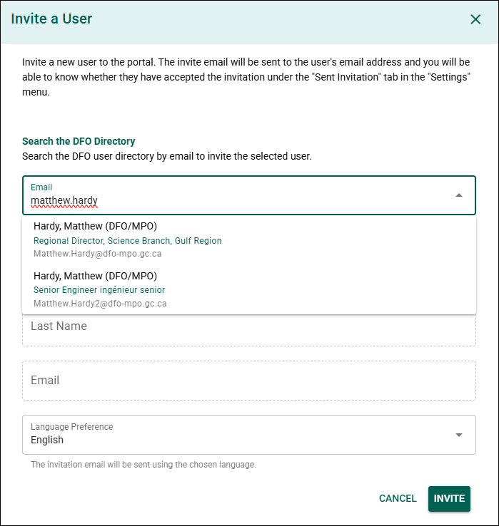
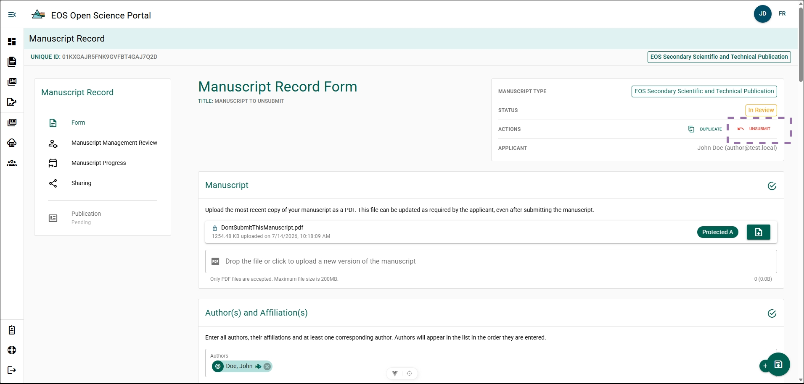
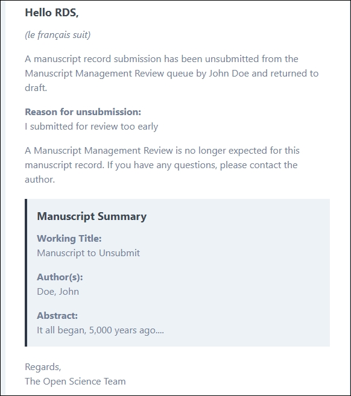
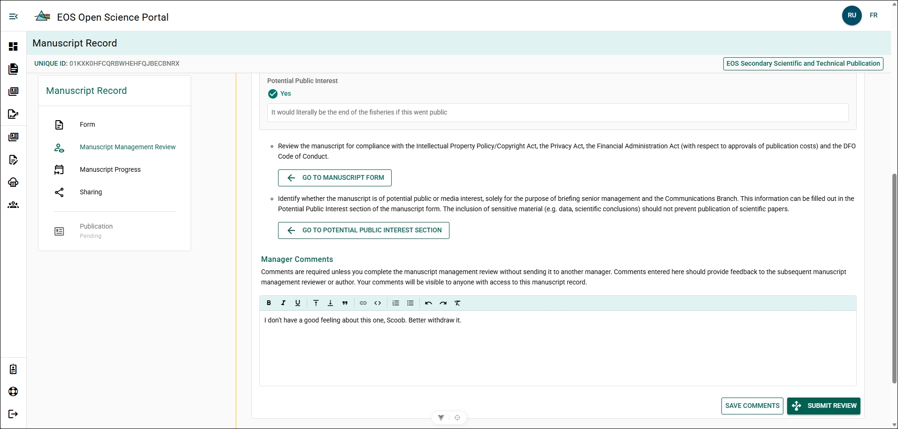
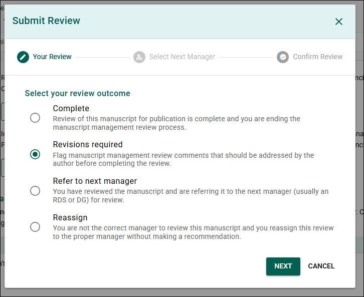
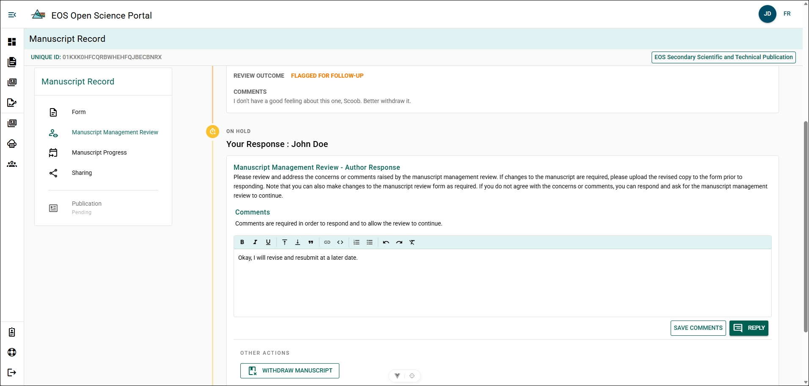

# More-Features
## Authors and Organizations {/* #authors-and-organizations */}
### Create a New Organization {/* #create-a-new-organization */}

Create a new organization if the required organization or group is not listed in the OSP **Organizations List**. This feature is typically used for Indigenous groups, long-term working groups, or organizations not already recorded in the system.

:::important
Use the organization's **official name** when creating a new record.

Official organization names can be found in the **Research Organization Registry (ROR)**:  
[Research Organization Registry](https://ror.org/)

If the organization is not listed in ROR, use the most current official name available.
:::

**Steps**

1. Click **Can't find the Organization you're looking for?**.
2. Complete the form.

Complete the form:

- **Organization Name (English)** – Enter the official organization name in English.
- **Organization Name (French)** – Enter the official organization name in French.
- **Abbreviation (English)** – Enter the organization abbreviation in English if applicable.
- **Abbreviation (French)** – Enter the organization abbreviation in French if applicable.

3. Click **Create**.

**Result**

The organization is added to the **Organizations List** and can be selected as an **Affiliation** or **Working Group**.

---

### Create a New Author {/* #create-a-new-author */}

Create a new author if the person does not appear in the **Author List**.

**Steps**

1. Click **Can't find the author you're looking for?**.
2. Complete the form.

Complete the form:

- **First Name** – Enter the author's first name.
- **Last Name** – Enter the author's last name.
- **Email** – Enter the author's email address.
- **Affiliation** – Select the author's organization.
- **ORCID** – Enter the author's ORCID identifier if available.

3. Click **Create**.

**Result**

The author is added to the **Author List** and can be selected when creating or editing Manuscript Record Forms.

### Affiliation Not Found {/* #affiliation-not-found */}

If the required affiliation does not appear in the list, see **[Create a New Organization](#create-a-new-organization)**.

---

### Edit an Author {/* #edit-an-author */}

You can update an author's **name**, **email**, or **affiliation** by editing their author profile. This is only possible if the author does **not** have an associated user account.

**Steps**

1. Click the author's name.
2. Click **View Author Profile**.
3. Click the **Pencil** icon next to the author's name.
4. Update the required information.
5. Save the changes.

**Result**

The author's profile information is updated.

#### Additional Information {/* #additional-information */}

Each Manuscript Record Form stores a **snapshot of the author's affiliation at the time the author was added**. If you update an author's affiliation, remove and re-add the author in the MRF for the change to appear in that record.

---

### Invite a User {/* #invite-a-user */}

Invite a user to access the Open Science Portal (OSP).

:::tip
The invitation tool searches the **DFO Active Directory** using the user's email address.

Some users may have similar email addresses. Verify the correct user before selecting them.

To help identify the correct user, the system displays the **job description from Active Directory** in the search results.
:::

**Steps**

1. Click **Can't find the user you're looking for?**.
2. Enter the user's **email address**.
3. Select the correct user from the dropdown list.

**Result**

The user receives an invitation to access the Open Science Portal.

#### Additional Information {/* #additional-information-1 */}

To view the status of sent invitations, see **[Sent Invitations](../settings/account-settings.mdx#sent-invitations)**.

## Manuscript Record Form {/* #manuscript-record-form */}

## Manuscript Management Review {/* #manuscript-management-review */}
### Unsubmit a MRF from Manuscript Management Review {/* #unsubmit-a-mrf-from-manuscript-management-review */}

A Manuscript Record Form can be unsubmitted from Manuscript Management Review and returned to **DRAFT** status at any time.

**Steps**

1. Open the MRF you wish to unsubmit from Manuscript Management Review.
2. Click **Unsubmit**.
3. Type reason for unsubmission.
4. Confirm the action.

**Result**
- The MRF has been unsubmitted from Manuscript Management Review and has moved from **In Review** to **Draft** status.
- An email notification has been sent to the Reviewing Manager and Author providing the reason for unsubmitting.

### Withdraw a MRF from Manuscript Management Review {/* #withdraw-a-mrf-from-manuscript-management-review */}

Withdraw a MRF from the publication process after it has been submitted for Manuscript Management Review.

This process requires actions from both the Reviewing Manager and the Author.

#### Manager: Request Revisions {/* #manager-request-revisions */}

**Steps**

1. Open the Manuscript Management Review for the MRF.
2. Write comments why the MRF should be withdrawn by the Author in the **Manager Comments**.
3. Click **SUBMIT REVIEW**.
4. Select **Revisions required**.
5. Confirm the action.

**Result**

The MRF remains **In Review**, but the Author can now withdraw it.

#### Author: Withdraw the MRF {/* #author-withdraw-the-mrf */}

**Steps**

1. Open the MRF.
2. Open the Manuscript Management Review. 
3. Write comments why you are withdrawing the MRF.
4. Click **WITHDRAW MANUSCRIPT**.
5. Confirm the action.

**Result**

The MRF has been withdrawn from the publication process and can no longer be edited.

