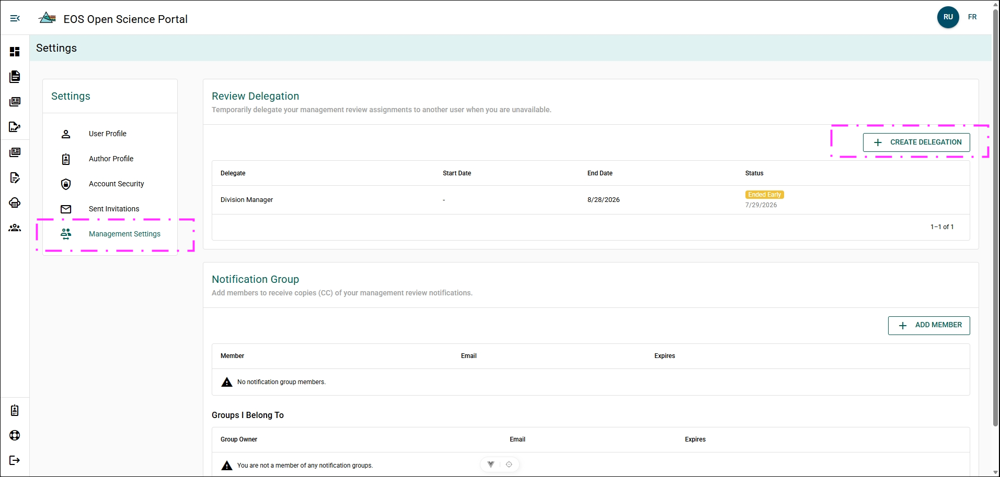
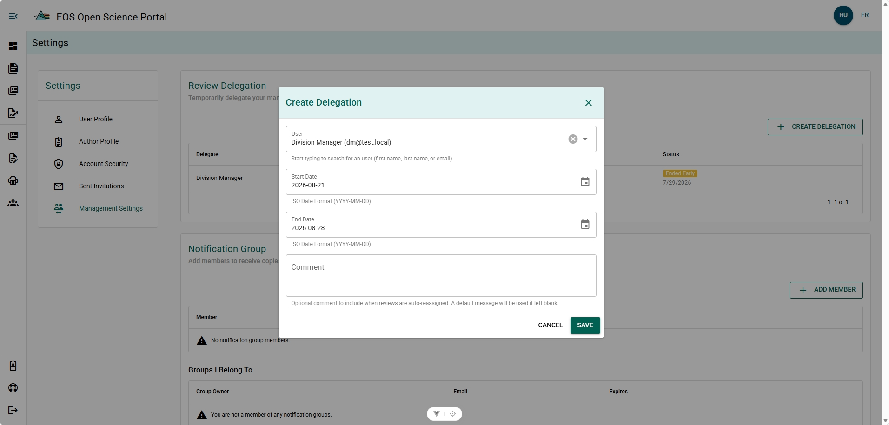
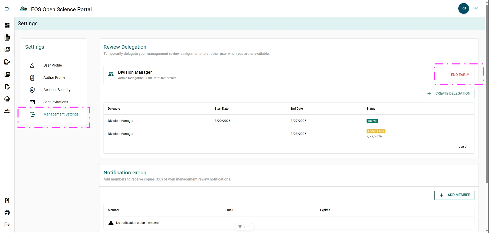

# Delegating

Review Delegation allows you to temporarily delegate your Manuscript Management Review responsibilities to another user. Delegating review responsibilities is typically done when you will be out of office for an extended period of time.

Rules when delegating include,
- Delegation must have a start and end date. Delegation can be ended early.
- A user can only have one active delegation at a time.
- A user cannot delegate themselves or extend the time of their assigned delegation period.

## Create a Delegation {/* #create-a-delegation */}

The Review Delegation menu can be found under [Settings](../settings):

**Steps**

1. Open **Settings**.
2. Click **Management Settings**.
3. Click **CREATE DELEGATION**.

**Result**

- The **Create a Review Delegation** dialog window will open.

**Additional Information**
- You will not be able to Create a Review Delegation if you have a delegation currently active.
- You can create multiple review delegations for future dates.
- You cannot have two delegation periods overlap.

## Delegate a User {/* #delegate-a-user */}

1. Click **+ CREATE DELEGATION**.
2. Complete the form:
    - **User** - Select the user who will be receive the delegation.
    - **Start Date** - Enter the date the delegation begins.
    - **End Date** - Enter the date the delegation ends.
    - **Comments** (optional) - Enter any notes.
3. Click **SAVE**

**Result**: 

- An email has been sent to the Delegated User with details of the delegation period.
- Pending Manuscript Management Reviews will be auto-reassigned to your delegate on the start Date.
- Any new Manuscript Management Review requests sent to you will be auto-reassigned to your delegate during the delegation period.

## Ending a Delegation Early {/* #ending-a-delegation-early */}

You can end an active delegation at any time.

**Steps**

1. Open **Settings**.
2. Click **Management Settings**.
3. Click **END EARLY**.
4. Confirm the dialog box.

**Result**

- The Delegation End Date is changed to today.
- Any pending Manuscript Management Reviews that were requested from you but reassigned during the delegation period have been automatically reassigned back to you.

