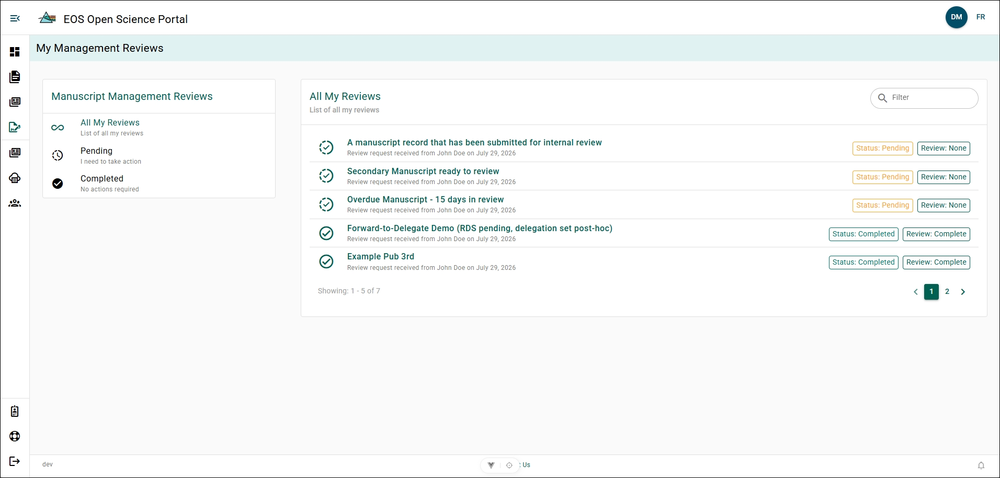

# My-Management-Reviews

The **My Management Reviews** page list all the Manuscript Record Forms (MRF) which have been submitted for your Manuscript Management Reviews which you have completed or that are pending.

## All My Reviews Form Labels {/* #all-my-reviews-form-labels */}
- **In-Progress**: Green half dash and half solid circle with a check-mark. A MRF whose Manuscript Management Review is still pending.
- **Complete**: Green circle with a check-mark. A MRF whose Manuscript Management Review is complete.
- **Pending**: Yellow box with "Status: Pending". A MRF awaiting your Manuscript Management Review decision.
- **Reassigned**: Blue box with "Status: Reassigned". A MRF which you have reassigned to a different person for Manuscript Management Review.
- **Complete - Status**: Green box with "Status: Complete". A MRF which you have completed the latest action requested for Manuscript Management Review.
- **None**: Green box with "Review: None". A MRF which you have not reviewed.
- **Flagged for Follow-Up**: Green box with "Review: Flagged for Follow-Up". A MRF which has been sent back to the author requesting revisions be made.
- **Complete - Review**: Green box with "Review: Complete". A MRF which has completed its Manuscript Management Review.

