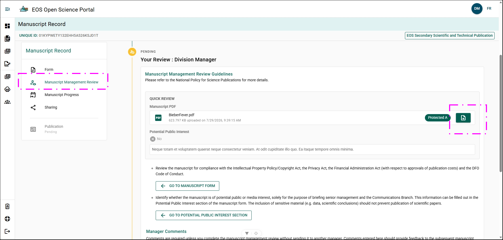
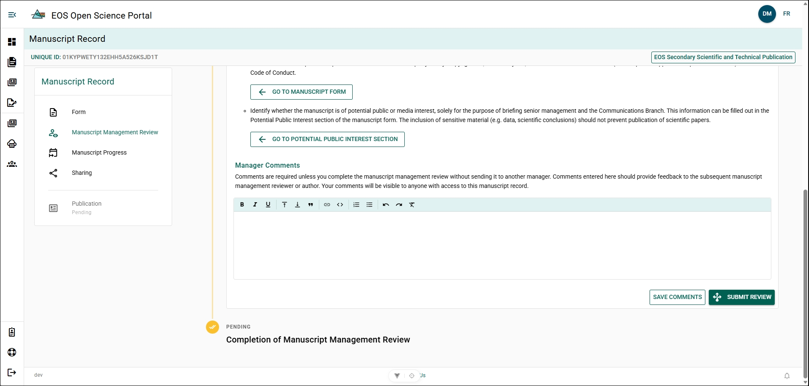

# Reviewing a Manuscript Record Form

Clicking on the Manuscript you would like to review will open the Manuscript Management Review Panel.

From the Manuscript Management Review Panel you can: 
- Click the **Download** button to download a PDF copy of the Manuscript.
- See if any Potential Public Interest has been declared.
- Click **Go to Manuscript Form** to open the Manuscript Record Form.
- Click **Go to Potential Public Interest Section** to jump to the Potential Public Interest section on the Manuscript Record Form.
- Click **Manuscript Management Review** from the Manuscript Record menu to return to the Manuscript Management Review panel.

## Manager Comments {/* #manager-comments */}

The **Manager Comments** box allows you to record any notes or requests you may have during your review.

Comments may include:
- Recording any changes you make to the MRF during your review.
- Requests or comments for the Author if you believe changes are required.
- Comments for managers who will be reviewing the MRF after you.
- Confirmation that you have reviewed the Manuscript and MRF.

:::info
Manager Comments are visible to any one who has access to the MRF in the OSP. This includes, All authors listed in the MRF, Regional Editors, and Directors.
:::

