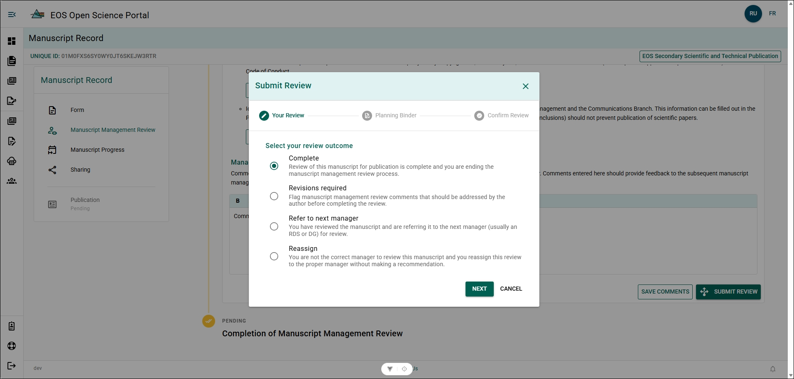
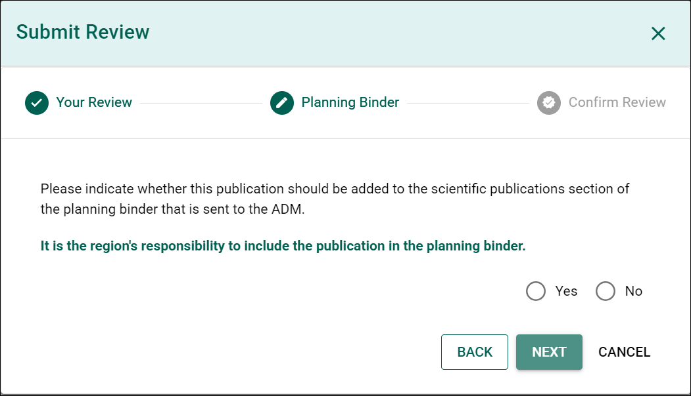
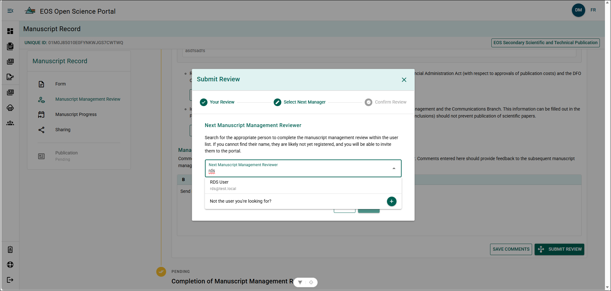
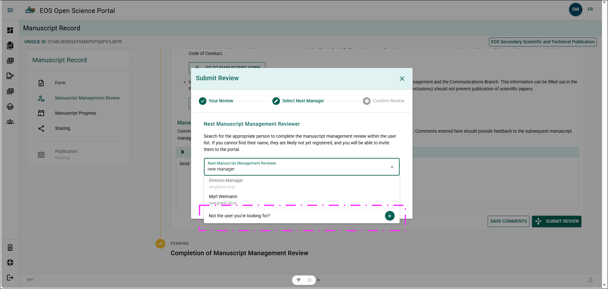
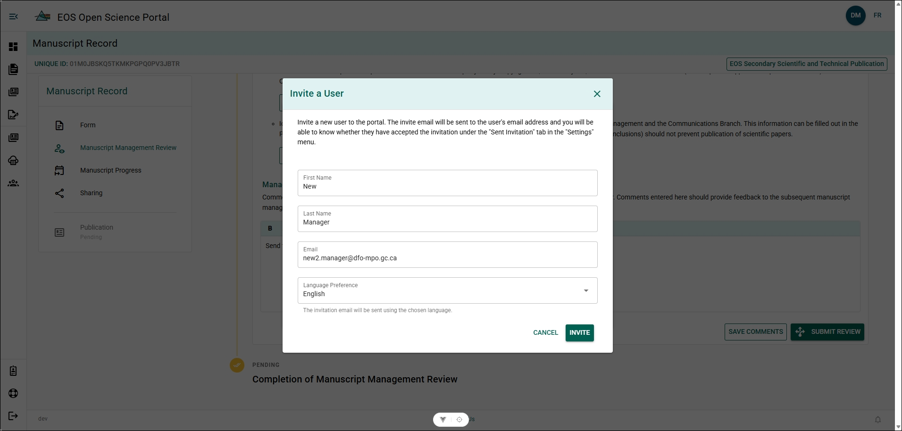

# Submit the Manuscript Management Review

:::important

- For EOS Secondary Scientific and Technical Publications, only an RDS, DG or user that has been assigned the `director` role may complete the Manuscript Management Review.
- A manager comment is required for all actions to complete the Manuscript Management Review.

:::

## Review Outcomes {/* #review-outcomes */}

### Complete {/* #complete */}

Based on your review of the manuscript and MRF, you approve that the manuscript may be published. This will end the Manuscript Management Review.

This will change the MRF's status to **Reviewed**.

See [Complete Submission Steps](#steps---complete).

### Revisions Required {/* #revisions-required */}

During your review of the manuscript and MRF, you found items which the author should address before the manuscript is ready to be published. Record your flagged issues in the [Manager Comment box](./reviewing-the-manuscript#manager-comments). 
This will pause the [10-Working day timeline](./reviewing-manager-role#10-working-day-timeline) to allow the author to review your comments and respond. Upon receiving a reply from the author, the 10-Working day timeline will resume.

See [Revisions Required Steps](#steps---revisions-required).

### Refer to Next Manager {/* #refer-to-next-manager */}

Based on your review of the manuscript and MRF, you approve that the manuscript is ready for final review by a RDS or DG, or you and the author cannot agree on a requested revision and the Manuscript Management Review is being referred to a RDS or DG for final decision.

This will pause the [10-Working day timeline](./reviewing-manager-role#10-working-day-timeline) to allow the RDS or DG time to review the manuscript, MRF, and Manager Comments and make a decision.

See [Refer to Next Manager Steps](#steps---refer-to-next-manager-and-reassign).

### Reassign {/* #reassign */}

You are not the correct manager to complete the Manuscript Management Review and are reassigning the Manuscript Management Review to an appropriate manager without making any recommendations.

See [Reassign Steps](#steps---refer-to-next-manager-and-reassign).

## Planning Binder {/* #planning-binder */}

A MRF **must** have [Potential Public Interest](../manuscript-record-forms/complete-manuscript-record-form#potential-public-interest) in order to be flagged for the Planning Binder within the OSP.

**Yes** should be selected if you believe the manuscript should be considered an item on the EOS Assistant Deputy Minister's Office (ADMO) Planning Binder. Selecting **Yes** places a flag in in the [Editor's Dashboard](../portal-basics/dashboard#editor-dashboard) and allows for greater tracking visibility of this manuscript within the OSP. 

If a manuscript is flagged for the Planning Binder, you will receive an email when the Manuscript Management Review is completed and a publication record is created for the manuscript. See [Planning Binder Email](./review-notifications) for more information.

:::warning
Selecting "Yes" **does not** automatically add the publication to the Planning Binder!

**It is the responsibility of the region to add the publication to the Planning Binder!**
:::

## Submitting Your Review {/* #submitting-your-review */}

From within the Manuscript Management Review Panel:

### Steps - Complete {/* #steps---complete */}

1. Type your comments in the Management Comment box.
2. Click **SUBMIT Review**.
3. Select **Complete** and click **NEXT**.
4. Select if the manuscript should be flagged for the Planning Binder and click **NEXT**. 
5. Confirm review and click **SUBMIT**.

**Result**

- The Manuscript Management Review is completed and closed.
- An email has been sent to the Author notifying them the Manuscript Management Review is complete.

### Steps - Revisions Required {/* #steps---revisions-required */}

1. Type your requested revisions in the Management Comment box.
2. Click **SUBMIT Review**.
3. Select **Revisions Required** and click **NEXT**.
4. Confirm review and click **Submit**.

**Result**

- The 10-day working timeline is paused.
- An email has been sent to the author, with you CC'd, notifying them that edits have been requested.

### Steps - Refer to Next Manager and Reassign {/* #steps---refer-to-next-manager-and-reassign */}

1. Type your requested revisions in the Management Comment box.
2. Click **SUBMIT Review**.
3. Select **Refer to Next Manager** or **Reassign** and click **NEXT**.
4. Search **Next Manuscript Management Reviewer** using their name or email.
5. Click **Manager's Name** to select them and click **NEXT**.
6. Confirm review and click **SUBMIT**

**Result**

- The Manuscript Management Review has been sent to the selected manager.
- An email has been sent to the next manager, with you and the author CC'd, notifying them that they have been identified as the next Manuscript Management Reviewer.

**Additional Information**
- See [Add a Manager](#add-a-manager) if the **Next Manuscript Management Reviewer's** name is not found in the search.

### Add a Manager {/* #add-a-manager */}

From within the Next Manuscript Management Reviewer search:

**Steps**

1. Click **Not the user you're looking for?**.
2. Input:
    - First Name
    - Last Name
    - Email Address
3. Click **Invite**.
4. Click **Next**.
5. Confirm review and click **SUBMIT**.

**Result**

- The Manuscript Management review has been sent to the newly added manager.
- An email has been sent to the newly added manager inviting them to the OSP.

:::tip
Use information found in the Contact Card for the Manager to ensure their Name and Email Address is correct.
:::

