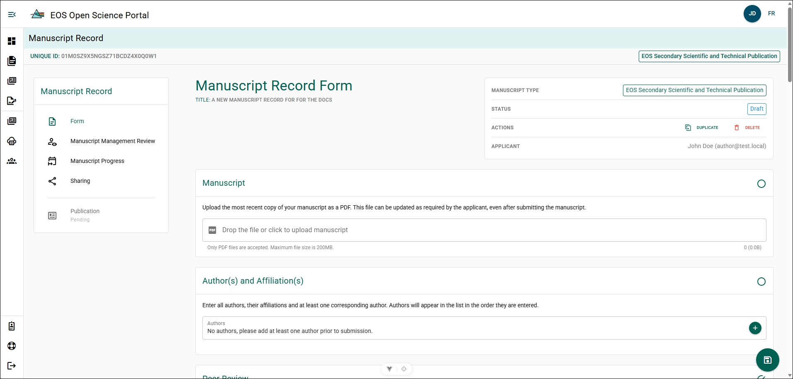
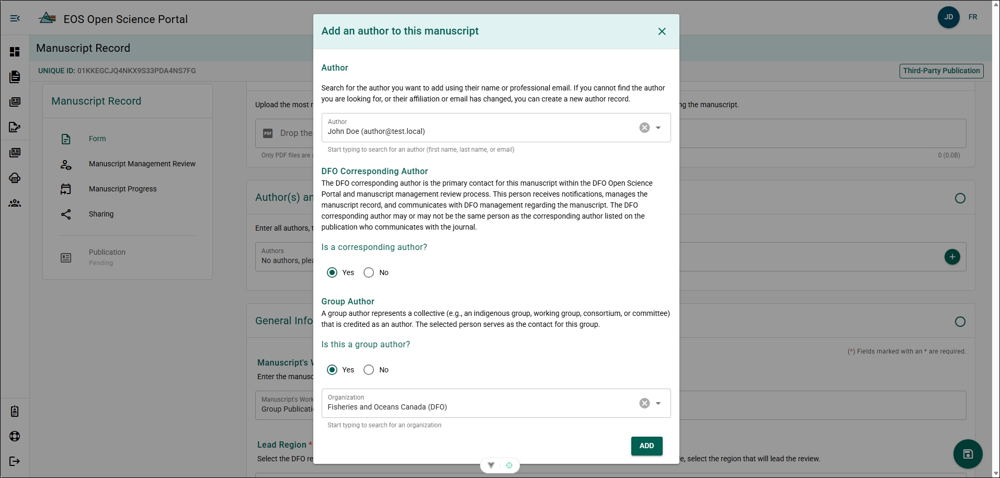
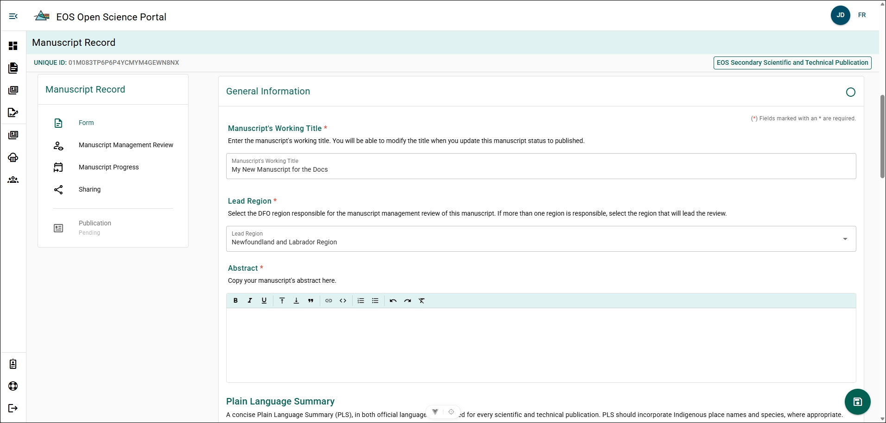
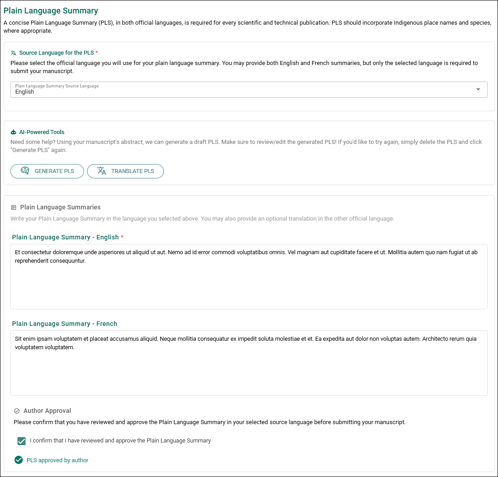
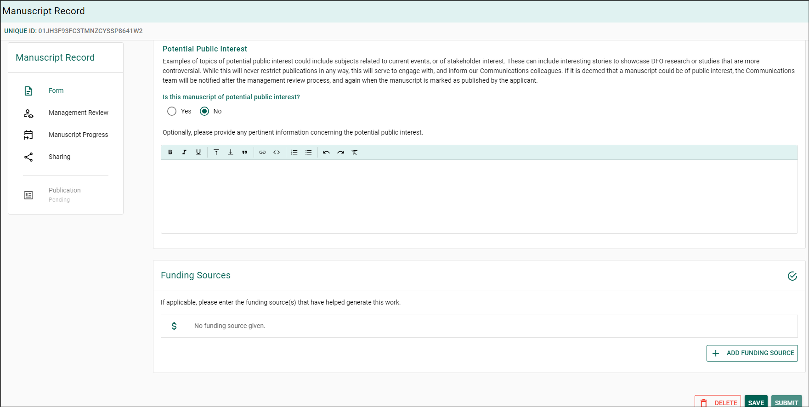
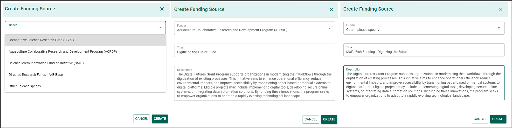

import ExternalLocalizedLink from '@site/src/components/ExternalLocalizedLink';

# Complete a Manuscript Record Form

:::tip
**Save Your Progress**

Save your manuscript frequently to prevent losing work.

You can save your progress by:

- Clicking the circular **Floppy-Disk** button in the bottom-right corner of the page.
- Scrolling to the bottom of the form and clicking **Save**.

After saving, you can safely log out of the OSP.
:::

## Manuscript {/* #manuscript */}

Upload a PDF version of your manuscript to the MRF. You can upload a newer version later if the manuscript changes.

**Steps**

1. Click the **Drop the file or click to upload manuscript** field.
2. Select the manuscript PDF from the file browser.
3. Click **Open**.

**Result**

The manuscript PDF is uploaded and attached to the Manuscript Record Form.

## Author(s) and Affiliation(s) {/* #authors-and-affiliations */}

Add all authors who contributed to the manuscript and specify their affiliations.

**Author Attributes**
- **DFO Corresponding Author**: The primary contact, within DFO, for this Manuscript and Publication.
  - There must be at least one DFO Corresponding Author.
- **Group Author**: The organization the author is apart of.

**Steps**

Repeat these steps for each author:

1. Click **+**.
2. Search for the author in the **Author** field using their name or email.
3. Select **Yes** for **Corresponding Author** if the author will be the primary contact within DFO.
4. Select **Yes** for **Group Author** if the author represents a group.

If **Group Author** is selected:

- Search for the group by name.
- Select the group from the search results.

5. Click **Save**.

**Result**

The selected author is added to the Manuscript Record Form. Added authors can view and edit the MRF but cannot delete it.

**Additional Information**
- See [Creating an Author](../common-features/author-and-affiliate-management#create-a-new-author) if an author does not appear within the searchable list.
- See [Creating an Organization](../common-features/author-and-affiliate-management#create-a-new-organization) if an organization does not appear within the searchable list.

## Peer Review {/* #peer-review */}

:::info
Only visible on EOS Secondary Scientific and Technical Publication Manuscript Record Forms!

Peer-Review is optional for Data, Contractor, and Bulletin reports!
:::

Add at least two subject matter experts who have conducted a peer-review of the report.

**Steps**

Repeat these steps for each peer reviewer:

1. Click **+**.
2. Search for the author in the **Author** field using their name or email.
4. Click **Save**.

**Result**

The selected reviewer is added to the Manuscript Record Form.

**Additional Info**
- See [Creating an Author](../common-features/author-and-affiliate-management#create-a-new-author) if an author does not appear within the searchable list.

## General Information {/* #general-information */}

### Manuscript Working Title {/* #manuscript-working-title */}

The working title is automatically populated from the title entered when the manuscript was created.

**Steps**

1. Click the **Title** field.
2. Enter the updated manuscript title.
3. Save the changes.

**Result**

The updated title is saved to the Manuscript Record Form.

### Lead Region {/* #lead-region */}

The **Lead Region** is automatically populated from the region selected when the manuscript was created.

**Steps**

1. Click the **Lead Region** field.
2. Select the appropriate region.
3. Save the changes.

**Result**

The updated **Lead Region** is saved to the Manuscript Record Form.

### Abstract {/* #abstract */}

Add the manuscript abstract to the record.

**Steps**

1. Copy the abstract from your manuscript.
2. Paste the abstract into the **Abstract** text field.
3. Save the changes.

**Result**

The abstract is stored in the Manuscript Record Form.

### Plain Language Summary {/* #plain-language-summary */}

Provide a plain language summary (PLS) to improve accessibility of the publication.
- Plain Language Summaries are required for all scientific publications.
- The summary should be written for approximately an **8th-grade reading level** to support broader comprehension.
- Guidance on writing plain language content is available from the Government of Canada: <ExternalLocalizedLink linkKey="communicationsCommunityOffice">Communications Community Office</ExternalLocalizedLink>.

#### Source Language for the PLS {/* #source-language-for-the-pls */}

You may provide the summary in **both English and French**, but only the selected source language is required for submission.

**Steps**

1. Select **English** or **French** in the **Source Language of the PLS** field.

**Result**

The selected language becomes the required language for the Plain Language Summary during management review.

#### AI-Powered Tools {/* #ai-powered-tools */}

Generate a draft Plain Language Summary (PLS) using the manuscript abstract and the selected language.

:::note
The **Generate PLS** tool uses the Artificial Intelligence (AI) Large Language Model (LLM) [Llama 3.2](https://www.llama.com/), developed by Meta.

This tool runs entirely within the DFO network. Information submitted to the tool **does not leave the DFO intranet** and **cannot be transmitted to Meta or external systems**.

When using AI tools within the Government of Canada network, review the Treasury Board of Canada Secretariat guidance on responsible AI use: <ExternalLocalizedLink linkKey="useOfAI">Guide on the use of generative artificial intelligence</ExternalLocalizedLink>.
:::

:::tip
The **Generate PLS** feature creates a draft based on your manuscript abstract. You can generate multiple drafts to refine the summary.

After finalizing the PLS, you can use **Translate PLS** to generate a version in the other official language.
:::

**Steps**

1. Click **Generate PLS**.
2. Review the generated draft.
3. Edit the summary if needed.

**Result**

A draft Plain Language Summary appears in the PLS text field.

#### Author Approval {/* #author-approval */}

Confirm that the author has reviewed and approved the Plain Language Summary.

**Steps**

1. Review the completed Plain Language Summary.
2. Select the **Author Approval** confirmation.

**Result**

The system records that the author has reviewed and approved the Plain Language Summary.

:::important
If you are completing the form on behalf of the author, ensure the author has reviewed the Plain Language Summary before confirming approval. Authors can access their own MRF by logging in to the portal.
:::

### Functional Area {/* #functional-area */}

Apply a **Functional Area** tag to classify the research focus of the manuscript.

**Steps**

1. Click the **Functional Area** field.
2. Select the appropriate **Functional Area** from the list.

**Result**

The selected Functional Area is applied to the Manuscript Record Form.

**Additional Information**

Functional Area tags help improve reporting and tracking of DFO scientific research focus areas.

### Relevance to Programs/Initiatives/Management Section {/* #relevance-to-programsinitiativesmanagement-section */}

Provide a summary describing how the manuscript supports the program that funded it and how it aligns with the department's mandate, strategic plan, or regional priorities.

**Steps**

1. Enter the summary in the **Relevance to Programs/Initiatives/Client Sector** field.
2. Save the changes.

**Result**

The relevance summary is saved to the Manuscript Record Form.

### Potential Public Interest {/* #potential-public-interest */}

Identify whether the manuscript may have public interest.

:::info

A publication can only be flagged for the [Planning Binder](../manuscript-management-review/submit-review#planning-binder) if it has potential public interest!

:::

**Steps**

1. Select **Yes** or **No** in the **Potential Public Interest** field.

**Conditional Steps**

If **Yes** is selected:

- Enter details about the potential public interest in the text field.

**Result**

The manuscript record reflects whether the publication may have public interest.

### Reporting Licensing {/* #reporting-licensing */}

:::info
This section is visible only for **EOS Secondary Scientific and Technical Publication** publication types.
:::

Specify whether the report should be licensed under the <ExternalLocalizedLink linkKey="openGovernmentLicence">**Open Government Licence – Canada**</ExternalLocalizedLink>.

**Steps**

1. Select **Yes** or **No** in the **Report Licensing** field.

**Conditional Steps**

If **No** is selected:

- Enter an explanation describing why the **Open Government Licence – Canada** cannot be applied.

**Result**

The selected licensing status is saved to the Manuscript Record Form.

**Additional Information**

DFO follows the **Open by Design and by Default** principle of Open Science. Publications should be licensed under the latest version of the **Open Government Licence – Canada** whenever possible.

The licence should not be applied if conflicting licensing obligations exist.

### Open Publication {/* #open-publication */}

:::info
This section is visible only for **Third-Party Publication** and **Preprint** publication types.
:::

Specify whether the publication will be made openly accessible.

**Steps**

1. Select **Yes** or **No** in the **Open Publication** field.

**Conditional Steps**

If **No** is selected:

- Enter the rationale explaining why open access cannot be applied.

**Result**

The manuscript record reflects whether the publication will be openly accessible.

**Additional Information**

The **Open by Design and by Default** approach requires publications to be freely and publicly accessible unless an exception applies.

Exceptions may include situations where information, data, or code are restricted due to:

- research security
- proprietary interests
- third-party restrictions
- legal, ethical, or confidentiality agreements

## Funding Sources {/* #funding-sources */}

Add funding sources if the work contributing to the manuscript was supported by a program.

**Steps**

1. Click **+ ADD FUNDING SOURCE**.
2. Click the **Funder** field.
3. Select the appropriate funder from the list.
4. Enter the program name in the **Title** field.
5. Enter a description of the funding program and its requirements in the **Description** field.
6. Click **Create**.

Repeat these steps to add additional funding sources.

**Result**

The funding source is added to the Manuscript Record Form.

