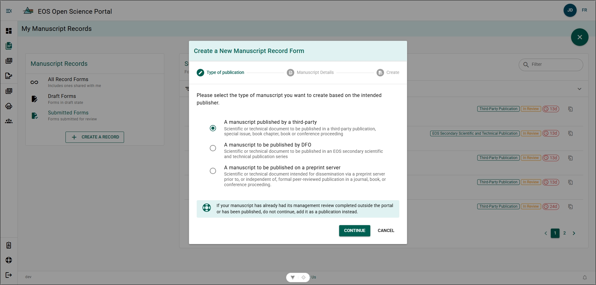
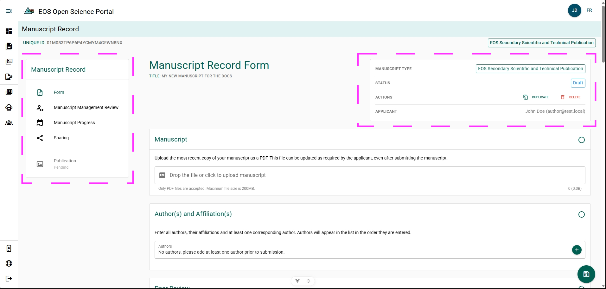

# Create a Manuscript Record Form

Create a Manuscript Record Form (MRF) to begin tracking a publication in the Open Science Portal (OSP). The MRF stores manuscript details and supports the publication review process.

Create a new MRF from the **My Manuscripts** page.

**Steps**

1. Click **+ Create Manuscript** in the **Manuscripts** menu.
2. Select the **Desired Publication Type**.
3. Click **Continue**.
4. Enter the manuscript title in the **Title** field.
5. Select the **Lead Region** in the **DFO Regions** field.
6. Click **Continue**.
7. Click **Create**.

**Result**

A new Manuscript Record Form is created and opened for editing.

**Additional Information**
- If you have already completed a Manuscript Management Review using the Old-Form MRF, please see the [Frequently Asked Questions](../frequently-asked-questions#how-do-i-add-my-publication-if-i-completed-my-manuscript-management-review-using-the-old-form-mrf)

## Navigate the Manuscript Record Form {/* #navigate-the-manuscript-record-form */}

### Manuscript Record Menu {/* #manuscript-record-menu */}

- **Form** – Opens the main MRF page where you complete and submit the manuscript record form.
- **Manuscript Management Review** – Opens the [Manuscript Management Review Panel](./submit-manuscript-record-form#manuscript-management-review-panel)  and displays the current review status.
- **Manuscript Progress** – Opens the [Manuscript Progress](./manuscript-record-form-features#view-manuscript-progress) page and shows the workflow and current progress of the MRF.
- **Sharing** – Opens the [Sharing](./manuscript-record-form-features#share-a-manuscript-record-form) page where you can share the MRF with additional users. Authors and management review users automatically have access and do not need to be added.
- **Publication** – Opens the associated [Publication Record](../publications/) if one exists. A publication record is automatically created after the manuscript is marked as accepted for publication.

### Manuscript Record Form Status Menu {/* #manuscript-record-form-status-menu */}

- **Manuscript Type**: Displays what publication type the MRF is for.
- **Status**: Displays what state publication process state the MRF is in.
- **Actions**: Available actions to take on the MRF.
  - See [Duplicate MRF](./manuscript-record-form-features#duplicate-a-manuscript-record-form).
  - See [Delete MRF](./manuscript-record-form-features#delete-a-manuscript-record-form).
- **Applicant**: Who created the MRF.

