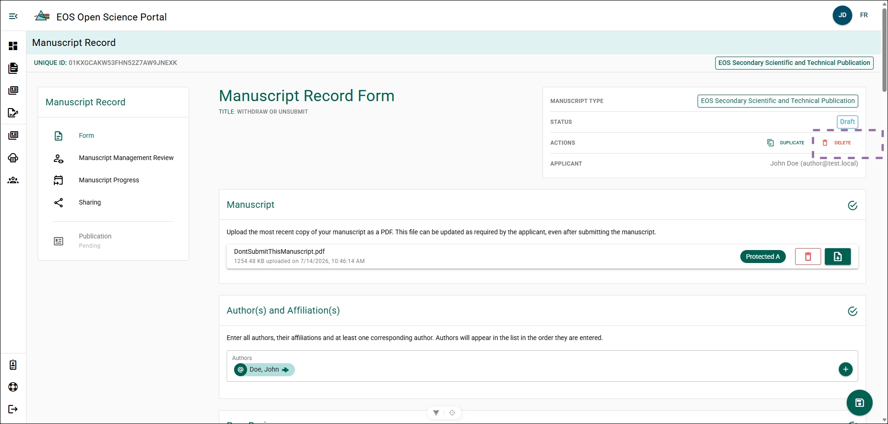
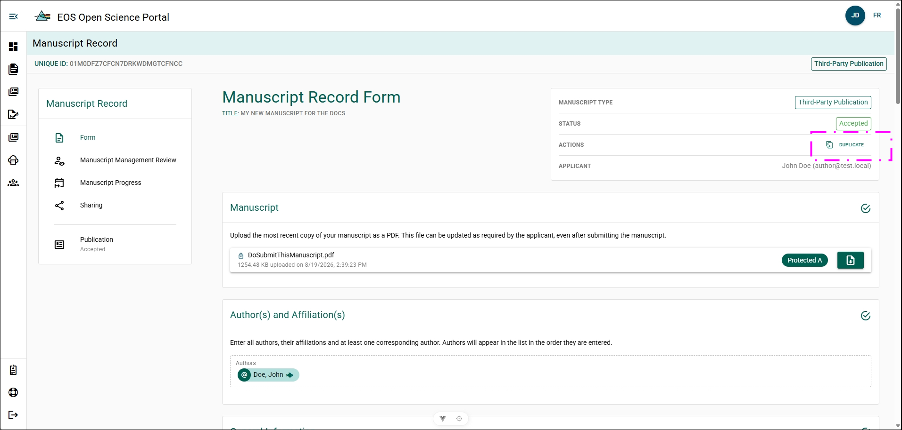
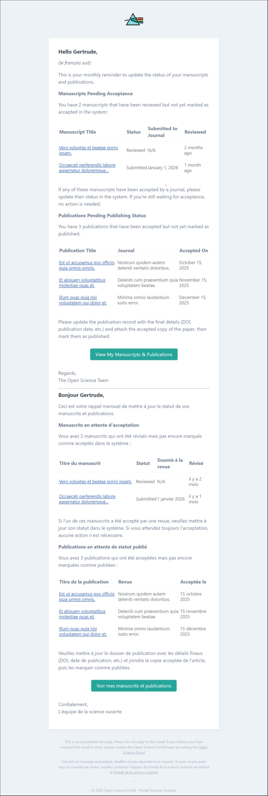
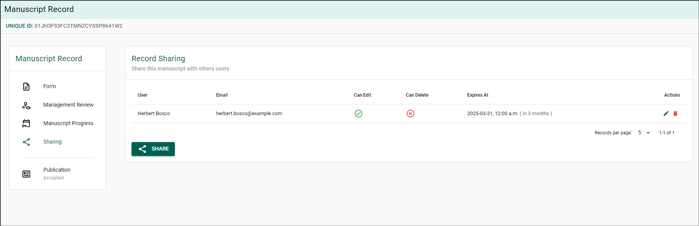
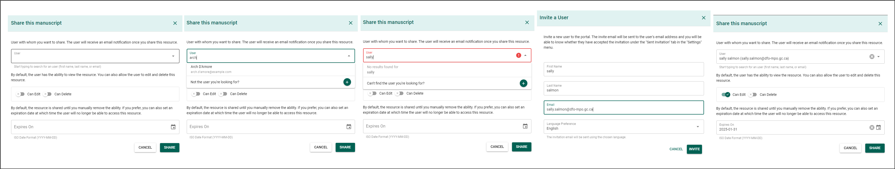
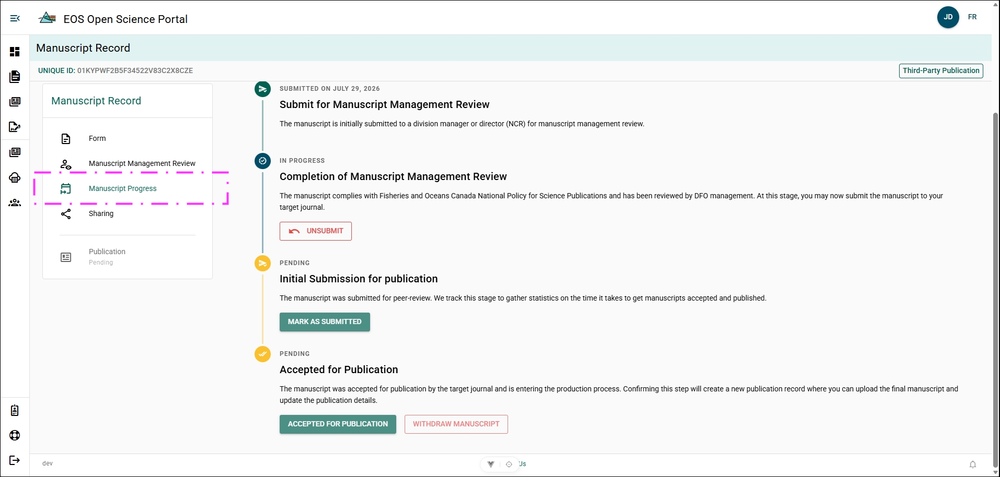

# Manuscript Record Form Features

## Delete a Manuscript Record Form {/* #delete-a-manuscript-record-form */}

A Manuscript Record Form can be deleted from the OSP if it is currently in **DRAFT** status.

**Steps**

1. Open the MRF you wish to delete.
2. Click **Delete**
3. Confirm the action.

**Result**

The MRF has been deleted from the OSP and will no longer appear within your list of Manuscript Record Forms.

## Duplicate a Manuscript Record Form {/* #duplicate-a-manuscript-record-form */}

Duplicating an MRF allows you to create a new manuscript record with a new publication type while retaining information from the original. 

**Steps**

1. Open the MRF you with to duplicate.
2. Click **Duplicate**.
3. Select Publication type, then click **Next**.
4. Confirm the action.

**Result**

- A new MRF has been created pre-populated with the same information from the original. 
- The new MRF will be in a **Draft** status.
- The new MRF has "(Clone)" appended to the end of the title.

**Additional Information**
- MRF's which have been completed or closed can still be duplicated.

## Monthly Reminder Emails {/* #monthly-reminder-emails */}

The OSP sends a **monthly reminder email** if you have Manuscript Record Forms where the **Management Review** step is marked as **Complete**.

These reminders help ensure the publication life-cycle is tracked accurately and that manuscript information remains up to date in the OSP.

## Share a Manuscript Record Form {/* #share-a-manuscript-record-form */}

Share access to a Manuscript Record Form (MRF) with another user, such as an administrator or section head.

:::tip
DFO authors and reviewers associated with the MRF already have access based on their role and do not need to be shared manually.
:::

**Steps**

1. Open the manuscript from the **My Manuscript Records** page.
2. Select **Sharing** from the section menu.
3. Click **Share**.
4. Enter the user's name or email in the **User** search field.
5. Select the user from the search results.
6. Select the access level.

Choose one of the following:

- **Can Edit** – Allows the user to view and edit the MRF.
- **Can Delete** – Allows the user to delete the MRF.

7. (Optional) Set an expiration date in the **Expires On** field.
8. Click **Share**.

**Conditional Steps**

If the user does not appear in the search results:

- Follow the steps in **[Invite a User](../common-features/invite-a-user)**.

**Result**

The selected user receives access to the Manuscript Record Form with the assigned permissions.

### Edit Share Permissions {/* #edit-share-permissions */}

Update the permissions for an existing shared Manuscript Record Form.

**Steps**

1. Click the **Pencil** icon in the **Actions** column.
2. Update the sharing settings.
3. Click **Save**.

**Result**

The updated permissions are applied to the shared Manuscript Record Form.

### Remove Share Permissions {/* #remove-share-permissions */}

Remove a user's shared access to the Manuscript Record Form.

**Steps**

1. Click the **Trash Can** icon in the **Actions** column.
2. Click **OK** to confirm.

**Result**

The user's access to the Manuscript Record Form is removed.

## View Manuscript Progress {/* #view-manuscript-progress */}

Use the **Manuscript Progress** page to track the status of the manuscript throughout the publication process.

**Steps**

1. Open the manuscript from the **My Manuscript Records** page.
2. Click **Manuscript Progress** in the Manuscript Record menu.

**Result**

The **Manuscript Progress** page displays the current workflow status and publication milestones for the manuscript.

