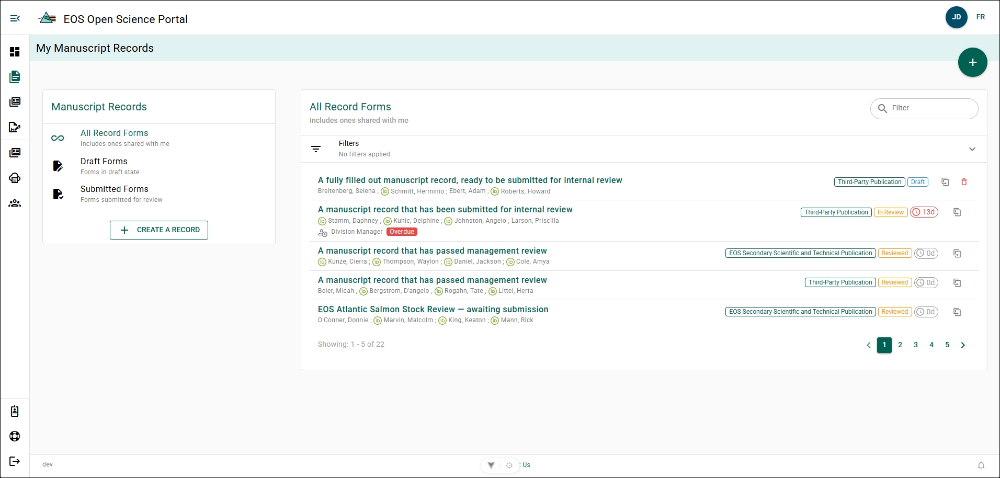

# My Manuscript Records

The **My Manuscript Records** page lists all manuscript records you have created or that have been shared with you. The default view displays MRF's which have been submitted and are under going Manuscript Management Review. You can change the current MRF view, or create a new MRF from the **Manuscript Records** menu on the left-side of the page. 

## All Record Forms Labels {/* #all-record-forms-labels */}

- **ORCID**: Green circle with the letters "iD" left of an author's name denote if the author has associated an [ORCID](../references/orcid) with their account.
- **Manuscript Management Review**: A grey person with a clock left of a manager's name denotes that this MRF has been submitted to this manager for Manuscript Management Review.
- **Overdue**: A red box with the word "Overdue" denotes that this MRF has been in Manuscript Management Review for longer than 10 business days.
- **Publication Type**: A green box with the word "Third-Party Publication", "EOS Secondary Scientific and Technical Publication", or "Preprint" denotes what publication type this MRF is for.
- **Status**: A blue box with the word "Draft", a yellow box with the words "In Review", a yellow box with the word "Reviewed", a green box with the word "Accepted", or a red box with the word "Withdrawn" denotes the status of the MRF in the publication cycle.
- **Review Counter**: A grey box with a clock, a number, and the letter "d", or a red box with a clock, a number, and the letter "d" denote how many business days have passed since the MRF was submitted for Manuscript Management Review. If the box is red, then the 10 day review time limit has passed.
- **Duplicate**: A grey square with an arrow pointing inside it denotes the [duplicate action](./duplicate-manuscript-record-form). This action allows you to create a copy of this MRF.

