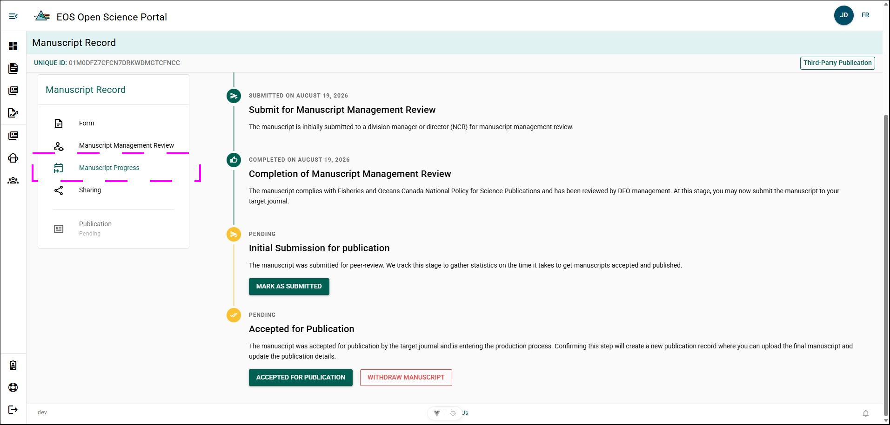
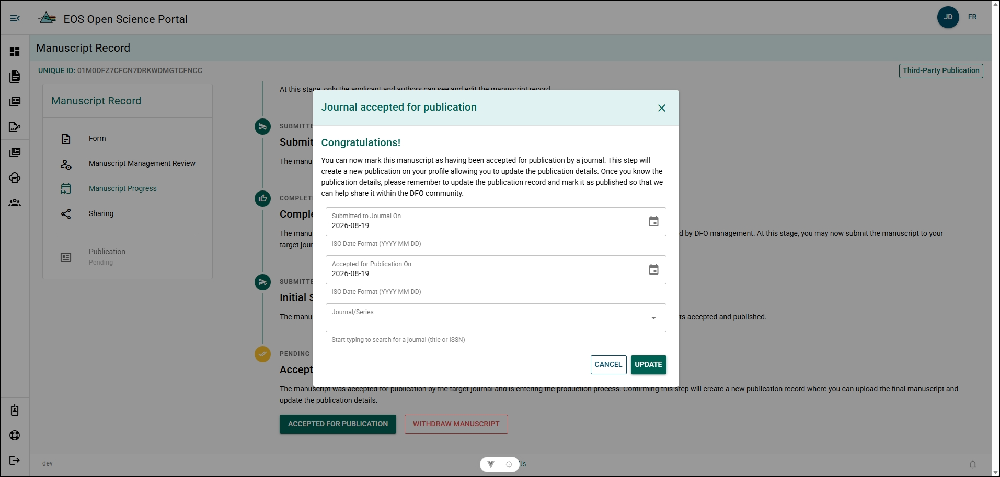
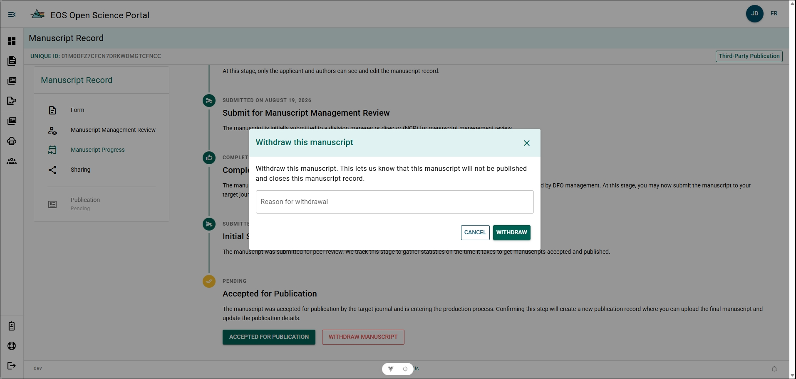
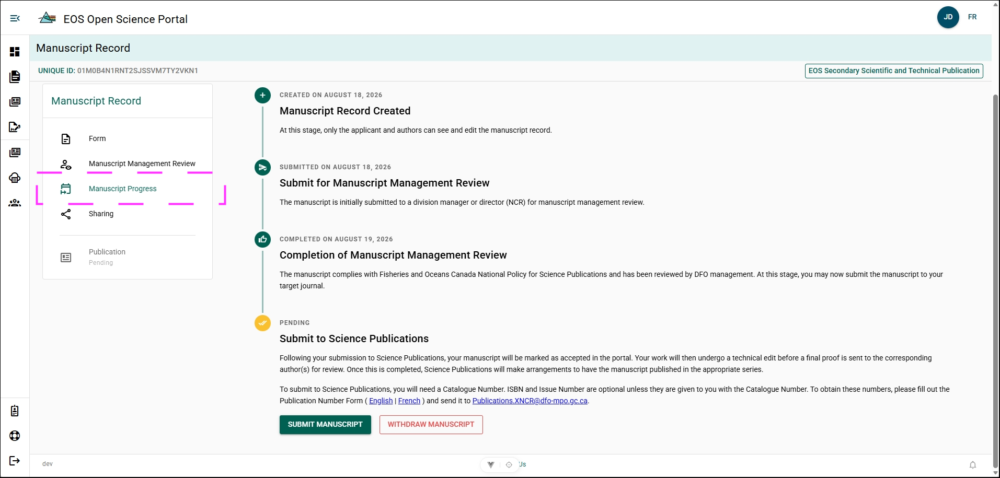
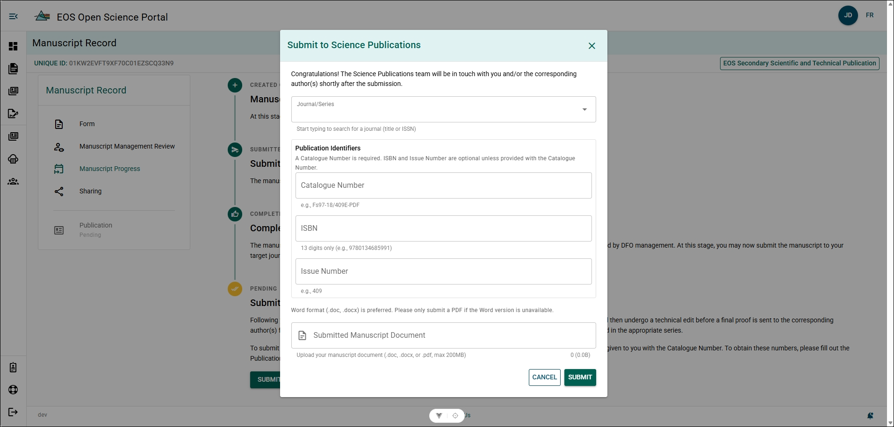

# Publish a Manuscript

## Third-Party Publications and Preprints {/* #third-party-publications-and-preprints */}

Third-Party Publications and Preprints, also known as:
- Primary Publications

### Mark as Submitted {/* #mark-as-submitted */}

Submit the manuscript to a journal after completing the Manuscript Management Review Process.

**Steps**

1. Open the Manuscript Record Form.
2. Select **Manuscript Progress** from the Manuscript Record menu.
3. Click **Mark as Submitted**.
4. Input the date the Manuscript was submitted to the publisher.
5. Click **Update**.

**Result**

- The MRF for this manuscript has moved to a **Submitted** status and can no longer be edited.

### Accepted for Publication {/* #accepted-for-publication */}

Declare the publishers decision:

**Steps**
1. Open the Manuscript Record Form.
2. Select **Manuscript Progress** from the Manuscript Record menu.
3. Click **Accepted for Publication**.
4. Complete the form:
  - Input **Submitted to Journal On** date, if different from what's listed.
  - Input **Accepted for Publication On** date, if different from what's listed.
  - Type and select **Journal/Series**.
5. Click **Update**.

**Result**

- The MRF for this Manuscript has moved to an **Accepted** status.
- A [Publication Record](../publications) has automatically been created for your manuscript.

:::tip
Continue updating the Manuscript Record Form throughout the publication process to improve publishing time metrics and increase visibility of the work.
:::

### Withdraw Manuscript {/* #withdraw-manuscript */}

Declare you are no longer trying to publish this manuscript

**Steps**
1. Open the Manuscript Record Form.
2. Select **Manuscript Progress** from the Manuscript Record menu.
3. Click **Withdraw Manuscript**.
4. Write comment why you are withdrawing the manuscript.
5. Click **Withdraw**.

**Result**

- The MRF for this Manuscript has been moved to a **Withdrawn** status.

## EOS Secondary Scientific and Technical Publications {/* #eos-secondary-scientific-and-technical-publications */}

EOS Secondary Scientific and Technical Publications, also known as: 
- Secondary Publications
- DFO Publications
- Tech Reports

## Request Publication Numbers {/* #request-publication-numbers */}

After completing the **Manuscript Management Review Process**, you are now ready to request Publication Numbers from DFO Publications.

**Steps**
1. Complete the **Request Form for Publication Numbers**.  
   [**REQUEST FORM FOR PUBLICATION NUMBERS**](https://intranet.ent.dfo-mpo.ca/mpo/sites/dfo-mpo/files/publishing-form-formulaire-publication-eng_0.pdf)
2. Email the completed form to [**Publications.XNCR@dfo-mpo.gc.ca**](mailto:Publications.XNCR@dfo-mpo.gc.ca).
3. Insert the Publication Numbers in your report's [Colophon or appropriate citation page](https://dfo-mpo.libguides.com/en/preparing-dfo-scientific-reports/formatting/colophon-page).

**Result**

Your report has the required catalog numbers and is ready for publishing.

:::info
DOI's will be generated by Science Publications on your behalf
:::

## Submit to Science Publications {/* #submit-to-science-publications */}

Submit the manuscript to the **Science Publications** after receiving Publication Numbers:

**Steps**

1. Open the Manuscript Record Form.
2. Select **Manuscript Progress** from the section menu.
3. Click **Submit Manuscript**.
4. Complete the form.

Complete the form:

- **Journal/Series** – Select the publication series.
- **Cataloger Number** – Enter the assigned cataloger number.
- **Copy of Manuscript** – Upload the manuscript file (.docx or .doc accepted).
- **ISBN** – Enter the ISBN if available.
- **Issue Number** – Enter the issue number if applicable.

5. Click **Submit**.

**Result**

- The manuscript is submitted to **Science Publications** for review and publication.
- A [Publication Record](../publications) has been automatically created for your manuscript.
- The MRF for this report has moved to an **Accepted** status and can no longer be edited.

:::tip
Submit your manuscript in a `docx` file format! 

You may submit your manuscript as a PDF, however, Science Publications will not be able to make edits if required! This will lead to publication delays!. If edits are required Science Publications will contact the corresponding author via email.
:::

