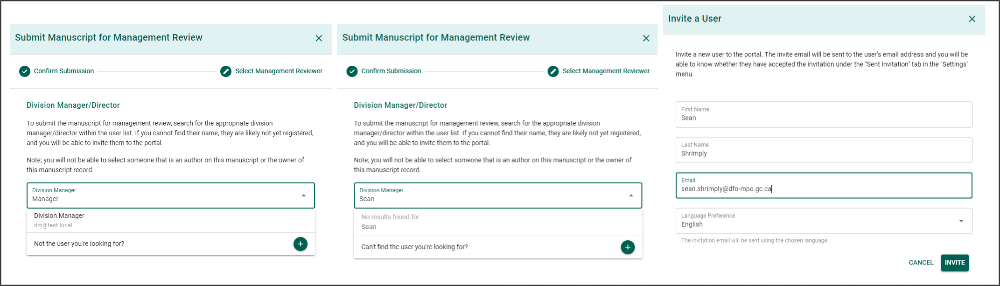
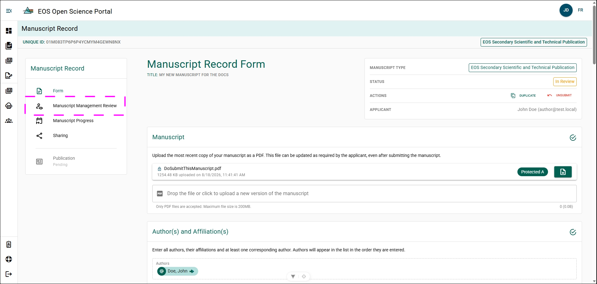
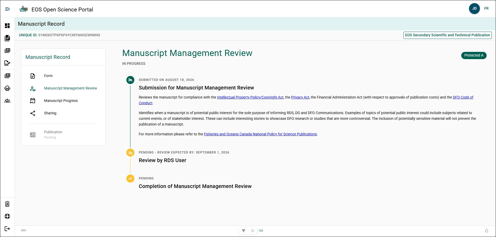
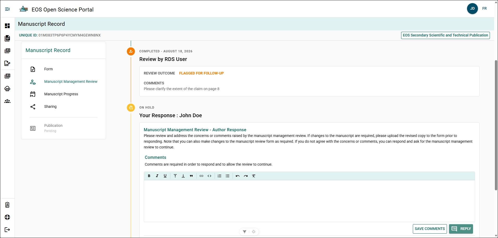
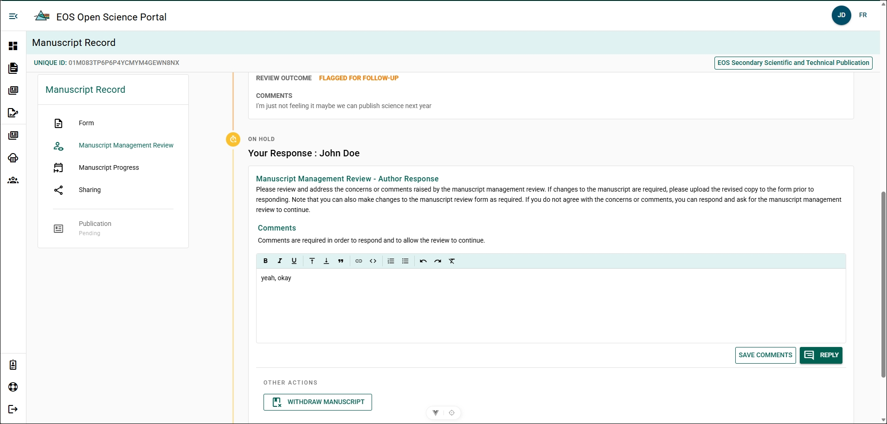

# Submit for Manuscript Management Review

Submit the Manuscript Record Form (MRF) once all required fields are complete.

:::important
The MRF **applicant or any listed author** can submit the manuscript for Manuscript Management Review.

The user who submits the MRF automatically becomes the **MRF applicant**.

If the person who created the MRF is **not an author** (for example, an administrative assistant), they may lose access to the MRF after submission. An author can share the MRF with them again if needed.
:::

**Steps**

1. Scroll to the bottom of the **Manuscript Record** page.
2. Click **Submit**.
3. Review the **Submission for Management Review** consent statement.
4. Click **Yes** to accept the consent.
5. Click **Next**.
6. Enter the name of the reviewing manager in the search field.
7. Select the manager from the search results.
8. Click **Submit**.

**Conditional Steps**

If the reviewing manager's name does not appear in the search results:

1. Click **Can't find the user you're looking for?**.
2. Enter the manager's **First Name**, **Last Name**, **E-mail**, and **Preferred Language**.
3. Click **Invite**.

**Result**

The manuscript is submitted for management review.

**Additional Information**
- For Third-Party Publication and Preprint publication types, Division Managers, Ecosystems and Oceans Science (EOS) National Capital Region (NCR) Directors, Regional Director of Sciences (RDSs), or EOS NCR Director Generals (DGs) may perform the Manuscript Management Review.
- For EOS Secondary Scientific and Technical Report publication type, RDS or EOS NCR DG may perform the Manuscript Management Review.

To confirm submission, check the **Status** box at the top-right of the **Manuscript Record** page. The status should display **In Review**.

## Manuscript Management Review Panel {/* #manuscript-management-review-panel */}

You can view and manage the progress of your MRF as it undergoes the Manuscript Management Review from the Manuscript Management Review panel.

Click **Manuscript Management Review** from the Manuscript Record menu.

The Manuscript Management Review panel will show:
- When the MRF was submitted for Manuscript Management Review.
- What the manager is reviewing for.
- When the current review is expected to have their review completed.
- The outcome of the Manuscript Management Review.

### Manuscript Management Review Comments {/* #manuscript-management-review-comments */}

The Manuscript Management Review panel allow the reviewing manager to leave comments. These comments can be viewed and replied to from the Manuscript Management Review Panel. Authors attributed to the MRF, Editors, and Directors will be able to see the comments. Comments will be saved with MRF record.

If a comment is left during the Manuscript Management Review, the corresponding author will receive an email notification and a alert notification will be visible on the Dashboard page for all attributed authors. The Manuscript Management Review 10-day timer is put on pause to allow time for revisions.

To continue the Manuscript Management Review:

**Steps**

1. Write comment in comment box.
2. Click **Reply**

**Result**

- The reply has been sent to the reviewing manager.
- An email has been sent to the reviewing manager notifying them of the reply.
- The 10-day timer has been resumed.

### Withdraw from Manuscript Management Review {/* #withdraw-from-manuscript-management-review */}

If the reviewing manager has flagged your MRF for revisions, you have the option to withdraw from the Manuscript Management Review. 

**Steps**
1. Write comment in comment box.
2. Click **Withdraw Manuscript**.
3. Confirm action.

**Result**

- Complete and end the Manuscript Management Review.
- Change the status of the Manuscript record to Withdrawn.
- Lock the Manuscript Record from any future edits.

