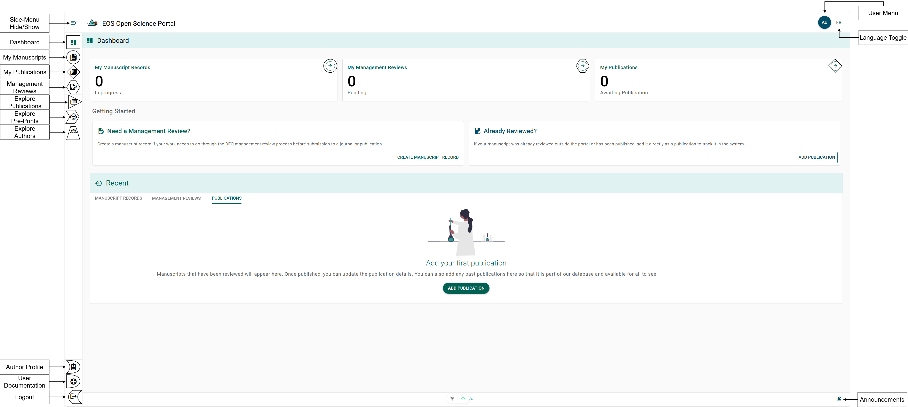
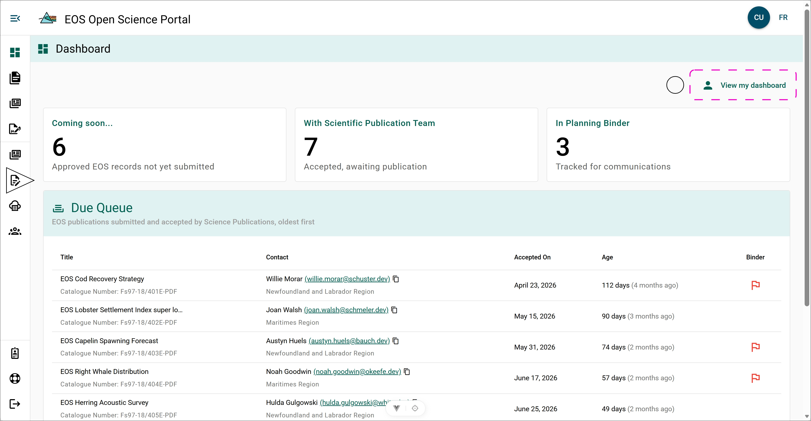

# Dashboard

## Author Dashboard {/* #author-dashboard */}

The **Dashboard page** is the main hub of the OSP and the page you will be
redirected to following your successful authentication. To access the **Dashboard
page** at any time, select the **Dashboard button** from the left-side menu.
Refer to the **Square Symbol** in the **Dashboard figure**.

### Navigation Buttons {/* #navigation-buttons */}

- □ [Dashboard](./dashboard.mdx)
- ○ [My Manuscripts](../manuscript-record-forms/my-manuscript-records-page.mdx)
- ◇ [My Publications](../publications/my-publications-page.mdx)
- ⬡ [My Management Reviews](../manuscript-management-review/my-management-reviews-page.mdx)
- △ [Publication Explorer](./publication-explorer.mdx)
- ⮞ [Preprint Explorer](./preprint-explorer.mdx)
- ▱ [Author Explorer](./author-explorer.mdx)
- ☽ [Author Profile](../settings/author-profile.mdx)
- ◗ [User Documentation](https://osp-pso-docs.ent.dfo-mpo.ca/)
- ☾ Logout
- ⍟ [Settings Menu](../settings)
- EN/FR English and French display toggle

## Editor Dashboard {/* #editor-dashboard */}

If you have a [Regional or Chief Editor Role](../settings/user-profile.mdx#user-roles), then you will be able to view the Editor Dashboard. From the Editor Dashboard, you will be able to see EOS Secondary Scientific and Technical Publications which have been submitted to Science Publications for review and publishing.

### Navigation Buttons {/* #navigation-buttons-1 */}

- ○ View My Dashboard
  - This buttons replaces the Editors dashboard with the Authors dashboard. A button in the same location will return you to the Editors dashboard.
- △ [Regional Manuscript Explorer](./regional-manuscript-explorer.mdx)

### Due Queue {/* #due-queue */}

- **Title**: Title of report with assigned Catelogue Number.
- **Contact**: Primary contact for the report with lead region.
- **Accepted On**: Date of when the report was submitted to Science Publications.
- **Age**: How many days have passed since the report was submitted to Science Publications.
- **Binder**: If this report has been flagged during the [Manuscript Management Review](../manuscript-management-review/reviewing-manager-role.mdx) that it should be considered for the [Planning Binder](../manuscript-management-review/submit-review.mdx#planning-binder) a red flag will appear.

