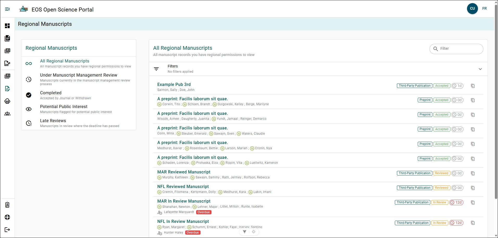

# Regional Manuscript Explorer

:::info
You must have the `Region Editor`, `Editor`, `Chief Editor`, or `Director` Role to view Regional Manuscripts!
:::

The Regional Manuscript Explorer allow Editors and Directors to explore what Manuscript Record Forms (MFR) are going through the Manuscript Management Review process.

## Regional vs National {/* #regional-vs-national */}

Users with a Regional Editor role will only see MRFs from their specific region. The Editor, Chief Editor, and Director role will allow the user to view MRFs from all regions.

## Quick Filter Menu {/* #quick-filter-menu */}

The **Regional Manuscripts** menu on the left-side of the page allows you to quickly filter the list of MRFs:
- **All Regional Manuscripts**: View all MRFs.
- **Under Manuscript Management Review**: MRFs which have been submitted for Manuscript Management Review.
- **Completed**: MRFs which have completed their Manuscript Management Review and have been accepted for Publication or Withdrawn.
- **Potential Public Interest**: MRFs which have been flagged for the Planning Binder during the Manuscript Management Review.
- **Late Reviews**: MRFs which have been in Manuscript Management Review for more then 10 days.

