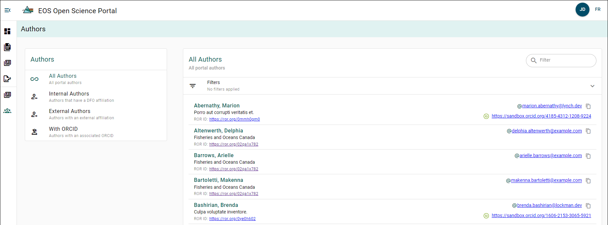

# Author Explorer

You can explore all authors who have created an account with the OSP or have been added as authors to a manuscript. By exploring an author, you can access a link to their organization's ROR page, their email address, and their ORCID (if available).

Authors can be filtered using the **Authors Filter Menu** on the left side of the page. The available filters are:
- All Authors
- Internal Authors
- External Authors
- Authors with ORCID