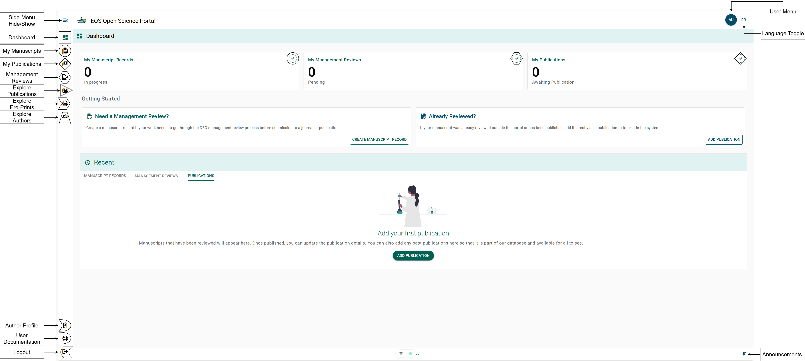

# Portal Navigation

## Purpose {/* #purpose */}

The Open Science Portal (OSP) aims to enhance Fisheries and Oceans Canada's
(DFO) scientific knowledge mobilization by adhering to Canada's Roadmap for Open
Science. The primary objective is to create an adaptable portal that simplifies
the publication process, ensures research traceability, promotes open
communication, and fosters collaboration. This portal empowers Ecosystem and Oceans Science Sector (EOS) staff
by providing a platform to track, discover, and promote scientific research and
expertise within the department.

Additional features of the OSP include storage and sharing of Manuscript Record
Forms (MRFs), publication status tracking, author expertise profiles, and ORCID
integration.

## Navigating the Dashboard {/* #navigating-the-dashboard */}

### Dashboard {/* #dashboard */}

The **Dashboard page** is the main hub of the OSP and the page you will be
redirected to following your successful authentication. To access the **Dashboard
page** at any time, select the **Dashboard button** from the left-side menu.
Refer to the **Square Symbol** in the **Dashboard figure**.

### Navigation Menu - "My" Pages versus "Explore" Pages {/* #navigation-menu---my-pages-versus-explore-pages */}

The side menu is separated into two primary sections. The "My" pages are for items
that relate directly to your account, while the "Explore" pages allow you to see
all public items of the portal, such as publications, authors, and preprints.

#### My Manuscripts Page {/* #my-manuscripts-page */}

The **My Manuscripts page** is where you can manage new and in-progress Manuscript Record Forms (MRF).

#### My Publications {/* #my-publications */}

The **My Publications page** is where you can manage pending or published publications.

#### My Manuscript Management Reviews {/* #my-manuscript-management-reviews */}

The **My Manuscript Management Reviews page** is where you can view manuscripts you have been asked to review.

#### User Menu Button {/* #user-menu-button */}

The **User Menu button** opens the menu where you can access your **[Account Settings](./account-settings.mdx)**, return to the dashboard, and **Logout**. To open the **User Menu**, select the **User Menu button** from the top-right navigation bar.

### Language Toggle Button {/* #language-toggle-button */}

The **Language Toggle button** allows you to switch the OSP's language between English and French. To change the language, select the **Language Toggle button** from the top-right navigation bar.

### Quick Action {/* #quick-action */}

#### Create Manuscript Record {/* #create-manuscript-record */}

The **CREATE MANUSCRIPT RECORD button** under the *Need a Management Review?* section allows you to launch the [Manuscript Record Creator Tool](../publication-process/manuscript-record-form.mdx#create-a-new-manuscript-record-form) directly from the Dashboard.

#### Add Publication {/* #add-publication */}

The **ADD PUBLICATION button** under the *Already Reviewd?* section allows you to launch the [Add Publication Tool](../publication-process/publications.mdx#creating-a-record-for-an-existing-publication) directly from the Dashboard.
