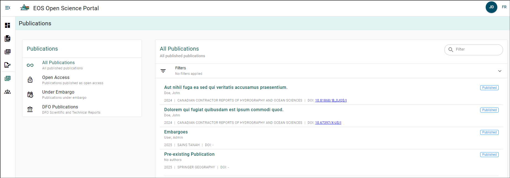
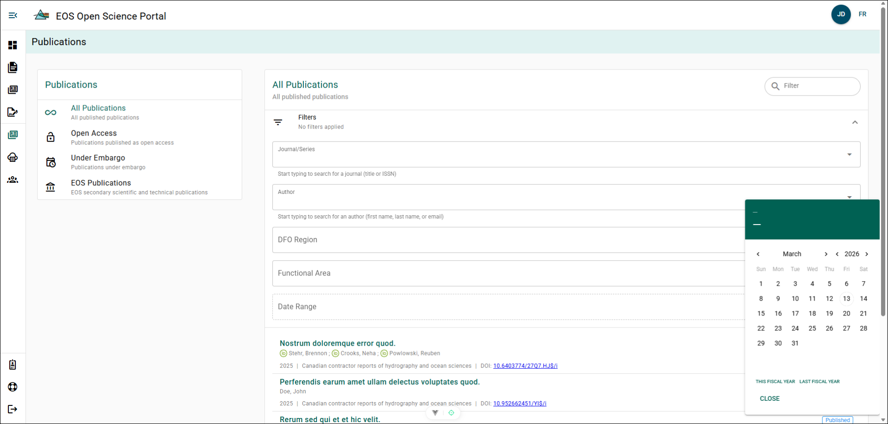

# Publication Explorer

You can explore publications and their details that have been submitted to the OSP. Please note that if a publication is under embargo, only its details can be viewed.

You can filter publications by type using the **Publication Filter Menu** located on the left side of the page.

:::tip

The filtering table is also available for roles with access to the Regional Manuscripts Explorer!

:::

