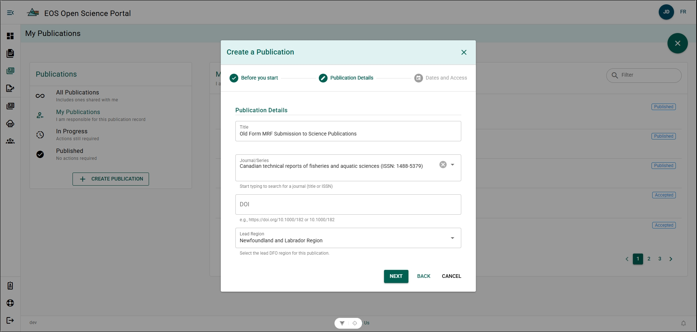
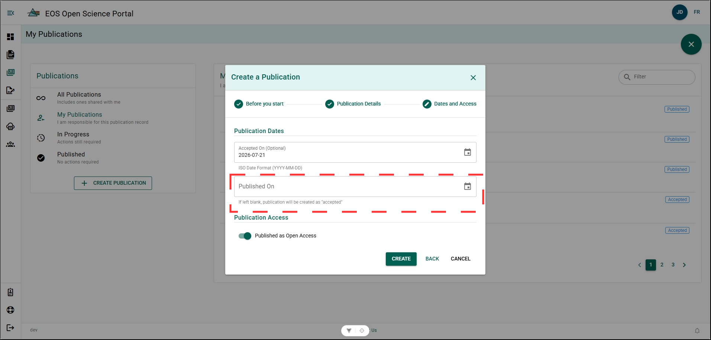
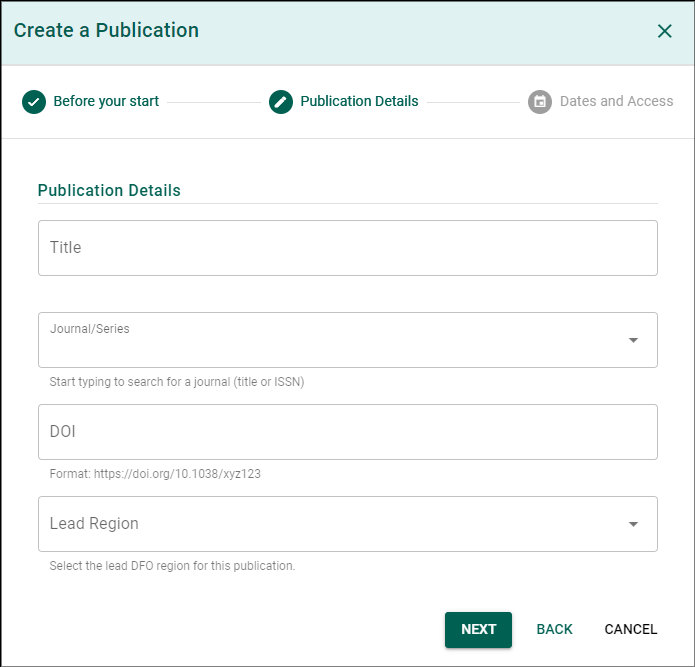

# Create a Publication Details Form

## Creating a Record from an Old Form MRF Approval prior Publication {/* #creating-a-record-from-an-old-form-mrf-approval-prior-publication */}

If you have completed the Old Form MRF approval, but have not published yet, you can create a Accepted Publication Record. This situation may occur if you were going through the publication process during the adoption transition to the OSP. Completing this step will automatically forward on your report to Science Publications for submission to Libraries.

**Steps**

1. Click **+ CREATE PUBLICATION** from the Publications menu.
2. Click **NEXT**.
3. Complete the Publication Details form and Click **NEXT**:
    - Title
    - Journal Series
    - DOI (Optional)
    - Lead Region
4. Complete the Dates and Access form and Click **CREATE**:
    - Accepted On (Optional)
    - Published On - **LEAVE BLANK!**
    - Published as Open Access

**Result**

- A new Publication Details Form has been created.
- The new Publication Details Form the status: **Accepted**.
- The Publication Record Form has been added to the Editor's dashboard.

## Creating a Record for an Existing Publication {/* #creating-a-record-for-an-existing-publication */}

If you have published outside, or before, the OSP, creating a Publication Record for your work is an excellent way to improve its visibility within DFO and help create a centralized digital archive for documents associated with your publication.

**Steps**

1. Hover over the left-sidebar menu to expand the page selection menu.
2. Select **My Publications**.
3. Click **CREATE PUBLICATION**.
4. Click **NEXT**.
5. Complete the **Publication Details form** and Click **NEXT**.
    - Title
    - Journal/Series
    - DOI (Optional)
    - Lead Region
6. Complete the Publication Dates and Publication Access form and Click **CREATE**.
    - Accepted On (Optional)
    - Published On
    - Published as Open Access
    - Embargoed Until (If applicable)

**Result**

- A new Publication Details Form has been created.

