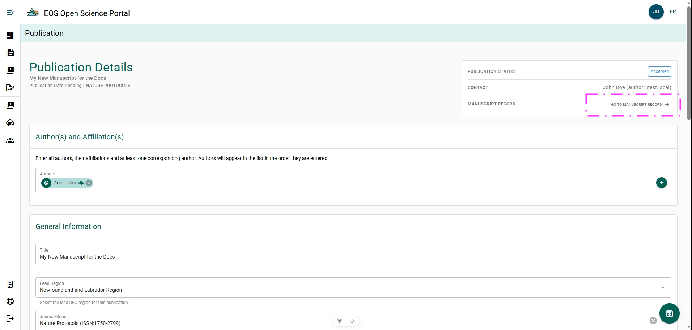
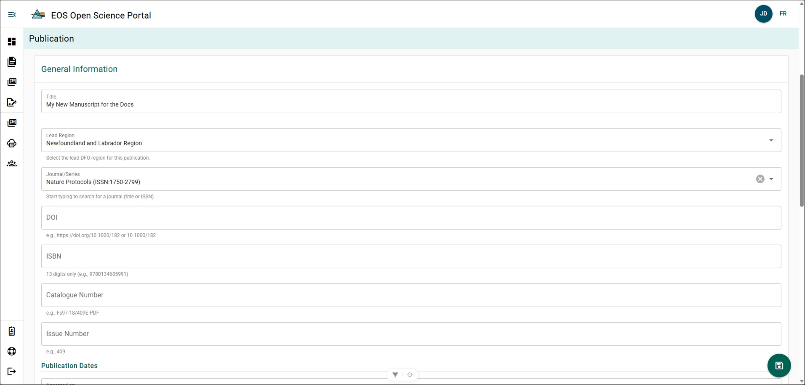
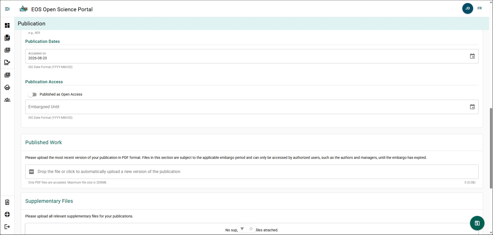
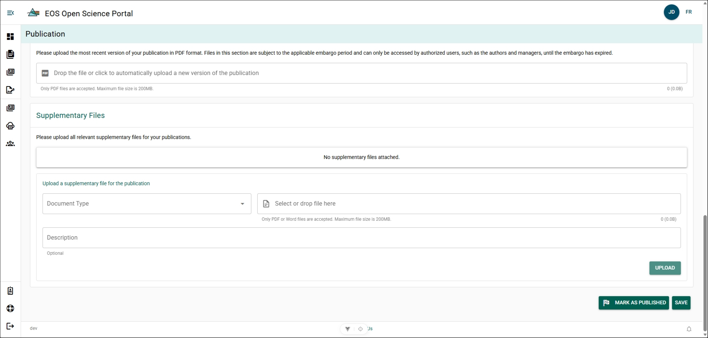
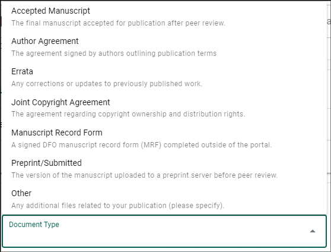

# Manage a Publication Details Form

A Publication's details may evolve after submission to a journal. The Publication Details Form should be updated as edits are made, additional metadata is generated, and documents are created.

:::tip
**Save Your Progress**

Save your manuscript frequently to prevent losing work.

You can save your progress by:

- Clicking the circular **Floppy-Disk** button in the bottom-right corner of the page.
- Scrolling to the bottom of the form and clicking **Save**.

After saving, you can safely log out of the OSP.
:::

The Publication Details Form is automatically created from your MRF once you have submitted your manuscript to the publisher. You can always jump back to the MRF tied to this Publication Details Form by clicking **Go to Manuscript Record** in the top-right details menu.

## Author(s) and Affiliation(s) {/* #authors-and-affiliations */}

**Steps**

Repeat these steps for each author:

1. Click **+**.
2. Search the author in the **Author** field using their name or email.
3. Select **Yes** for Corresponding Author if the author will be the primary contact within DFO.
4. Select **Yes** for **Group Author** if the author represents a group and search the group by name.
5. Click **Save**.

**Result**

- The selected author(s) are added to the Publication Details Form.
- Authors added can view and edit the Publication Details Form but cannot delete it.

:::info
An author who does not have a valid email address and is credited in the publication does not need to be added.
:::

## General Information {/* #general-information */}

### Title {/* #title */}

**Steps**

1. Click **Title**.
2. Update title text.
3. Click **SAVE**.

**Result**

- The Publication Details Form title has been updated.

### Lead Region {/* #lead-region */}

**Steps**

1. Click **Lead Region**.
2. Select Region.
3. Click **SAVE**.

**Result**

- The Lead Region has been updated.

### Journal/Series {/* #journalseries */}

**Steps**

1. Click **Journal/Series**.
2. Search ISSN or Journal/Series title.
3. Select Journal/Series. 
4. Click **SAVE**

**Result**

- The Journal/Series has been updated.

**Additional Information**

- If it is not listed, please email [OSP Support](mailto:DFO.OpenScience-ScienceOuverte.MPO@dfo-mpo.gc.ca).

### DOI {/* #doi */}

**Steps**

1. Click **DOI**.
2. Input DOI in format: `https://doi.org/10.1038/xyz123`.
3. Click **SAVE**.

**Result**

- DOI has updated.

**Additional Information**

- For EOS Secondary Scientific and Technical Publications, a DOI will be generated for you by the Science Publications team.

### ISBN {/* #isbn */}

**Steps**

1. Click **ISBN**.
2. Input issued ISBN.
3. Click **Save**.

**Result**

- ISBN has been updated.

### Catalog Number {/* #catalog-number */}

**Steps**

1. Click **Catalog Number**.
2. Input issued catalog number.
3. Click **Save**.

**Result**

- Catalog Number has been updated.

### Issue Number {/* #issue-number */}

**Steps**

1. Click **Issue Number**.
2. Input issued issue number.
3. Click **Save**.

**Result**

- Issue Number has been updated.

###  Publication Dates {/* #publication-dates */}

#### Accepted On {/* #accepted-on */}

**Steps**

1. Click **Accepted on**.
2. Select date.
3. Click **Save**.

**Result**

- Accepted on date has been updated.

#### Published On {/* #published-on */}

**Steps**

1. Click **Published on**.
2. Select date.
3. Click **Save**.

**Result**

- Published on date has been updated.

**Additional Information**

- The Published on section won't be visible until you mark your Publication Details Form as published.

### Publication Access {/* #publication-access */}

#### Open Access {/* #open-access */}

By default, all EOS Secondary Scientific and Technical Publications are published as Open Access!

**Steps**

1. Click **Published as Open Access** to toggle True.

**Result**

- Toggle switch will go from grey to green.
- Embargoed Until section will disappear.
- Publication will be marked as Open Access.

#### Other Licencing Agreement {/* #other-licencing-agreement */}

Some Third-Party publishers will have an embargo period where you will not be able to publish or share your manuscript elsewhere until a pre-determined date. Setting an Embargoed Until date will allow you to mark your manuscript as published but will prevent OSP users from seeing your publication until after that date.

**Steps**

1. Click **Embargoed Until**.
2. Select date.
3. Click **Save**. 

**Result**

- Your publication will not be viewable to OSP users until after the selected embargoed until date.

**Additional Information**

- Authors listed on the Publication Details Form, your regions Editors, and users with a Director role will be able to download and view your manuscript.
- If the Embargoed Until box does not appear, ensure Published as Open Access is toggled to False (grey).

### Published Work {/* #published-work */}

Published Work is for a PDF copy of your work which the publisher has published.

**Steps**

1. Click **Drop the file or click to automatically upload a new version of the publication**
2. Select your Publication from the File Explorer.
3. Click **Save**.

**Result**

- A PDF copy of your published work has been uploaded.

**Additional Information**

- If you have set an Embargoed Until date, your Published Work will not be viewable by OSP users until after that date passes.

## Supplementary Files {/* #supplementary-files */}

Supplementary files can be uploaded to your publication record as they are created. These files can be PDF or Word files and should be uploaded to complete the publication details form.

**Steps**

1. Click **Document Type**.
2. Select document type.
3. Click **Select or drop file here**.
4. Select file from File Explorer.
5. Click **Description** and input contextual information. (optional)
6. Click **Upload**.

