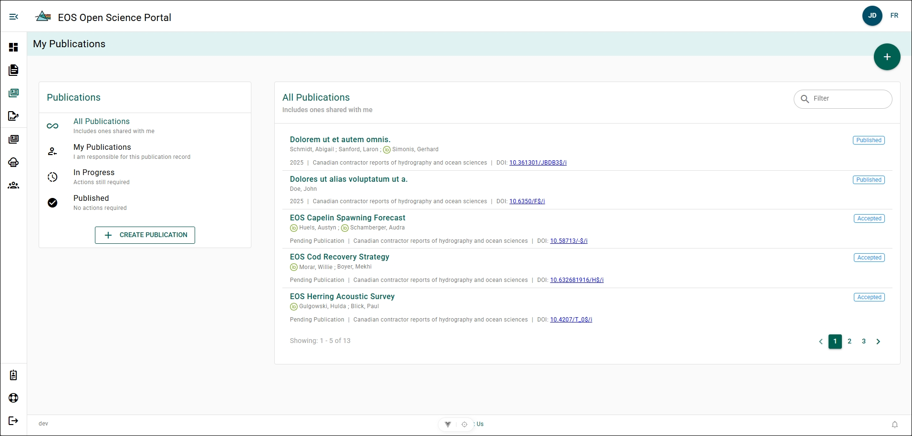

# My Publications Page

The **My Publications page** allows you to view all publication records that you have created or that have been shared with you. From this page, you can create new publication records or manage existing ones.

## All Publications Labels {/* #all-publications-labels */}

- **ORCID**: Green circle with the letters "iD" left of an author's name denote if the author has associated an [ORCID](../references/orcid) with their account.
- **Year of Publication**: A year in grey or the words "Pending Publication" if the Publication Record Form has not been marked as published.
- **Journal**: The name of the journal or series which the publication has been submitted to.
- **DOI**: The [Digital Object Identifier (DOI)](https://www.doi.org/) hyperlink for the publication.
- **Status**: The word "Accepted" or "Published" in blue text in a blue box. This status shows whether the publication has been marked as published or not.

