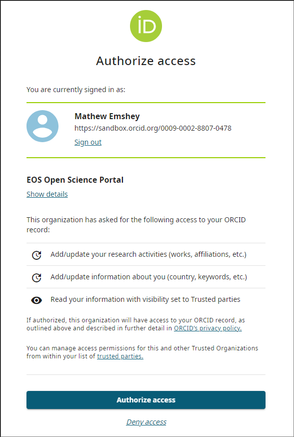
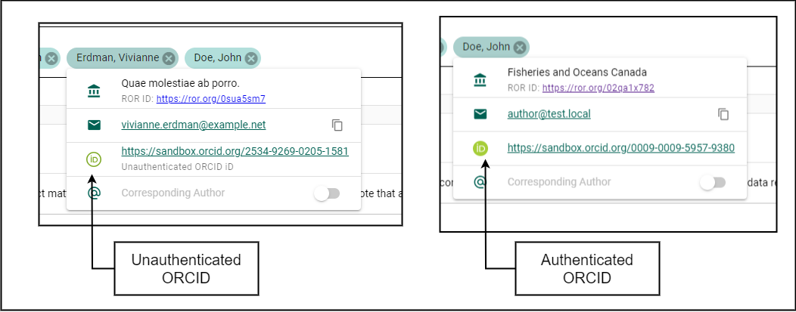
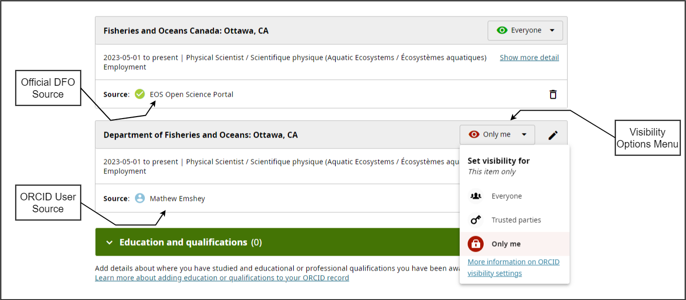
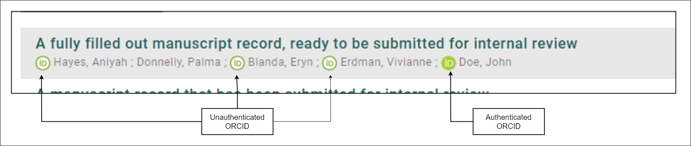
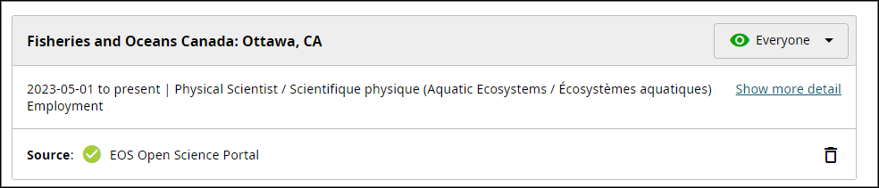
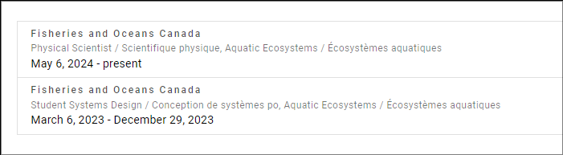

# ORCID

[ORCID (Open Researcher and Contributor ID)](https://orcid.org/) is a unique, persistent digital identifier (PID) that distinguishes individual researchers and their work. It connects contributions—such as articles, datasets, and reviews—across organizations, journals, and funding bodies. ORCID ensures researchers receive proper attribution and recognition for their work, even as they change institutions or roles.

ORCID simplifies data collection and reporting, enhances collaboration and visibility across projects, and improves the management of researcher profiles. This supports transparency and continuity in scientific endeavors.

## Create an ORCID {/* #create-an-orcid */}

If you **do not already have** an ORCID account:

**Steps**

1. Login to [**osp-pso.ent.dfo-mpo.ca**](https://osp-pso.ent.dfo-mpo.ca/).
2. Click **User Menu** in the top-right corner of the page.
3. Select **Settings**.
4. Click **Author Profile**.
5. Click **CREATE OR CONNECT YOUR ORCID ID** under the ORCID Integration section.
6. Click **Register now** link under the **Sign in to ORCID** header.
7. Complete the registration form and click **Next Step**.

:::tip
It is recommended to use your personal email as your **Primary Email** since your ORCID profile is personal and not tied to DFO.  
You may use your @dfo-mpo.gc.ca email as the **Secondary Email**.
:::

8. Complete the password setup and click **Next Step**.
9. Skip the *Current employment* form by clicking **Skip this step without adding an affiliation** below the **Next Step** button.  
    - (Your **Employment Record** will be added in the [Add Employment through the OSP](#add-employment-through-the-osp) section.)
10. Choose your preferred profile visibility and click **Next Step**.
11. Agree to the ORCID Terms of Service and click **Complete registration**.
12. Click **Authorize access**.  
    - For details on what access you are authorizing for the OSP, see [Authorize Access](#authorize-access).
13. Click **CONTINUE** to finalize the process.
14. Check the inbox of your primary email and click **Verify your email address**.

**Result**

- Your ORCID account is now created, verified, and linked to your OSP profile!

## Add an Existing ORCID to Your OSP Profile {/* #add-an-existing-orcid-to-your-osp-profile */}

If you **already have** an ORCID account and want to link it to your OSP profile:

**Steps**

1. Login to [**osp-pso.ent.dfo-mpo.ca**](https://osp-pso.ent.dfo-mpo.ca/).
2. Click **User Menu** in the top-right corner of the page.
3. Select **Settings**.
4. Click **Author Profile**.
5. Click **CREATE OR CONNECT YOUR ORCID ID** under the **ORCID Integration** section.
6. Log in to your existing ORCID account and click **Sign in to ORCID**.
7. Click **Authorize access**.  
    - For details on the access you are granting, see [Authorize Access](#authorize-access).
8. Click **CONTINUE**.

**Result**

- Your ORCID account is now linked to your OSP profile!

## Authorize Access {/* #authorize-access */}

To optimize your experience with ORCID through the OSP, we recommend authorizing the OSP to update your ORCID profile on your behalf. This authorization confirms your DFO affiliation and allows the OSP to automatically add attributes like affiliations, areas of expertise, and research contributions to your ORCID profile.  

By managing your employment records through the OSP, you enable the appearance of an official DFO source badge on your ORCID profile, providing visible, verified credentials that enhance your professional reputation.

## Manage Employment Records {/* #manage-employment-records */}

Linking your DFO employment to your ORCID profile through the OSP increases the credibility of your profile, making it more visible and trusted within the scientific community.

### Add Employment through the OSP {/* #add-employment-through-the-osp */}

To add an employment record via the OSP:

**Steps**

1. Open **Author Profile** page.
2. Click **ADD EMPLOYMENT**.
3. Complete *Add a DFO employment to ORCID* form:
   - **Organization**: Fisheries and Oceans Canada (pre-filled by default)
   - **Department**: Ecosystems and Oceans Science / Sciences des écosystèmes et des océans
   - **Role/Job Title**: For example, *Biologist / Biologiste*
   - Leave **End Date** blank if you are adding your current role.
4. Click **CREATE**.

:::tip
**Best Practice:** Include your Department and Role Title in both English and French!  
Refer to [Best Practices](#best-practices) for further guidance.
:::

**Result**

- An employment record has been added to your ORCID.

### Hide Non-DFO Sourced Employment {/* #hide-non-dfo-sourced-employment */}

When you create your ORCID account, you may add your current employment, which will be displayed as *Sourced by your ORCID User Account*. However, it is recommended to have all records related to your DFO activities include the DFO Source Badge, in line with [ORCID Best Practices](#best-practices).

To hide your self-sourced employment record:

**Steps**

1. Add your current and/or previous employment records by following the steps in [Add Employment through the OSP](#add-employment-through-the-osp).
2. Log in to your ORCID account at [orcid.org](https://orcid.org/signin).
3. Under the *Employment* section, find the employment record labeled **Source: *Your Name***.
4. Click **Visibility** in the top-right corner of the record to expand the *Visibility Settings*.
    - Visibility options include **Everyone**, **Trusted parties**, or **Only me**, depending on the setting chosen during account creation.
5. Select **Only me** to hide the employment record.

**Result**

- The employment record is  now hidden on your ORCID.

### Edit Employment Records {/* #edit-employment-records */}

To edit an employment record:

**Steps**

1. Open **Author Profile** page.
2. Select the employment record you wish to edit.
3. Modify the details in the **Edit your DFO employment ORCID record** form.
4. Click **SAVE**.

**Result**

- The employment record has been edited.

### Delete Employment Records {/* #delete-employment-records */}

To delete an employment record:

**Steps**

1. Open **Author Profile** page.
2. Select the employment record.
3. Click **DELETE**.
4. Confirm the action.

**Result**

- The employment record has been removed from your OSP and ORCID.

## Disconnect Your ORCID {/* #disconnect-your-orcid */}

Once disconnected, the OSP will delete all keys and tokens used to modify your ORCID profile, preventing further updates by the OSP. However, any modifications previously made by the OSP will remain on your ORCID profile.

To disconnect your ORCID profile from your OSP account:

**Steps**

1. Open **Author Profile** page.
2. Click **DISCONNECT YOUR ORCID ID**.
3. Confirm the action.

**Result**

- Your ORCID is no longer associated with your OSP profile.

**Additional Information**

- To remove or edit these changes, log in to your account on the [ORCID website](https://orcid.org/).
- If you wish to reconnect your ORCID profile to your OSP account, follow the steps in [Add an Existing ORCID to Your OSP
Profile](#add-an-existing-orcid-to-your-osp-profile).

## Best Practices {/* #best-practices */}

Below are the recommended best practices for using ORCID within the context of the OSP.

### Authenticate Your ORCID {/* #authenticate-your-orcid */}

Authenticating your ORCID account allows the OSP to update your ORCID profile with information from an official DFO source. Follow the steps in [Add an Existing ORCID to Your OSP Profile](#add-an-existing-orcid-to-your-osp-profile) to authenticate your account. If you do not have an ORCID account, you can create one through the OSP by following [Create an ORCID](#create-an-orcid).

### Use the Official DFO Source Badge {/* #use-the-official-dfo-source-badge */}

Employment records added through the ORCID website will be sourced by you, whereas those added through the OSP will display an official DFO Source badge. Re-add any DFO-related records through the OSP to apply this badge.

Refer to the example in [Hide Non-DFO Sourced Employment](#hide-non-dfo-sourced-employment) for a visual comparison of source badges.

### Bilingual Organization and Role Title {/* #bilingual-organization-and-role-title */}

- Include both English and French versions of your Organization and Role Title.
- Choose the order of languages (English/French or French/English) based on your preference.
- Separate the languages with a `/`.
    - Example: **English / French** or **French / English**

### Update Employment Records When Your Employment Changes {/* #update-employment-records-when-your-employment-changes */}

Keep your ORCID employment records up-to-date, especially when your role at DFO ends (including Acting roles). Be sure to add an **End Date** to these records via the OSP. This ensures your employment history remains clear, professional, and accurate.

