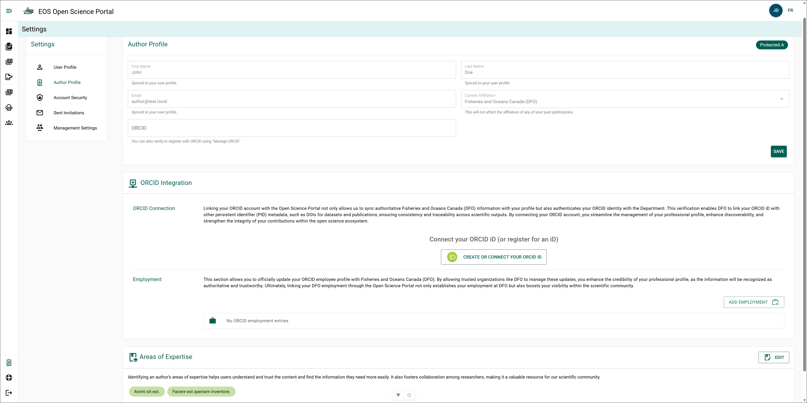
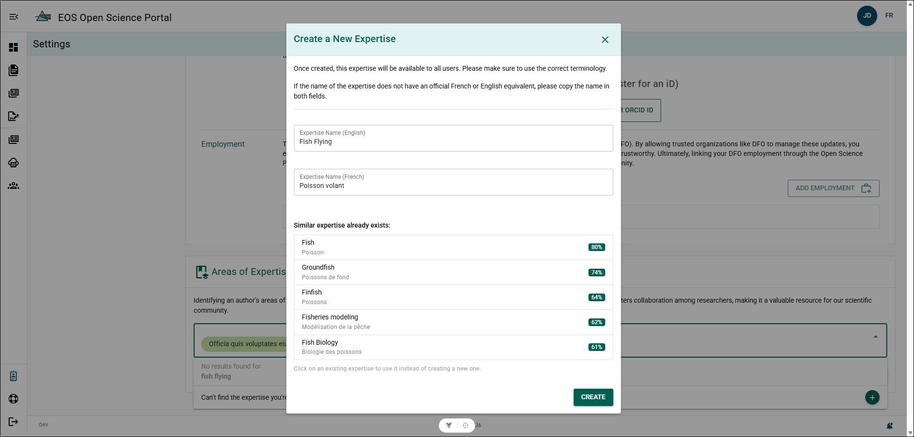

# Author Profile Page

Author Profile allows you to define information that will improve your ability to connect with other DFO researchers and keep your ORCID up to date.

## Author Profile {/* #author-profile */}

Information within your Author Profile is synchronized from your [User Profile](./user-profile).

**Additional Information**

- The OSP can only be accessed from within the DFO intranet, therefore, your email and current affiliation cannot be changed. If you would like to have a non-DFO author account created, please contact the [Open Science Portal Support Team](mailto:DFO.OpenScience-ScienceOuverte.MPO@dfo-mpo.gc.ca).

### ORCID {/* #orcid */}

If you have an ORCID but **do not** want to authenticate your OSP account with ORCID, you can manually add it to your Author Profile. However, it is highly recommended that you connect and authenticate your OSP account with your ORCID. Please see the [ORCID section](../references/orcid) for more information.

**Steps**

1. Click **ORCID**.
2. Input your ORCID iD.
3. Click **Save**.

**Result**

- Your ORCID iD has been added to your Author Profile.
- An Unauthenticated ORCID symbol will appear next to your name within the OSP.

## ORCID Integration {/* #orcid-integration */}

The OSP allows for the connection and authentication of your **Open Researcher and Contributor ID (ORCID)** with your OSP account. This integration enables your ORCID records to be managed through the OSP with an official DFO tag.

For detailed instructions on ORCID integration and how to connect your ORCID account with the OSP, please refer to the [ORCID section](../references/orcid).

## Areas of Expertise {/* #areas-of-expertise */}

The **Areas of Expertise** allow you to add areas in which you are a subject matter expert. Adding areas of expertise improve your ability to connect with other authors.

**Steps**

1. Click **EDIT**.
2. Click **Areas of Expertise** field to select it.
3. Input your expertise.
4. Select your expertise from the filtered list.
5. Click **SAVE**.

**Result**

- The expertise has been added to your author profile.

**Additional Information**

- You can have multiple areas of expertise associated with your author profile.

### If your Area of Expertise is not listed {/* #if-your-area-of-expertise-is-not-listed */}

If you Area of Expertise is not found in the search field, you can add it to the OSP! 
Once an Area of Expertise is created, it becomes available for all OSP users.

**Steps**

1. Click **EDIT**.
2. Click **Areas of Expertise** field to select it.
3. Input your expertise.
4. Click **Can't find the expertise you're looking for? +**.
5. Type the name of the expertise in English and in French (Use the same name in both language boxes if there is no French or English equivalent).
6. Click **CREATE**.

**Result**

- The expertise has been added to your author profile.
- The expertise has been added to the OSP and is now available to other authors.

