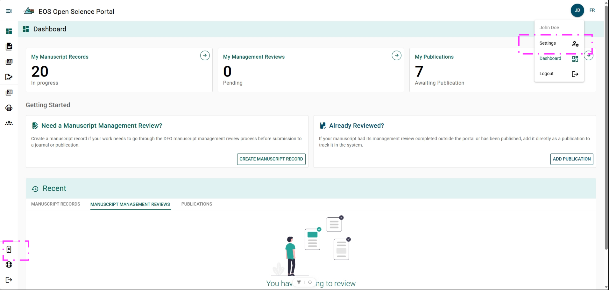

# Settings

## Accessing Settings Menu {/* #accessing-settings-menu */}

**Steps**

1. Click **Your Initials**.
2. Click **Settings**

**Result**

- User Settings page has opened.

**Alternative**

1. Click **Author Profile**

**Result**

- Author Profile page within settings menu has opened.

