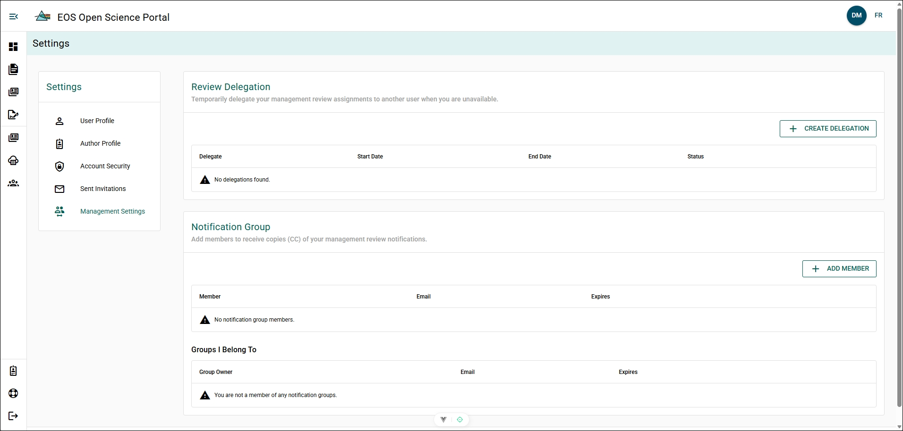
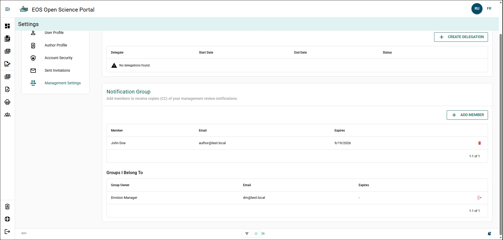
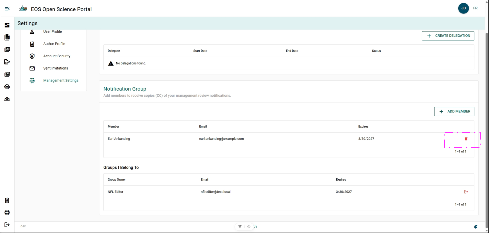
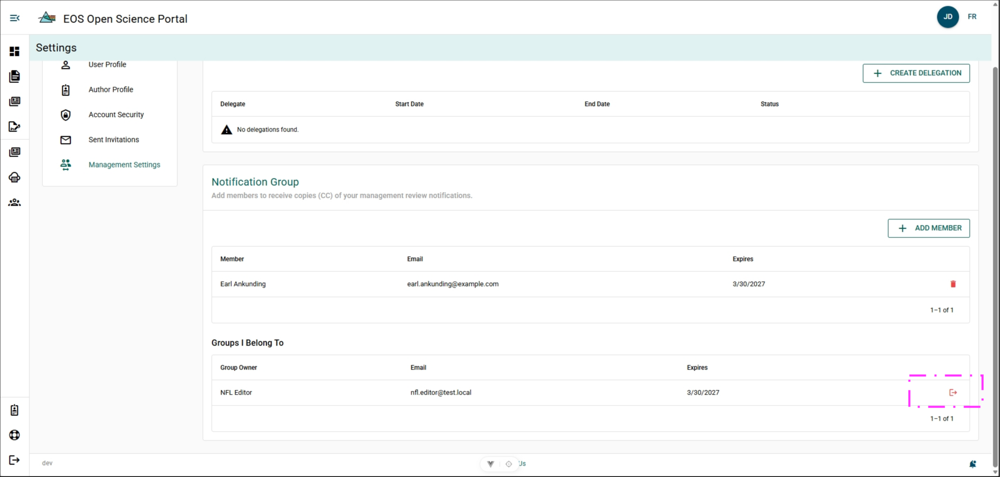

# Management Settings

## Review Delegation {/* #review-delegation */}

Review Delegation allows you to assign another user to complete Manuscript Management Reviews on your behalf for a set period of time. Creating a Review Delegation is usually done when you are going on a leave of absence or an acting assignment.

Detailed instruction for creating and managing a Review Delegation can be found under the [Manuscript Management Review](../manuscript-management-review/delegating) section.

## Notification Group {/* #notification-group */}

Notification Group allow you to select which users you would like receive Manuscript Management Review emails sent to you from the OSP.

The Manuscript Management Review emails your notification group will receive include:
- Manuscript submitted for Manuscript Management Review
- Review step notifications (new reviewer assigned)
- Author has unsubmitted a manuscript from Manuscript Management Review
- Management review due/overdue reminders
- Management review pending weekly summaries
- Management review complete notifications
- Delegation created notifications
- Planning binder reminders

### Add Member to your Notification Group {/* #add-member-to-your-notification-group */}

**Steps**

1. Click **+ ADD MEMBER**.
2. Complete form:
    - **User** - Select the user you want to receive the emails.
    - **Expires** (optional) - Select the date you want the user to stop receiving the emails.
3. Click **SAVE**.

**Result** 

- The user is added to your Notification Group.

### Remove Member from your Notification Group {/* #remove-member-from-your-notification-group */}

**Steps**

1. Click **Delete** at the end of the user's row.

**Result**

- The user is removed from your Notification Group. 
- The user will receive an email notifying them of this change.

#### Remove yourself from a Notification Group {/* #remove-yourself-from-a-notification-group */}

**Steps**

1. Click **Leave** at the end of notification group's row.

**Result**

- You are removed from that Notification Group. 
- The group owner will receive an email notifying them of this change.

