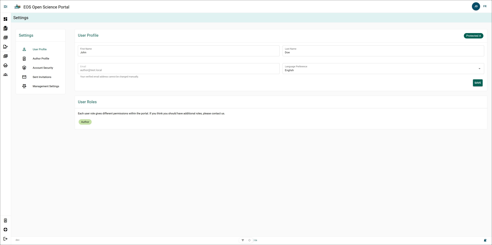

# User Profile

The User Profile page allows you to update how your name will appear within the OSP and what language, by default, the OSP will open in. Your User Profile data is automatically populated from your DFO-Microsoft credentials.

### First and Last Name {/* #first-and-last-name */}

The **First and Last Name** associated with your account will appear in gray. If you wish to change the name associated with your account:

**Steps**

1. Click **Name Field**.
2. Update name.
3. Click **Save**.

**Result**

- Name has been updated.

### Email {/* #email */}

The email associated with your account will appear in gray and cannot be edited. This email is also used to log in to your Open Science Portal account. If you would like to make changes to the email, please email the [Open Science Portal Support Team](mailto:DFO.OpenScience-ScienceOuverte.MPO@dfo-mpo.gc.ca).

### Default Language {/* #default-language */}

The default language for your account will appear in this box. If you would like to change your default language:

1. Click **Default Language**.
2. Select desired default language.
3. Click the **Save**.

**Result**

- The default language for your OSP account has been updated.

## User Roles {/* #user-roles */}

User roles identify the type of account you have. All users are given the Author role upon account creation.

Email the [OSP Support Team](mailto:DFO.OpenScience-ScienceOuverte.MPO@dfo-mpo.gc.ca) to add or remove roles to your account.

### Permission Summary Table {/* #permission-summary-table */}

| Permission | Author (default) | Director | Editor | Chief Editor | Regional Editor | Regional Observer |
|------------|:----------------:|:--------:|:------:|:------------:|:---------------:|:-----------------:|
| Create Manuscript Records | ✓ | ✓ | ✓ | ✓ | ✓ | ✓ |
| Create Publications | ✓ | ✓ | ✓ | ✓ | ✓ | ✓ |
| Update Any Authors | ✗ | ✗ | ✓ | ✓ | Regional | ✗ |
| Complete Management Review | ✗ | ✓ | ✗ | ✗ | ✗ | ✗ |
| View Any Manuscript Record | ✗ | ✓ | ✓ | ✓ | Regional | Regional |
| Update Any Publications | ✗ | ✗ | ✓ | ✓ | Regional | ✗ |
| Delete Any Publications | ✗ | ✗ | ✗ | ✓ | ✗ | ✗ |
| Publish EOS Secondary Publications | ✗ | ✗ | ✗ | ✓ | ✗ | ✗ |
| Update Author Affiliations | ✗ | ✗ | ✓ | ✓ | ✗ | ✗ |
