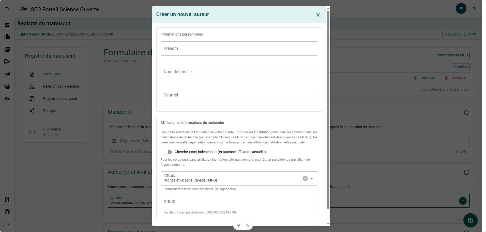

# Gestion des auteurs et des affiliations

## Auteurs {/* #authors */}

### Créer un nouvel auteur {/* #create-a-new-author */}

Créez un nouvel auteur si la personne ne figure pas dans la **Liste des auteurs**.

**Étapes**

1. Cliquez sur **Vous ne trouvez pas l’auteur que vous recherchez?**.
2. Remplissez le formulaire.
   - Prénom
   - Nom de famille
   - Courriel
   - Affiliation
   - ORCID (facultatif)
3. Cliquez sur **Créer**.

**Résultat**

- L’auteur est ajouté à la Liste des auteurs.
- L’auteur est ajouté au répertoire des auteurs du PSO.

**Autre type d’affiliation - Chercheur indépendant**

- Activez cette option uniquement si l’auteur se représente lui-même et n’agit pas au nom d’une institution.
- Il est fortement recommandé d’inclure l’ORCID de l’auteur afin d’obtenir un dossier de publication plus précis et complet.
- Pour obtenir de plus amples renseignements, consultez l’[entrée de la foire aux questions](../frequently-asked-questions.mdx#what-email-or-affiliation-do-i-use-for-an-author-who-no-longer-works-at-dfo).

### Supprimer un auteur {/* #remove-an-author */}

Supprimez un auteur s’il ne doit plus être associé au manuscrit.

**Étapes**

1. Cliquez sur l’icône **X** à côté du nom de l’auteur.
2. Cliquez sur **OK**.

**Résultat**

- L’auteur est supprimé du formulaire de dossier de manuscrit et ne peut plus le consulter ni le modifier.

## Affiliations {/* #affiliates */}
### Créer une nouvelle organisation {/* #create-a-new-organization */}

Créez une nouvelle organisation si l’organisation ou le groupe requis ne figure pas dans la **Liste des organisations** du PSO. Cette fonctionnalité est généralement utilisée pour les groupes autochtones, les groupes de travail à long terme ou les organisations qui ne sont pas déjà enregistrées dans le système.

:::important
Utilisez le **nom officiel** de l’organisation lors de la création d’un nouveau dossier.

Les noms officiels des organisations peuvent être trouvés dans le **Research Organization Registry (ROR)** :  
[Research Organization Registry](https://ror.org/)

Si l’organisation ne figure pas dans le ROR, utilisez son nom officiel le plus récent.
:::

**Étapes**

1. Cliquez sur **Vous ne trouvez pas l’organisation que vous recherchez?**.
2. Remplissez le formulaire.
   - Nom de l’organisation (anglais)
   - Nom de l’organisation (français)
   - Abréviation (anglais) (si disponible)
   - Abréviation (français) (si disponible)
3. Cliquez sur **Créer**.

**Résultat**

- L’organisation est ajoutée à la **Liste des organisations** et peut être sélectionnée comme **Affiliation** ou **Groupe de travail**.
