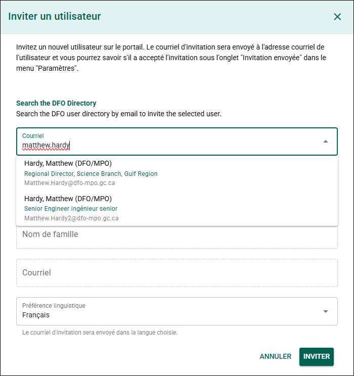
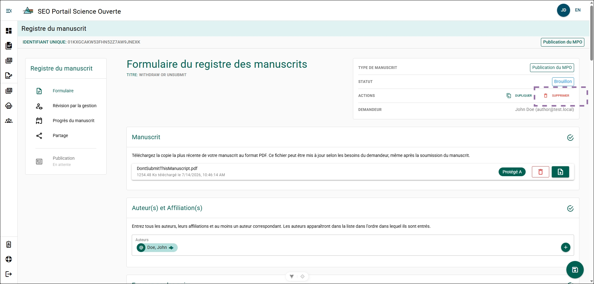
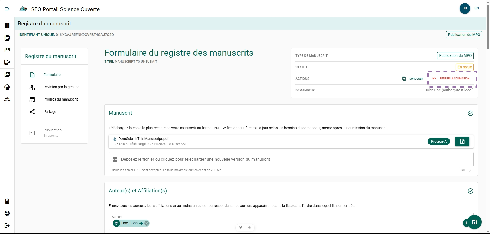
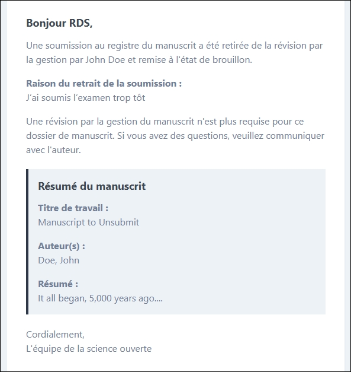
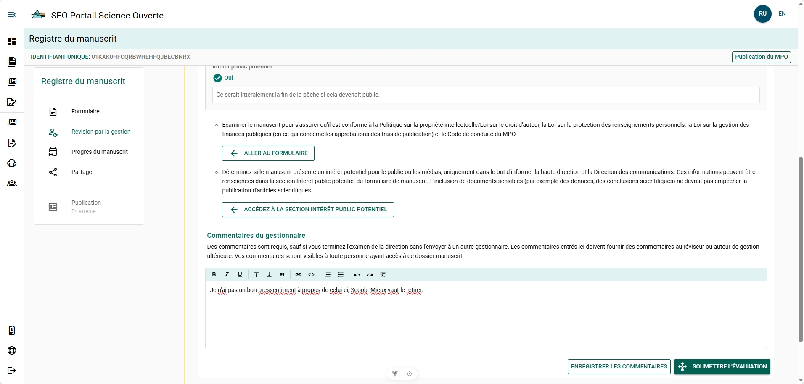
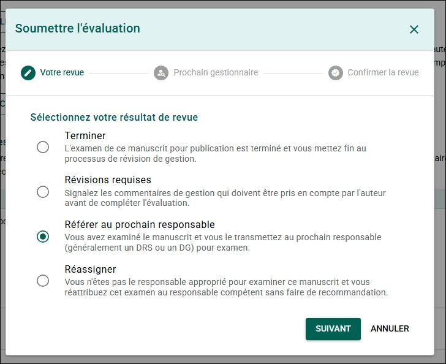
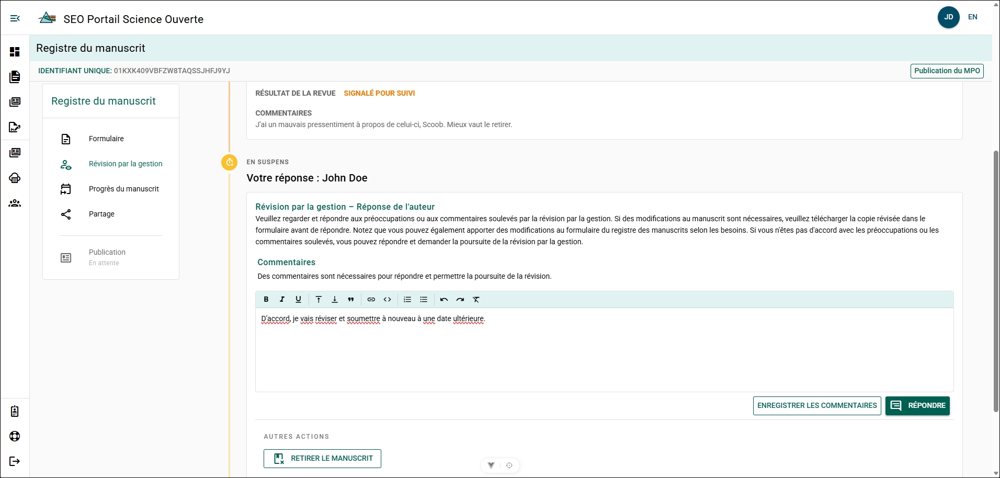

---

sidebar_position: 1
description: Fonctionnalités supplémentaires offertes dans le PSO.
------------------------------------------------------------------

# Fonctionnalités supplémentaires

## Auteurs et organisations {/* #authors-and-organizations */}

### Créer une nouvelle organisation {/* #create-a-new-organization */}

Créez une nouvelle organisation si l’organisation ou le groupe recherché ne figure pas dans la **liste des organisations** du PSO. Cette fonctionnalité est généralement utilisée pour les groupes autochtones, les groupes de travail à long terme ou les organisations qui ne sont pas encore enregistrées dans le système.

**Étapes**

1. Cliquez sur **Vous ne trouvez pas l’organisation recherchée?**.
2. Remplissez le formulaire.

Remplissez le formulaire :

* **Nom de l’organisation (anglais)** – Entrez le nom officiel de l’organisation en anglais.
* **Nom de l’organisation (français)** – Entrez le nom officiel de l’organisation en français.
* **Abréviation (anglais)** – Entrez l’abréviation anglaise de l’organisation, s’il y a lieu.
* **Abréviation (français)** – Entrez l’abréviation française de l’organisation, s’il y a lieu.

3. Cliquez sur **Créer**.

**Résultat**

L’organisation est ajoutée à la **liste des organisations** et peut être sélectionnée comme **affiliation** ou **groupe de travail**.

---

### Créer un nouvel auteur {/* #create-a-new-author */}

Créez un nouvel auteur si la personne n’apparaît pas dans la **liste des auteurs**.

**Étapes**

1. Cliquez sur **Vous ne trouvez pas l’auteur recherché?**.
2. Remplissez le formulaire.

Remplissez le formulaire :

* **Prénom** – Entrez le prénom de l’auteur.
* **Nom** – Entrez le nom de famille de l’auteur.
* **Adresse courriel** – Entrez l’adresse courriel de l’auteur.
* **Affiliation** – Sélectionnez l’organisation de l’auteur.
* **ORCID** – Entrez l’identifiant ORCID de l’auteur, s’il est disponible.

3. Cliquez sur **Créer**.

**Résultat**

L’auteur est ajouté à la **liste des auteurs** et peut être sélectionné lors de la création ou de la modification d’un formulaire de dossier de manuscrit.

### Affiliation introuvable {/* #affiliation-not-found */}

Si l’affiliation recherchée n’apparaît pas dans la liste, consultez **[Créer une nouvelle organisation](#create-a-new-organization)**.

---

### Modifier un auteur {/* #edit-an-author */}

Vous pouvez mettre à jour le **nom**, l’**adresse courriel** ou l’**affiliation** d’un auteur en modifiant son profil. Cette opération est possible uniquement si l’auteur **n’est pas associé à un compte utilisateur**.

**Étapes**

1. Cliquez sur le nom de l’auteur.
2. Cliquez sur **Voir le profil de l’auteur**.
3. Cliquez sur l’icône **Crayon** située à côté du nom de l’auteur.
4. Mettez à jour les renseignements requis.
5. Enregistrez les modifications.

**Résultat**

Les renseignements du profil de l’auteur sont mis à jour.

#### Informations supplémentaires {/* #additional-information */}

Chaque formulaire de dossier de manuscrit conserve un **instantané de l’affiliation de l’auteur au moment où celui-ci a été ajouté**. Si vous modifiez l’affiliation d’un auteur, retirez-le puis ajoutez-le de nouveau au MRF afin que la modification apparaisse dans ce dossier.

---

### Inviter un utilisateur {/* #invite-a-user */}

Invitez un utilisateur à accéder au Portail de la science ouverte (PSO).

**Étapes**

1. Cliquez sur **Vous ne trouvez pas l’utilisateur recherché?**.
2. Entrez l’**adresse courriel** de l’utilisateur.
3. Sélectionnez le bon utilisateur dans la liste déroulante.

**Résultat**

L’utilisateur reçoit une invitation lui permettant d’accéder au Portail de la science ouverte.

#### Informations supplémentaires {/* #additional-information-1 */}

Pour consulter l’état des invitations envoyées, consultez **[Invitations envoyées](../portal-features/account-settings.mdx#sent-invitations)**.

## Formulaire de dossier de manuscrit {/* #manuscript-record-form */}

### Supprimer un formulaire de dossier de manuscrit {/* #delete-a-manuscript-record-form */}

Un formulaire de dossier de manuscrit (MRF) peut être supprimé du PSO lorsqu’il est à l’état **BROUILLON**.

**Étapes**

1. Ouvrez le MRF que vous souhaitez supprimer.
2. Cliquez sur **Supprimer**.
3. Confirmez l’action.

**Résultat**

Le MRF est supprimé du PSO et n’apparaît plus dans votre liste de formulaires de dossier de manuscrit.

### Dupliquer un formulaire de dossier de manuscrit {/* #duplicate-a-manuscript-record-form */}

La duplication d’un MRF permet de créer un nouveau dossier tout en conservant les renseignements du dossier original.

**Étapes**

1. Ouvrez le MRF que vous souhaitez dupliquer.
2. Cliquez sur **Dupliquer**.
3. Sélectionnez le type de publication, puis cliquez sur **Suivant**.
4. Confirmez l’action.

**Résultat**

* Un nouveau MRF est créé et prérempli avec les mêmes renseignements que le dossier original.
* Le texte **« (Clone) »** est ajouté à la fin du titre du nouveau MRF.

## Examen de gestion du manuscrit {/* #manuscript-management-review */}

### Annuler la soumission d’un MRF à l’examen de gestion du manuscrit {/* #unsubmit-a-mrf-from-manuscript-management-review */}

Un formulaire de dossier de manuscrit (MRF) peut être retiré de l’examen de gestion du manuscrit et remis à l’état **BROUILLON** en tout temps.

**Étapes**

1. Ouvrez le MRF dont vous souhaitez annuler la soumission à l’examen de gestion du manuscrit.
2. Cliquez sur **Annuler la soumission**.
3. Entrez la raison de l’annulation de la soumission.
4. Confirmez l’action.

**Résultat**

* Le MRF est retiré de l’examen de gestion du manuscrit et passe de l’état **En examen** à l’état **Brouillon**.
* Une notification par courriel est envoyée au gestionnaire responsable de l’examen ainsi qu’à l’auteur, indiquant la raison de l’annulation de la soumission.

### Retirer un MRF de l’examen de gestion du manuscrit {/* #withdraw-a-mrf-from-manuscript-management-review */}

Retirez un MRF du processus de publication après qu’il a été soumis à l’examen de gestion du manuscrit.

Ce processus exige des actions de la part du **gestionnaire responsable de l’examen** et de **l’auteur**.

#### Gestionnaire : Demander des révisions {/* #manager-request-revisions */}

**Étapes**

1. Ouvrez l’examen de gestion du manuscrit du MRF.
2. Expliquez dans le champ **Commentaires du gestionnaire** pourquoi l’auteur devrait retirer le MRF.
3. Cliquez sur **SOUMETTRE L’EXAMEN**.
4. Sélectionnez **Révisions requises**.
5. Confirmez l’action.

**Résultat**

Le MRF demeure à l’état **En examen**, mais l’auteur peut maintenant le retirer.

#### Auteur : Retirer le MRF {/* #author-withdraw-the-mrf */}

**Étapes**

1. Ouvrez le MRF.
2. Ouvrez la page **Examen de gestion du manuscrit**.
3. Expliquez dans les commentaires pourquoi vous retirez le MRF.
4. Cliquez sur **RETIRER LE MANUSCRIT**.
5. Confirmez l’action.

**Résultat**

Le MRF est retiré du processus de publication et ne peut plus être modifié.

