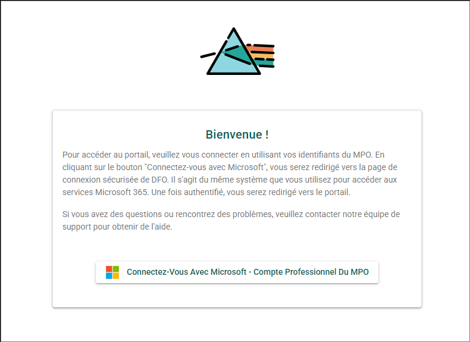

# Pour commencer

## Configuration requise du système {/* #system-requirements */}

### Adresse du site (URL) {/* #site-address-url */}

:::important
Assurez-vous d’être connecté au VPN du MPO si vous travaillez à distance. Le PSO est accessible uniquement à partir du réseau du MPO ou lorsque vous êtes connecté au VPN.
:::

[https://osp-pso.ent.dfo-mpo.ca](https://osp-pso.ent.dfo-mpo.ca)

### Exigences relatives au navigateur Web {/* #web-browser-requirements */}

Le PSO est optimisé pour tous les principaux navigateurs (Chrome, Firefox, Edge et Safari), à l’exception d’Internet Explorer 11 et des versions antérieures.

## Connexion {/* #logging-in */}

L’authentification au PSO se fait à l’aide de votre compte Microsoft du MPO. Si c’est votre première connexion, un compte sera automatiquement créé à partir de votre profil du MPO.

Pour vous connecter au PSO :

1. Accédez au PSO : [https://osp-pso.ent.dfo-mpo.ca](https://osp-pso.ent.dfo-mpo.ca).
2. Cliquez sur **CONNEXION**.
3. Sélectionnez **Se connecter avec Microsoft - Compte professionnel du MPO**.
4. Suivez les instructions pour vous connecter avec votre compte Microsoft du MPO.

Si vous éprouvez des difficultés à vous connecter, veuillez communiquer avec l’[équipe de soutien du PSO](mailto:DFO.OpenScience-ScienceOuverte.MPO@dfo-mpo.gc.ca).

## Mettre à jour les informations de l’utilisateur {/* #update-user-information */}

Pour accéder au menu des informations de l’utilisateur :

1. Cliquez sur le bouton circulaire **Menu utilisateur** contenant vos initiales situé dans le coin supérieur droit de l’écran.
2. Cliquez sur le **bouton Paramètres**.

### Profil utilisateur {/* #user-profile */}

Assurez-vous que les informations suivantes sont exactes :

- Prénom
- Nom de famille
- Courriel professionnel
- Langue préférée

Si des modifications sont apportées, assurez-vous de les enregistrer en cliquant sur le **bouton Enregistrer** situé dans le coin inférieur droit de la boîte Profil utilisateur. Si vous devez modifier l’adresse courriel associée à ce compte, veuillez communiquer avec l’[équipe de soutien du PSO](mailto:DFO.OpenScience-ScienceOuverte.MPO@dfo-mpo.gc.ca).

## Utiliser l’application {/* #use-the-application */}

Vous êtes maintenant prêt à utiliser l’application ! Consultez la section [Navigation dans le portail](../portal-features/portal-navigation) pour obtenir plus d’informations sur la façon de naviguer dans l’application !

## Déconnexion {/* #logging-out */}

Pour vous déconnecter de l’application du Portail de la science ouverte :

1. Cliquez sur le **bouton Menu utilisateur** dans le coin supérieur droit de l’écran.
2. Cliquez sur le **bouton Déconnexion**.

Vous êtes maintenant déconnecté avec succès de l’application du Portail de la science ouverte. Veuillez noter que de longues périodes d’inactivité entraîneront une déconnexion automatique.