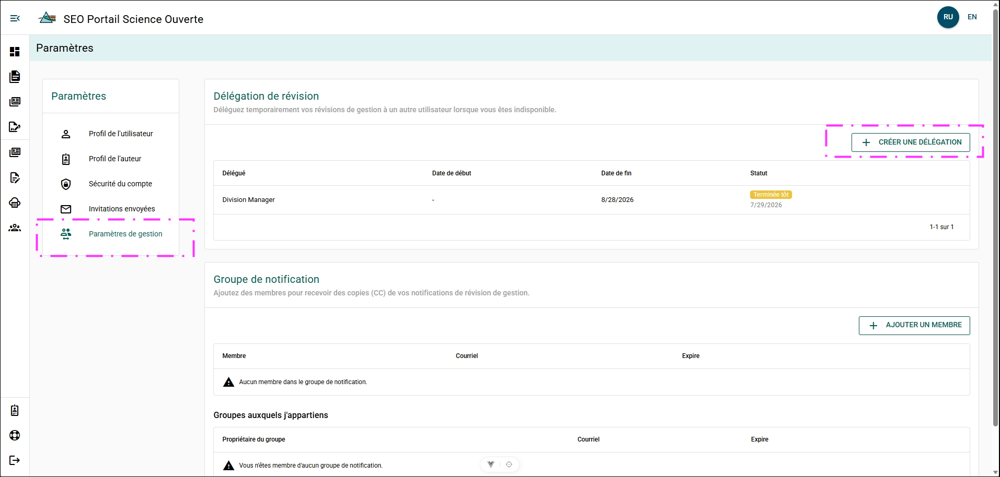
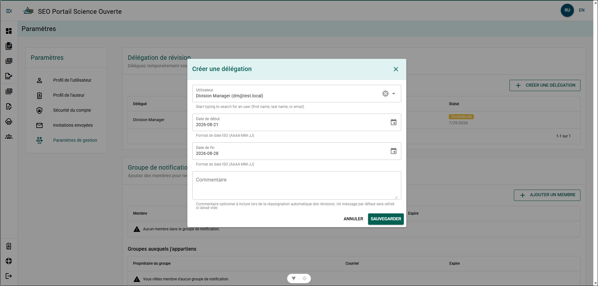
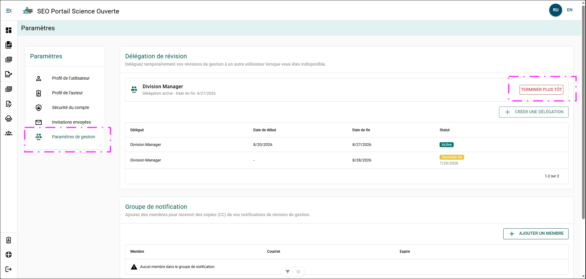

# Délégation

La délégation des examens vous permet de déléguer temporairement vos responsabilités liées à l’examen de gestion du manuscrit à un autre utilisateur. La délégation des responsabilités d’examen est généralement utilisée lorsque vous prévoyez vous absenter du bureau pendant une période prolongée.

Les règles de délégation comprennent les suivantes :

- La délégation doit avoir une date de début et une date de fin. Elle peut prendre fin plus tôt.
- Un utilisateur ne peut avoir qu’une seule délégation active à la fois.
- Un utilisateur ne peut pas se déléguer lui-même ni prolonger la durée de la période de délégation qui lui a été attribuée.

## Créer une délégation {/* #create-a-delegation */}

Le menu **Délégation des examens** se trouve sous [Paramètres](../settings) :

**Étapes**

1. Ouvrez **Paramètres**.
2. Cliquez sur **Paramètres de gestion**.
3. Cliquez sur **CRÉER UNE DÉLÉGATION**.

**Résultat**

- La boîte de dialogue **Créer une délégation d’examen** s’ouvre.

**Informations supplémentaires**

- Vous ne pourrez pas créer une délégation d’examen si vous avez actuellement une délégation active.
- Vous pouvez créer plusieurs délégations d’examen pour des dates futures.
- Deux périodes de délégation ne peuvent pas se chevaucher.

## Déléguer à un utilisateur {/* #delegate-a-user */}

1. Cliquez sur **+ CRÉER UNE DÉLÉGATION**.
2. Remplissez le formulaire :
   - **Utilisateur** – Sélectionnez l’utilisateur qui recevra la délégation.
   - **Date de début** – Entrez la date à laquelle la délégation commence.
   - **Date de fin** – Entrez la date à laquelle la délégation prend fin.
   - **Commentaires** (facultatif) – Entrez toute remarque pertinente.
3. Cliquez sur **ENREGISTRER**.

**Résultat**

- Un courriel contenant les détails de la période de délégation est envoyé à l’utilisateur délégué.
- Les examens de gestion du manuscrit en attente vous étant attribués seront automatiquement réattribués à votre délégué à la date de début.
- Toute nouvelle demande d’examen de gestion du manuscrit qui vous est envoyée pendant la période de délégation sera automatiquement réattribuée à votre délégué.

## Mettre fin à une délégation de façon anticipée {/* #ending-a-delegation-early */}

Vous pouvez mettre fin à une délégation active en tout temps.

**Étapes**

1. Ouvrez **Paramètres**.
2. Cliquez sur **Paramètres de gestion**.
3. Cliquez sur **TERMINER PLUS TÔT**.
4. Confirmez l’action dans la boîte de dialogue.

**Résultat**

- La date de fin de la délégation est remplacée par la date d’aujourd’hui.
- Tous les examens de gestion du manuscrit en attente qui vous avaient initialement été attribués, mais qui avaient été réattribués pendant la période de délégation, vous sont automatiquement réattribués.

