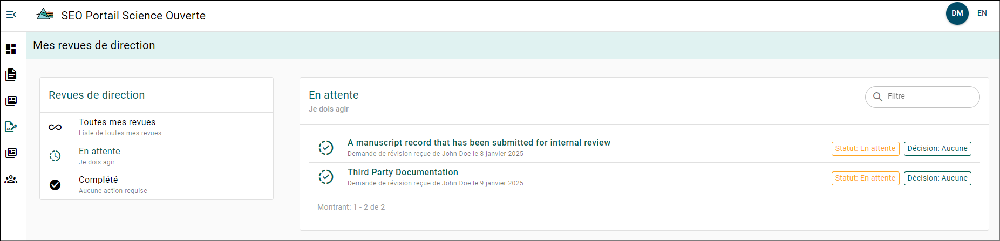
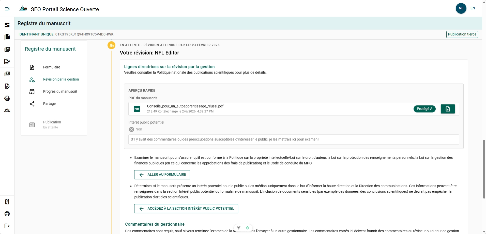
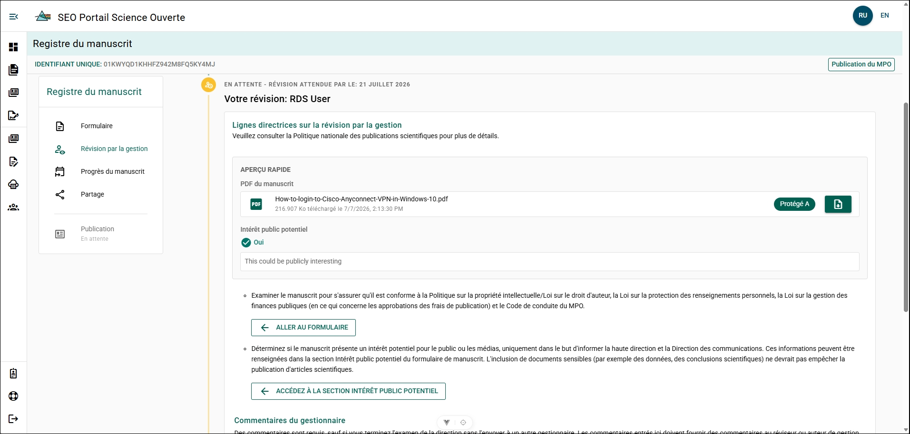
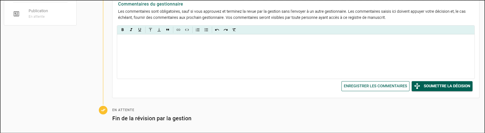
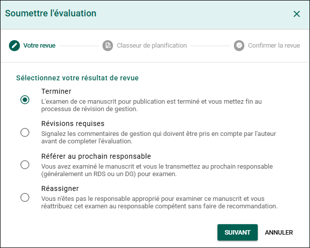
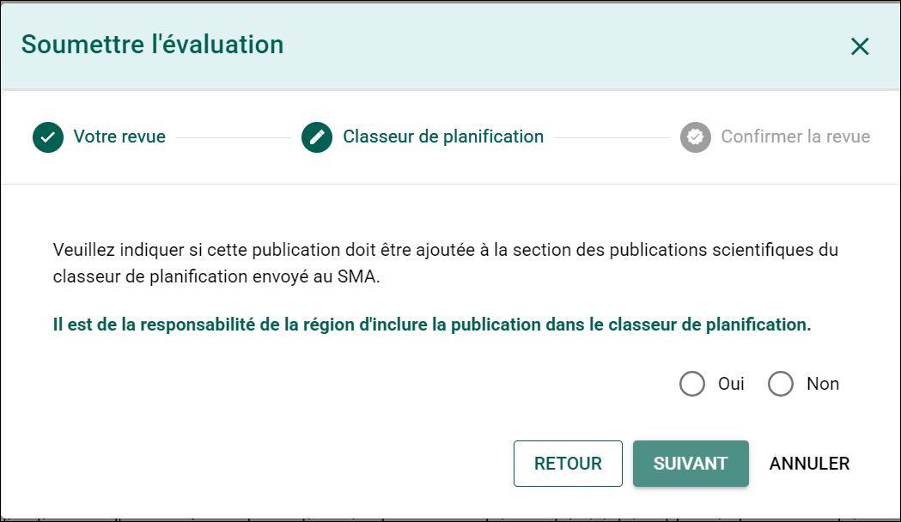
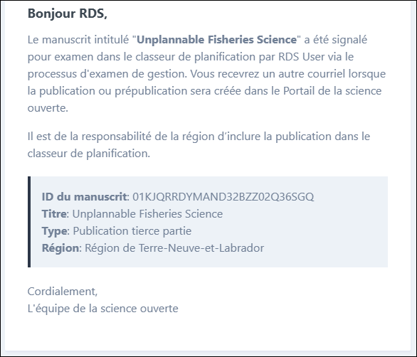

import Tabs from '@theme/Tabs';
import TabItem from '@theme/TabItem';
import TurnaroundMap from '@site/src/components/TurnaroundMap';

# Examen de gestion du manuscrit

## Page Mes examens de gestion des manuscrits {/* #my-manuscript-management-reviews-page */}

Vous pouvez consulter l’état des manuscrits que vous avez examinés ou pour lesquels vous avez été sélectionné comme évaluateur dans la page **Mes examens de gestion des manuscrits**.

Pour accéder à la page **Mes examens de gestion des manuscrits** :

1. Développez le menu de sélection des pages en survolant le menu latéral gauche avec votre souris.
2. Sélectionnez **Mes examens de gestion des manuscrits**.

:::note
Lorsque l’examen comprend des révisions du manuscrit, vous pourriez remarquer que le même manuscrit apparaît à chaque étape de l’examen. Cela s’explique par le fait que chaque étape possède son propre résultat d’examen consigné.
:::

Dans la page **Mes examens de gestion des manuscrits**, vous verrez une liste de tous les manuscrits en attente de votre examen. Cliquez sur un formulaire de dossier de manuscrit (MRF) en attente pour commencer l’examen.

## Examiner un MRF {/* #reviewing-an-mrf */}

### Votre rôle en tant que gestionnaire évaluateur {/* #your-role-as-the-reviewing-manager */}

Examinez le manuscrit afin d’en vérifier la conformité avec la [Politique sur la propriété intellectuelle et la Loi sur le droit d’auteur](https://www.dfo-mpo.gc.ca/terms-avis/copyright-droits-fra.htm), la [Loi sur la protection des renseignements personnels](https://www.priv.gc.ca/fr/sujets-lies-a-la-protection-de-la-vie-privee/lois-sur-la-protection-des-renseignements-personnels-au-canada/la-loi-sur-la-protection-des-renseignements-personnels/lprp_survol/), la Loi sur la gestion des finances publiques en ce qui concerne l’approbation des coûts de publication, ainsi que le [Code de valeurs et d’éthique du MPO](https://intranet.ent.dfo-mpo.ca/hr-rh/fr/node/1172).

Déterminez si le manuscrit présente un intérêt potentiel pour le public, uniquement afin d’en informer les directeurs régionaux des sciences (DRS) et les équipes régionales des Communications du MPO. Les sujets d’intérêt potentiel pour le public peuvent comprendre des thèmes liés à l’actualité ou présentant un intérêt pour les intervenants. Il peut notamment s’agir d’histoires intéressantes mettant en valeur la recherche du MPO ou d’études plus controversées. La présence de contenu potentiellement sensible n’empêchera jamais la publication d’un manuscrit.

Les auteurs peuvent soumettre leur publication à une revue tierce pour évaluation par les pairs lorsque le gestionnaire a déterminé qu’elle respecte les lois, politiques et directives applicables, ou lorsqu’aucun commentaire n’a été reçu dans les 10 jours ouvrables suivant le début de l’examen de gestion du manuscrit. Les gestionnaires de division, les directeurs du SEO dans la région de la capitale nationale (RCN), les directeurs régionaux des sciences et les directeurs généraux nationaux peuvent effectuer l’examen de gestion du manuscrit.

Pour obtenir de plus amples renseignements, consultez la [Politique nationale sur les publications scientifiques de Pêches et Océans Canada](https://intranet.ent.dfo-mpo.ca/science/fr/node/1471).

### Échéancier de 10 jours ouvrables {/* #10-working-day-timeline */}

Pour plus de commodité, le portail calcule l’échéancier de 10 jours ouvrables lorsqu’il s’applique. Toutefois, le portail n’effectue pas automatiquement l’examen des MRF une fois ce délai écoulé, et les gestionnaires sont tout de même tenus de terminer leur examen, que le manuscrit ait été soumis à une revue ou non.

<Tabs>

<TabItem value="third-party-journal-publications" label="Publications dans des revues tierces" default>

Si un gestionnaire relève des problèmes liés aux lois, politiques ou directives applicables, il doit communiquer avec le ou les auteurs afin de demander des révisions ou transmettre la publication au directeur régional des sciences ou au directeur général national responsable. Dans ce cas, le délai de 10 jours ouvrables est suspendu.

Exemples de suspension du délai :

- Un gestionnaire de division transmet le manuscrit à un DRS ou à un DG.
- Un gestionnaire demande à l’auteur d’apporter des révisions à la suite de son examen. Dans ce cas, le délai de 10 jours ouvrables recommence lorsque l’auteur répond.
</TabItem>

<TabItem value="dfo-publications" label="Publications du MPO">

Il n’existe aucun délai obligatoire de 10 jours ouvrables pour les publications du MPO. Conformément à la politique, les gestionnaires doivent répondre dans un délai raisonnable.

Le directeur régional des sciences (DRS) d’une région peut choisir d’appliquer un délai de 10 jours ouvrables aux publications du MPO. Les publications du MPO seront alors assujetties à une échéance de 10 jours ouvrables, avec des rappels avant l’échéance et après son dépassement.  
Pour adhérer à cette option, veuillez envoyer un courriel à [l’**équipe de soutien du PSO**](mailto:DFO.OpenScience-ScienceOuverte.MPO@dfo-mpo.gc.ca).
</TabItem>

</Tabs>

### Délai facultatif de 10 jours ouvrables par région {/* #optional-10-business-day-turnaround-by-region */}

La carte indique si une région a adopté le délai facultatif de 10 jours ouvrables pour les publications secondaires.

<TurnaroundMap />

### Examiner le formulaire de manuscrit {/* #review-the-manuscript-form */}

:::tip
Pendant que vous êtes l’évaluateur actuel, vous pouvez modifier le formulaire MRF au besoin.
:::

Le manuscrit et tout renseignement concernant un intérêt potentiel pour le public peuvent être examinés dans le panneau **Examen rapide** de la page **Examen de gestion du manuscrit**.

Examinez le fichier PDF du manuscrit.

**Étapes**

1. Cliquez sur l’icône **Télécharger** située à droite de la zone du fichier PDF du manuscrit.
2. Ouvrez le fichier PDF à partir du dossier **Téléchargements** de votre ordinateur.

Examinez le formulaire de dossier de manuscrit.

**Étapes**

1. Cliquez sur **\<- ALLER AU FORMULAIRE DE MANUSCRIT**.
2. Passez en revue la page du MRF.
3. Apportez les modifications souhaitées au MRF (facultatif).

Si des **modifications** sont apportées :

- Consignez toutes les modifications effectuées dans les **Commentaires de gestion**.

Examiner l’intérêt potentiel pour le public.

**Étapes**

1. Cliquez sur **\<- ALLER À LA SECTION INTÉRÊT POTENTIEL POUR LE PUBLIC**.
2. Passez en revue les renseignements concernant l’intérêt potentiel pour le public dans la page du MRF.
3. Apportez les modifications souhaitées à la section **Intérêt potentiel pour le public** (facultatif).

Si des **modifications** sont apportées :

- Consignez toutes les modifications effectuées dans les **Commentaires de gestion**.

**Résultat**

L’examen de gestion du manuscrit est terminé.

#### Commentaires de gestion {/* #management-comments */}

Si vous prévoyez transmettre ou réattribuer l’examen de gestion du manuscrit à un autre gestionnaire, ou si vous souhaitez fournir des commentaires auxquels l’auteur devra répondre, vous devez les consigner dans la zone de texte **Commentaires de gestionnaire**. Ces commentaires seront visibles par toute personne ayant actuellement ou ultérieurement accès à ce dossier de manuscrit.

Si vous prévoyez approuver et terminer l’examen de gestion du manuscrit, les commentaires ne sont pas obligatoires.

## Actions de l’examen de gestion du manuscrit {/* #manuscript-management-review-actions */}

### Décision de l’examen {/* #review-decision */}

:::important

- Pour les publications du MPO, seul un DRS, un DG ou un utilisateur auquel le rôle `director` a été attribué dans le portail peut terminer l’examen de gestion du manuscrit.
- Un commentaire du gestionnaire est requis pour toutes les actions, sauf **Terminer** l’examen de gestion du manuscrit.

:::

Les décisions de gestion disponibles sont :

- **Terminer**
  :::info
  Pour les publications du MPO, seul un utilisateur ayant le rôle **Directeur** peut effectuer cette action.
  :::
  - Vous avez terminé l’examen du manuscrit en vue de sa publication et mettez fin au processus d’examen de gestion du manuscrit.

  - **Révision requise**
  - Vous consignez des commentaires d’examen de gestion du manuscrit que l’auteur doit prendre en compte avant que vous puissiez donner votre approbation.

- **Transmettre au prochain gestionnaire**
  - Vous avez examiné ce manuscrit et le transmettez au prochain gestionnaire (habituellement un DRS ou un DG) pour examen.
  - Cette étape suspend le délai de 10 jours ouvrables pour les manuscrits destinés à une revue tierce ou à un serveur de prépublications.
  :::tip
  Pour accélérer le processus d’examen et accroître la transparence, assurez-vous toujours d’inclure des notes et des recommandations claires à l’intention du prochain gestionnaire. Cela est particulièrement important si vous estimez que des révisions sont nécessaires.
  :::

- **Réattribuer**
  - Vous n’êtes pas le gestionnaire approprié pour examiner ce manuscrit et vous réattribuez l’examen au gestionnaire approprié.
  :::tip
  Si vous êtes un auteur et que vous avez envoyé le manuscrit au mauvais destinataire par erreur, vous pouvez également communiquer avec l’équipe du portail pour obtenir de l’aide.
  :::

### Cahier de planification {/* #planning-binder */}

Un MRF **doit** indiquer un [**intérêt potentiel pour le public**](./manuscript-record-form.mdx#indicate-potential-public-interest) afin de pouvoir être signalé dans le **Cahier de planification** du PSO.

Si le MRF doit être considéré comme un élément du **Cahier de planification du SMA du secteur des SEO**, sélectionnez **Oui**. Cette action avise l’équipe de la Science ouverte et améliore la visibilité ainsi que le suivi de ce manuscrit dans le PSO.

:::warning
Sélectionner **« Oui »** **n’ajoute pas automatiquement** la publication au Cahier de planification !

**Il incombe à la région d’ajouter la publication au Cahier de planification.**
:::

### Confirmer l’examen {/* #confirm-review */}

Après avoir examiné le dossier de manuscrit et ajouté les commentaires nécessaires, vous pouvez soumettre votre examen.

Pour soumettre un examen de gestion du manuscrit :

1. Cliquez sur le bouton **SOUMETTRE**.
2. Sélectionnez la décision que vous souhaitez prendre, puis cliquez sur le bouton **SUIVANT**.
3. Si vous transmettez l’examen de gestion du manuscrit à un autre gestionnaire :
   - Cliquez dans la zone de recherche **Prochain évaluateur de l’examen de gestion du manuscrit**, puis saisissez le nom du gestionnaire de division.
   - Si le gestionnaire figure dans la base de données, son nom apparaîtra. Cliquez sur son nom pour le sélectionner.
   - Si son nom n’apparaît pas, suivez les étapes suivantes pour l’inviter au PSO :
     1. Cliquez sur le bouton **Vous ne trouvez pas l’utilisateur recherché ?**.
     2. Entrez l’**adresse courriel** du gestionnaire et sélectionnez l’utilisateur approprié dans l’annuaire du MPO.
     3. Cliquez sur le bouton **INVITER** pour l’inviter au PSO.
4. Cliquez sur le bouton **SUIVANT** pour confirmer le gestionnaire sélectionné.
5. Sélectionnez **Oui**, puis cliquez sur le bouton **SOUMETTRE**.

### Notifications par courriel {/* #email-notifications */}

Le PSO envoie automatiquement un courriel :

- Lorsqu’une action est effectuée dans le cadre d’un examen de gestion du manuscrit.
  - Les gestionnaires ayant **terminé** leur examen sont mis en copie conforme (CC) de tous les courriels envoyés pendant le reste du processus d’examen.
- Une fois par semaine, contenant un résumé de tous vos examens de gestion de manuscrits en attente.
- Deux jours ouvrables avant l’échéance du délai de dix jours ouvrables (pour les publications dans des revues tierces).