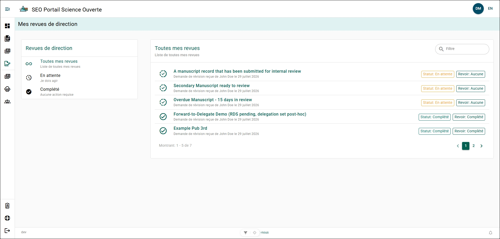

# Page Mes examens de gestion

La page **Mes examens de gestion** présente tous les formulaires de dossier de manuscrit (MRF) qui vous ont été soumis aux fins d’examen de gestion du manuscrit, qu’ils soient terminés ou en attente.

## Étiquettes des formulaires dans Mes examens {/* #all-my-reviews-form-labels */}

- **En cours** : Cercle vert composé d’une moitié en tirets et d’une moitié pleine, avec une coche. Indique un MRF dont l’examen de gestion du manuscrit est toujours en attente.
- **Terminé** : Cercle vert avec une coche. Indique un MRF dont l’examen de gestion du manuscrit est terminé.
- **En attente** : Case jaune affichant « État : En attente ». Indique un MRF en attente de votre décision concernant l’examen de gestion du manuscrit.
- **Réaffecté** : Case bleue affichant « État : Réaffecté ». Indique un MRF que vous avez réaffecté à une autre personne aux fins d’examen de gestion du manuscrit.
- **Terminé - État** : Case verte affichant « État : Terminé ». Indique un MRF pour lequel vous avez effectué la dernière action demandée dans le cadre de l’examen de gestion du manuscrit.
- **Aucun** : Case verte affichant « Examen : Aucun ». Indique un MRF que vous n’avez pas examiné.
- **Signalé pour suivi** : Case verte affichant « Examen : Signalé pour suivi ». Indique un MRF qui a été retourné à l’auteur afin que des révisions soient apportées.
- **Terminé - Examen** : Case verte affichant « Examen : Terminé ». Indique un MRF dont l’examen de gestion du manuscrit est terminé.

