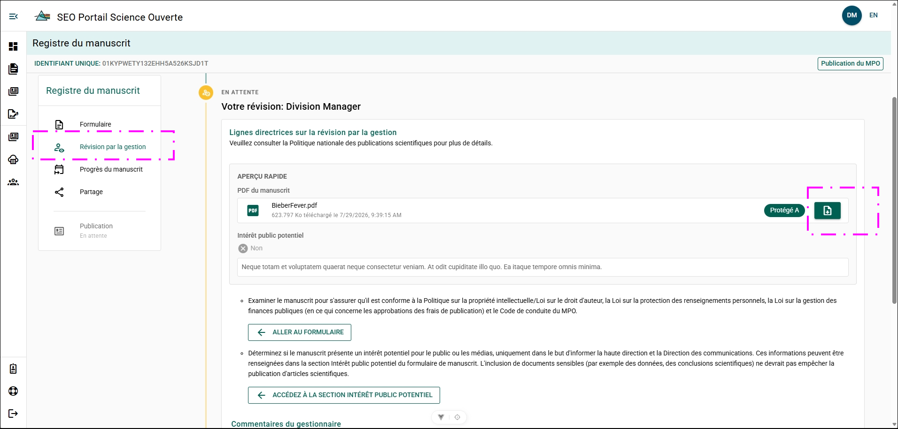
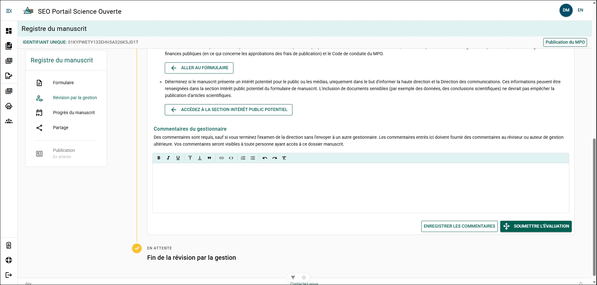

# Examiner un formulaire de dossier de manuscrit

Cliquez sur le manuscrit que vous souhaitez examiner pour ouvrir le panneau **Examen de gestion du manuscrit**.

À partir du panneau **Examen de gestion du manuscrit**, vous pouvez :

- Cliquer sur **Télécharger** pour télécharger une copie PDF du manuscrit.
- Vérifier si un intérêt potentiel pour le public a été déclaré.
- Cliquer sur **Accéder au formulaire de manuscrit** pour ouvrir le formulaire de dossier de manuscrit.
- Cliquer sur **Accéder à la section Intérêt potentiel pour le public** pour accéder directement à la section **Intérêt potentiel pour le public** du formulaire de dossier de manuscrit.
- Cliquer sur **Examen de gestion du manuscrit** dans le menu du dossier de manuscrit pour revenir au panneau **Examen de gestion du manuscrit**.

## Commentaires du gestionnaire {/* #manager-comments */}

La zone **Commentaires du gestionnaire** vous permet de consigner les notes ou les demandes que vous pourriez avoir au cours de votre examen.

Les commentaires peuvent notamment servir à :

- Consigner les modifications que vous apportez au MRF pendant votre examen.
- Formuler des demandes ou des commentaires à l’intention de l’auteur si vous estimez que des modifications sont nécessaires.
- Laisser des commentaires aux gestionnaires qui examineront le MRF après vous.
- Confirmer que vous avez examiné le manuscrit et le MRF.

:::info
Les commentaires du gestionnaire sont visibles par toute personne ayant accès au MRF dans le PSO. Cela comprend tous les auteurs inscrits dans le MRF, les rédacteurs régionaux et les directeurs.
:::

