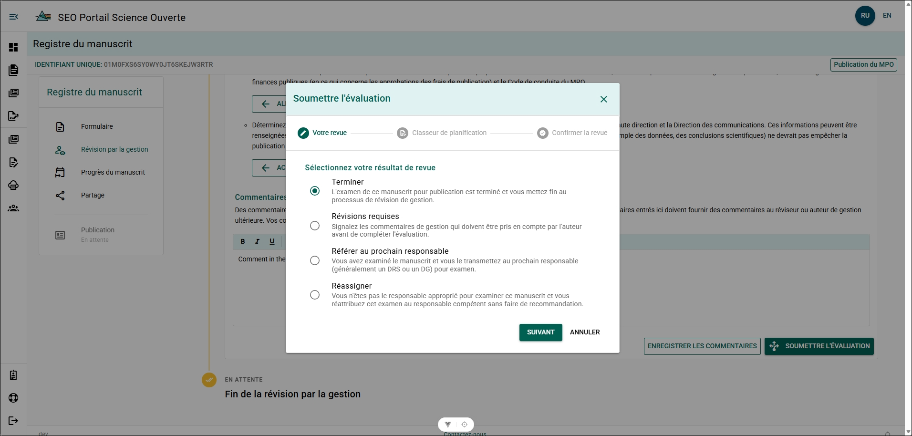
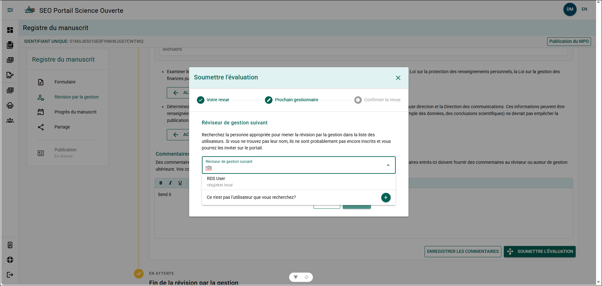
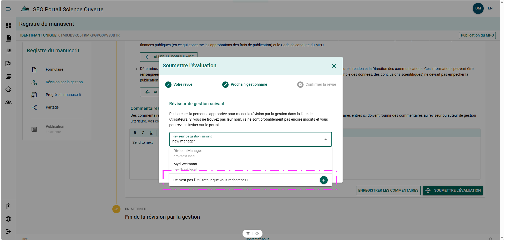
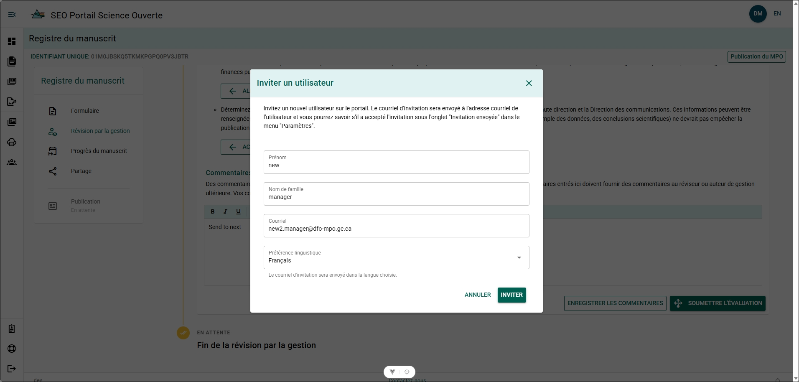

# Soumettre l’examen de gestion du manuscrit

:::important

- Pour les publications scientifiques et techniques secondaires de la DGEO, seul un DRS, un DG ou un utilisateur auquel le rôle `director` a été attribué peut terminer l’examen de gestion du manuscrit.
- Un commentaire du gestionnaire est requis pour toutes les actions permettant de terminer l’examen de gestion du manuscrit.

:::

## Résultats de l’examen {/* #review-outcomes */}

### Terminer {/* #complete */}

À la suite de votre examen du manuscrit et du MRF, vous approuvez la publication du manuscrit. Cette action met fin à l’examen de gestion du manuscrit.

L’état du MRF passe à **Examiné**.

Consultez les [Étapes pour terminer la soumission](#steps---complete).

### Révisions requises {/* #revisions-required */}

Au cours de votre examen du manuscrit et du MRF, vous avez relevé des éléments que l’auteur doit corriger avant que le manuscrit soit prêt à être publié. Consignez les problèmes relevés dans la [zone Commentaires du gestionnaire](./reviewing-the-manuscript#manager-comments).

Cette action met en pause le [délai de 10 jours ouvrables](./reviewing-manager-role#10-working-day-timeline) afin de permettre à l’auteur d’examiner vos commentaires et d’y répondre. Lorsque l’auteur répond, le délai de 10 jours ouvrables reprend.

Consultez les [Étapes pour les révisions requises](#steps---revisions-required).

### Transmettre au prochain gestionnaire {/* #refer-to-next-manager */}

À la suite de votre examen du manuscrit et du MRF, vous estimez que le manuscrit est prêt à faire l’objet d’un examen final par un DRS ou un DG, ou vous et l’auteur ne parvenez pas à vous entendre sur une révision demandée et l’examen de gestion du manuscrit est transmis à un DRS ou à un DG aux fins de décision finale.

Cette action met en pause le [délai de 10 jours ouvrables](./reviewing-manager-role#10-working-day-timeline) afin de donner au DRS ou au DG le temps d’examiner le manuscrit, le MRF et les commentaires du gestionnaire, puis de prendre une décision.

Consultez les [Étapes pour transmettre au prochain gestionnaire et réattribuer](#steps---refer-to-next-manager-and-reassign).

### Réattribuer {/* #reassign */}

Vous n’êtes pas le gestionnaire approprié pour effectuer l’examen de gestion du manuscrit et vous réattribuez l’examen à un gestionnaire approprié sans formuler de recommandation.

Consultez les [Étapes pour réattribuer](#steps---refer-to-next-manager-and-reassign).

## Cahier de planification {/* #planning-binder */}

Un MRF **doit** indiquer un [intérêt potentiel pour le public](../manuscript-record-forms/complete-manuscript-record-form#potential-public-interest) afin de pouvoir être signalé pour le Cahier de planification dans le PSO.

Sélectionnez **Oui** si vous estimez que le manuscrit devrait être considéré comme un élément du Cahier de planification du Bureau du sous-ministre adjoint (BSMA) de la DGEO. La sélection de **Oui** ajoute un indicateur dans le [Tableau de bord du rédacteur](../portal-basics/dashboard#editor-dashboard) et permet d’accroître la visibilité et le suivi de ce manuscrit dans le PSO.

Si un manuscrit est signalé pour le Cahier de planification, vous recevrez un courriel lorsque l’examen de gestion du manuscrit sera terminé et qu’un dossier de publication sera créé pour le manuscrit. Consultez [Courriel du Cahier de planification](./review-notifications) pour obtenir de plus amples renseignements.

:::warning
Sélectionner « Oui » **n’ajoute pas automatiquement** la publication au Cahier de planification!

**Il incombe à la région d’ajouter la publication au Cahier de planification!**
:::

## Soumettre votre examen {/* #submitting-your-review */}

À partir du panneau **Examen de gestion du manuscrit** :

### Étapes – Terminer {/* #steps---complete */}

1. Entrez vos commentaires dans la zone **Commentaires de gestion**.
2. Cliquez sur **SOUMETTRE L’EXAMEN**.
3. Sélectionnez **Terminer**, puis cliquez sur **SUIVANT**.
4. Indiquez si le manuscrit doit être signalé pour le Cahier de planification, puis cliquez sur **SUIVANT**.
5. Confirmez l’examen et cliquez sur **SOUMETTRE**.

**Résultat**

- L’examen de gestion du manuscrit est terminé et fermé.
- Un courriel est envoyé à l’auteur pour l’informer que l’examen de gestion du manuscrit est terminé.

### Étapes – Révisions requises {/* #steps---revisions-required */}

1. Entrez les révisions demandées dans la zone **Commentaires de gestion**.
2. Cliquez sur **SOUMETTRE L’EXAMEN**.
3. Sélectionnez **Révisions requises**, puis cliquez sur **SUIVANT**.
4. Confirmez l’examen et cliquez sur **SOUMETTRE**.

**Résultat**

- Le délai de 10 jours ouvrables est mis en pause.
- Un courriel est envoyé à l’auteur, avec vous en copie conforme, pour l’informer que des modifications ont été demandées.
### Étapes – Transmettre au prochain gestionnaire et réattribuer {/* #steps---refer-to-next-manager-and-reassign */}

1. Entrez vos révisions demandées dans la zone **Commentaires de gestion**.
2. Cliquez sur **SOUMETTRE L’EXAMEN**.
3. Sélectionnez **Transmettre au prochain gestionnaire** ou **Réattribuer**, puis cliquez sur **SUIVANT**.
4. Recherchez le **Prochain examinateur de gestion du manuscrit** à l’aide de son nom ou de son adresse courriel.
5. Cliquez sur le **nom du gestionnaire** pour le sélectionner, puis cliquez sur **SUIVANT**.
6. Confirmez l’examen et cliquez sur **SOUMETTRE**.

**Résultat**

- L’examen de gestion du manuscrit est transmis au gestionnaire sélectionné.
- Un courriel est envoyé au prochain gestionnaire, avec vous et l’auteur en copie conforme, pour l’informer qu’il a été désigné comme prochain examinateur de gestion du manuscrit.

**Informations supplémentaires**

- Consultez [Ajouter un gestionnaire](#add-a-manager) si le nom du **prochain examinateur de gestion du manuscrit** n’apparaît pas dans les résultats de recherche.

### Ajouter un gestionnaire {/* #add-a-manager */}

À partir de la recherche du **Prochain examinateur de gestion du manuscrit** :

**Étapes**

1. Cliquez sur **Ce n’est pas l’utilisateur que vous recherchez?**.
2. Entrez les renseignements suivants :
   - Prénom
   - Nom de famille
   - Adresse courriel
3. Cliquez sur **Inviter**.
4. Cliquez sur **Suivant**.
5. Confirmez l’examen et cliquez sur **SOUMETTRE**.

**Résultat**

- L’examen de gestion du manuscrit est transmis au gestionnaire nouvellement ajouté.
- Un courriel est envoyé au gestionnaire nouvellement ajouté pour l’inviter à accéder au PSO.

:::tip
Utilisez les renseignements figurant sur la fiche de contact du gestionnaire afin de vous assurer que son nom et son adresse courriel sont exacts.
:::

