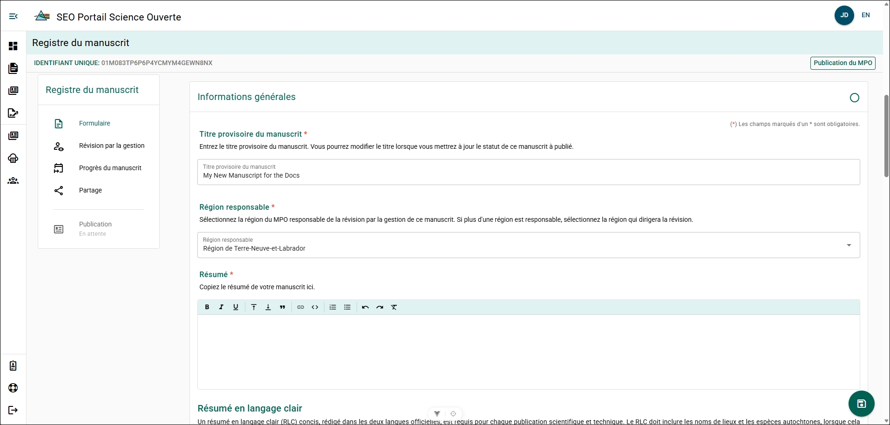
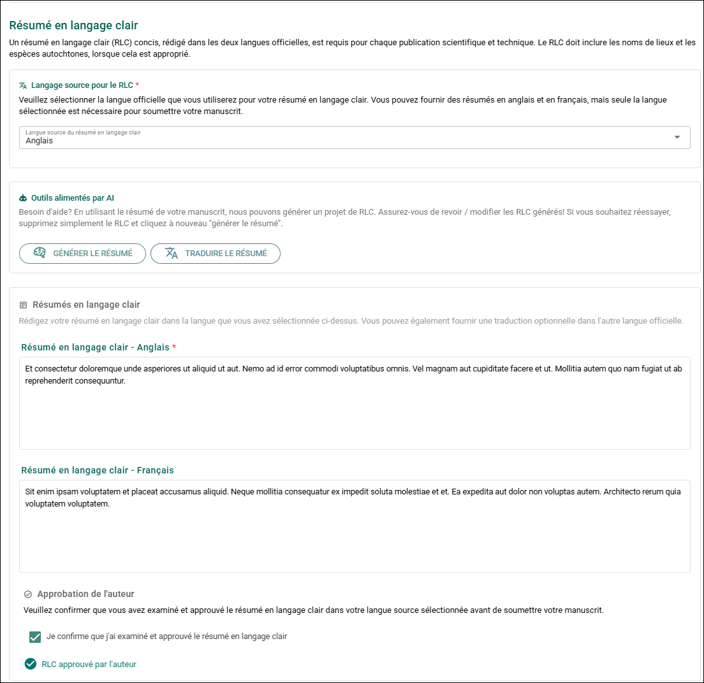
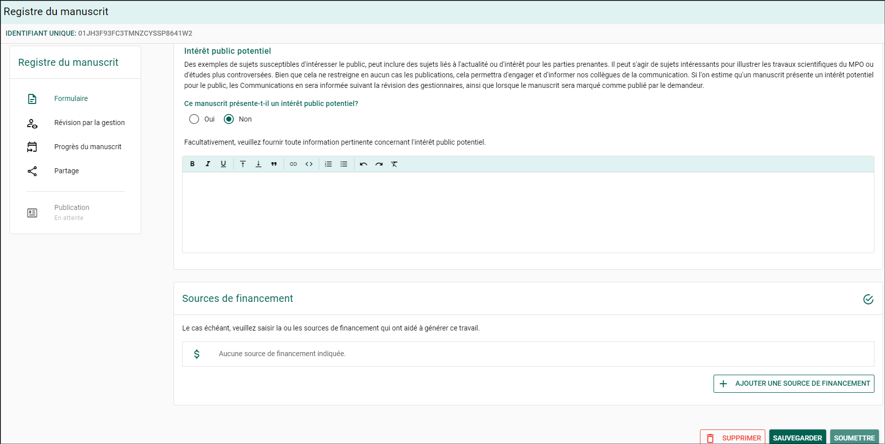
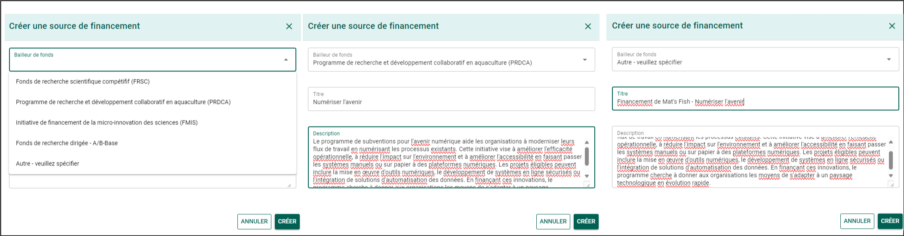

# Remplir un formulaire de dossier de manuscrit

:::tip
**Enregistrez votre progression**

Enregistrez fréquemment votre manuscrit afin d’éviter de perdre votre travail.

Vous pouvez enregistrer votre progression en :

- cliquant sur le bouton circulaire **Disquette** dans le coin inférieur droit de la page;
- faisant défiler la page jusqu’au bas du formulaire et en cliquant sur **Enregistrer**.

Après avoir enregistré votre progression, vous pouvez fermer votre session du PSO en toute sécurité.
:::

## Manuscrit {/* #manuscript */}

Téléversez une version PDF de votre manuscrit dans le MRF. Vous pourrez téléverser une version plus récente ultérieurement si le manuscrit est modifié.

**Étapes**

1. Cliquez sur le champ **Déposez le fichier ou cliquez pour téléverser le manuscrit**.
2. Sélectionnez le fichier PDF du manuscrit dans l’explorateur de fichiers.
3. Cliquez sur **Ouvrir**.

**Résultat**

Le fichier PDF du manuscrit est téléversé et joint au formulaire de dossier de manuscrit.

## Auteur(s) et affiliation(s) {/* #authors-and-affiliations */}

Ajoutez tous les auteurs qui ont contribué au manuscrit et précisez leurs affiliations.

**Attributs de l’auteur**

- **Auteur-ressource du MPO** : La principale personne-ressource au sein du MPO pour ce manuscrit et cette publication.
  - Il doit y avoir au moins un auteur-ressource du MPO.
- **Auteur collectif** : L’organisation dont l’auteur fait partie.

**Étapes**

Répétez les étapes suivantes pour chaque auteur :

1. Cliquez sur **+**.
2. Recherchez l’auteur dans le champ **Auteur** à l’aide de son nom ou de son adresse courriel.
3. Sélectionnez **Oui** pour **Auteur-ressource du MPO** si l’auteur sera la principale personne-ressource au sein du MPO.
4. Sélectionnez **Oui** pour **Auteur collectif** si l’auteur représente un groupe.

Si **Auteur collectif** est sélectionné :

- Recherchez le groupe par son nom.
- Sélectionnez le groupe dans les résultats de recherche.

5. Cliquez sur **Enregistrer**.

**Résultat**

L’auteur sélectionné est ajouté au formulaire de dossier de manuscrit. Les auteurs ajoutés peuvent consulter et modifier le MRF, mais ne peuvent pas le supprimer.

**Informations supplémentaires**

- Consultez [Créer un auteur](../common-features/author-and-affilliate-management) si un auteur n’apparaît pas dans la liste de recherche.
- Consultez [Créer une organisation](../common-features/author-and-affiliate-management) si une organisation n’apparaît pas dans la liste de recherche.

## Examen par les pairs {/* #peer-review */}

:::info
Cette section est visible uniquement dans les formulaires de dossier de manuscrit pour les publications scientifiques et techniques secondaires de la DGSE!

L’examen par les pairs est facultatif pour les rapports de données, les rapports d’entrepreneurs et les bulletins!
:::

Ajoutez au moins deux experts en la matière qui ont effectué un examen par les pairs du rapport.

**Étapes**

Répétez les étapes suivantes pour chaque pair examinateur :

1. Cliquez sur **+**.
2. Recherchez l’auteur dans le champ **Auteur** à l’aide de son nom ou de son adresse courriel.
3. Cliquez sur **Enregistrer**.

**Résultat**

Le pair examinateur sélectionné est ajouté au formulaire de dossier de manuscrit.

**Informations supplémentaires**

- Consultez [Créer un auteur](../common-features/author-and-affilliate-management) si un auteur n’apparaît pas dans la liste de recherche.

## Renseignements généraux {/* #general-information */}

### Titre provisoire du manuscrit {/* #manuscript-working-title */}

Le titre provisoire est automatiquement rempli à partir du titre saisi lors de la création du manuscrit.

**Étapes**

1. Cliquez sur le champ **Titre**.
2. Entrez le titre mis à jour du manuscrit.
3. Enregistrez les modifications.

**Résultat**

Le titre mis à jour est enregistré dans le formulaire de dossier de manuscrit.

### Région responsable {/* #lead-region */}

La **Région responsable** est automatiquement remplie à partir de la région sélectionnée lors de la création du manuscrit.

**Étapes**

1. Cliquez sur le champ **Région responsable**.
2. Sélectionnez la région appropriée.
3. Enregistrez les modifications.

**Résultat**

La **Région responsable** mise à jour est enregistrée dans le formulaire de dossier de manuscrit.

### Résumé {/* #abstract */}

Ajoutez le résumé du manuscrit au dossier.

**Étapes**

1. Copiez le résumé de votre manuscrit.
2. Collez le résumé dans le champ de texte **Résumé**.
3. Enregistrez les modifications.

**Résultat**

Le résumé est enregistré dans le formulaire de dossier de manuscrit.

### Résumé en langage clair {/* #plain-language-summary */}

Fournissez un résumé en langage clair (RLC) afin d’améliorer l’accessibilité de la publication.

- Les résumés en langage clair sont obligatoires pour toutes les publications scientifiques.
- Le résumé devrait être rédigé à un niveau de lecture correspondant approximativement à une **8e année** afin d’en faciliter la compréhension par un large public.
- Des conseils sur la rédaction en langage clair sont disponibles auprès du gouvernement du Canada :  
  [Bureau de la communauté des communications](https://www.canada.ca/fr/conseil-prive/services/bureau-collectivite-communications/communications-101-camp-entrainement-fonctionnaires-canadiens/langage-clair-accessibilite-communications-inclusives.html)

#### Langue source du RLC {/* #source-language-for-the-pls */}

Vous pouvez fournir le résumé en **anglais et en français**, mais seule la langue source sélectionnée est requise pour la soumission.

**Étapes**

1. Sélectionnez **Anglais** ou **Français** dans le champ **Langue source du RLC**.

**Résultat**

La langue sélectionnée devient la langue requise pour le résumé en langage clair lors de l’examen de gestion.

#### Outils alimentés par l’IA {/* #ai-powered-tools */}

Générez une ébauche de résumé en langage clair (RLC) à partir du résumé du manuscrit et de la langue sélectionnée.

:::note
L’outil **Générer un RLC** utilise le grand modèle de langage (LLM) d’intelligence artificielle (IA) [Llama 3.2](https://www.llama.com/), développé par Meta.

Cet outil fonctionne entièrement à l’intérieur du réseau du MPO. Les renseignements soumis à l’outil **ne quittent pas l’intranet du MPO** et **ne peuvent pas être transmis à Meta ni à des systèmes externes**.

Lors de l’utilisation d’outils d’IA au sein du réseau du gouvernement du Canada, consultez les lignes directrices du Secrétariat du Conseil du Trésor du Canada sur l’utilisation responsable de l’IA :  
[Guide sur l’utilisation de l’intelligence artificielle générative](https://www.canada.ca/fr/gouvernement/systeme/gouvernement-numerique/innovations-gouvernement-numerique/utilisation-responsable-ia/guide-utilisation-intelligence-artificielle-generative.html)
:::

:::tip
La fonctionnalité **Générer un RLC** produit une ébauche à partir du résumé de votre manuscrit. Vous pouvez générer plusieurs ébauches afin d’affiner le résumé.

Une fois le RLC finalisé, vous pouvez utiliser **Traduire le RLC** pour générer une version dans l’autre langue officielle.
:::

**Étapes**

1. Cliquez sur **Générer un RLC**.
2. Passez en revue l’ébauche générée.
3. Modifiez le résumé au besoin.

**Résultat**

Une ébauche du résumé en langage clair apparaît dans le champ de texte du RLC.

#### Approbation de l’auteur {/* #author-approval */}

Confirmez que l’auteur a examiné et approuvé le résumé en langage clair.

**Étapes**

1. Passez en revue le résumé en langage clair terminé.
2. Sélectionnez la confirmation **Approbation de l’auteur**.

**Résultat**

Le système indique que l’auteur a examiné et approuvé le résumé en langage clair.

:::important
Si vous remplissez le formulaire au nom de l’auteur, assurez-vous que celui-ci a examiné le résumé en langage clair avant de confirmer son approbation. Les auteurs peuvent accéder à leur propre MRF en ouvrant une session dans le portail.
:::

### Secteur fonctionnel {/* #functional-area */}

Appliquez une étiquette de **Secteur fonctionnel** pour classifier le domaine de recherche du manuscrit.

**Étapes**

1. Cliquez sur le champ **Secteur fonctionnel**.
2. Sélectionnez le **Secteur fonctionnel** approprié dans la liste.

**Résultat**

Le secteur fonctionnel sélectionné est appliqué au formulaire de dossier de manuscrit.

**Informations supplémentaires**

Les étiquettes de secteur fonctionnel permettent d’améliorer la production de rapports et le suivi des domaines de recherche scientifique du MPO.

### Pertinence pour les programmes, les initiatives et la gestion {/* #relevance-to-programsinitiativesmanagement-section */}

Fournissez un résumé décrivant comment le manuscrit appuie le programme qui l’a financé et comment il s’harmonise avec le mandat, le plan stratégique ou les priorités régionales du Ministère.

**Étapes**

1. Entrez le résumé dans le champ **Pertinence pour les programmes/initiatives/secteur client**.
2. Enregistrez les modifications.

**Résultat**

Le résumé de la pertinence est enregistré dans le formulaire de dossier de manuscrit.

### Intérêt potentiel pour le public {/* #potential-public-interest */}

Indiquez si le manuscrit pourrait présenter un intérêt pour le public.

:::info

Une publication peut être signalée pour le [Cahier de planification](../manuscript-management-review/manuscript-management-review.mdx#planning-binder) uniquement si elle présente un intérêt potentiel pour le public!

:::

**Étapes**

1. Sélectionnez **Oui** ou **Non** dans le champ **Intérêt potentiel pour le public**.

**Étapes conditionnelles**

Si vous sélectionnez **Oui** :

- Entrez les détails concernant l’intérêt potentiel pour le public dans le champ de texte.

**Résultat**

Le dossier de manuscrit indique si la publication pourrait présenter un intérêt pour le public.

### Licence du rapport {/* #reporting-licensing */}

:::info
Cette section est visible uniquement pour les publications de type **Publication scientifique et technique secondaire de la DGSE**.
:::

Indiquez si le rapport doit être publié sous la **[Licence du gouvernement ouvert – Canada](https://ouvert.canada.ca/fr/licence-du-gouvernement-ouvert-canada)**.

**Étapes**

1. Sélectionnez **Oui** ou **Non** dans le champ **Licence du rapport**.

**Étapes conditionnelles**

Si vous sélectionnez **Non** :

- Fournissez une explication indiquant pourquoi la **Licence du gouvernement ouvert – Canada** ne peut pas être appliquée.

**Résultat**

Le statut de licence sélectionné est enregistré dans le formulaire de dossier de manuscrit.

**Informations supplémentaires**

Le MPO applique le principe de la science ouverte **« ouvert dès la conception et par défaut »**. Dans la mesure du possible, les publications devraient être diffusées sous la version la plus récente de la **Licence du gouvernement ouvert – Canada**.

La licence ne devrait pas être appliquée lorsqu’il existe des obligations de licence incompatibles.

### Publication ouverte {/* #open-publication */}

:::info
Cette section est visible uniquement pour les types de publication **Publication par un tiers** et **Prépublication**.
:::

Indiquez si la publication sera rendue librement accessible.

**Étapes**

1. Sélectionnez **Oui** ou **Non** dans le champ **Publication ouverte**.

**Étapes conditionnelles**

Si vous sélectionnez **Non** :

- Expliquez pourquoi le libre accès ne peut pas être appliqué.

**Résultat**

Le dossier de manuscrit indique si la publication sera librement accessible.

**Informations supplémentaires**

L’approche **« ouvert dès la conception et par défaut »** exige que les publications soient librement et publiquement accessibles, sauf si une exception s’applique.

Les exceptions peuvent comprendre les situations où des renseignements, des données ou du code font l’objet de restrictions en raison de :

- la sécurité de la recherche;
- droits de propriété;
- restrictions imposées par des tiers;
- ententes juridiques, éthiques ou de confidentialité.

## Sources de financement {/* #funding-sources */}

Ajoutez les sources de financement si les travaux ayant contribué au manuscrit ont été soutenus par un programme.

**Étapes**

1. Cliquez sur **+ AJOUTER UNE SOURCE DE FINANCEMENT**.
2. Cliquez sur le champ **Bailleur de fonds**.
3. Sélectionnez le bailleur de fonds approprié dans la liste.
4. Entrez le nom du programme dans le champ **Titre**.
5. Entrez une description du programme de financement et de ses exigences dans le champ **Description**.
6. Cliquez sur **Créer**.

Répétez ces étapes pour ajouter d’autres sources de financement.

**Résultat**

La source de financement est ajoutée au formulaire de dossier de manuscrit.
