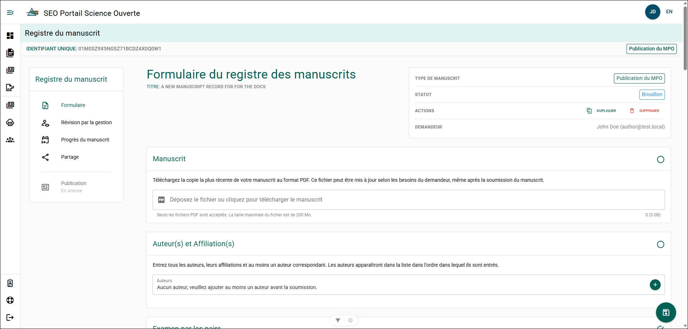

import ExternalLocalizedLink from '@site/src/components/ExternalLocalizedLink';

# Remplir un formulaire de dossier de manuscrit

:::tip
**Enregistrez votre progression**

Enregistrez fréquemment votre manuscrit afin d’éviter de perdre votre travail.

Vous pouvez enregistrer votre progression en :

- cliquant sur le bouton circulaire **Disquette** dans le coin inférieur droit de la page;
- faisant défiler la page jusqu’au bas du formulaire et en cliquant sur **Enregistrer**.

Après avoir enregistré votre travail, vous pouvez vous déconnecter du PSO en toute sécurité.
:::

## Manuscrit {/* #manuscript */}

Téléversez une version PDF de votre manuscrit dans le MRF. Vous pourrez téléverser une version plus récente ultérieurement si le manuscrit est modifié.

**Étapes**

1. Cliquez sur le champ **Déposez le fichier ou cliquez pour téléverser le manuscrit**.
2. Sélectionnez le fichier PDF du manuscrit dans l’explorateur de fichiers.
3. Cliquez sur **Ouvrir**.

**Résultat**

Le fichier PDF du manuscrit est téléversé et joint au formulaire de dossier de manuscrit.

## Auteur(s) et affiliation(s) {/* #authors-and-affiliations */}

Ajoutez tous les auteurs qui ont contribué au manuscrit et précisez leurs affiliations.

**Attributs de l’auteur**
- **Auteur correspondant du MPO** : La principale personne-ressource au sein du MPO pour ce manuscrit et cette publication.
  - Il doit y avoir au moins un auteur correspondant du MPO.
- **Auteur collectif** : L’organisation dont l’auteur fait partie.

**Étapes**

Répétez les étapes suivantes pour chaque auteur :

1. Cliquez sur **+**.
2. Recherchez l’auteur dans le champ **Auteur** à l’aide de son nom ou de son adresse courriel.
3. Sélectionnez **Oui** pour **Auteur correspondant** si l’auteur sera la principale personne-ressource au sein du MPO.
4. Sélectionnez **Oui** pour **Auteur collectif** si l’auteur représente un groupe.

Si **Auteur collectif** est sélectionné :

- Recherchez le groupe par son nom.
- Sélectionnez le groupe dans les résultats de recherche.

5. Cliquez sur **Enregistrer**.

**Résultat**

L’auteur sélectionné est ajouté au formulaire de dossier de manuscrit. Les auteurs ajoutés peuvent consulter et modifier le MRF, mais ne peuvent pas le supprimer.

**Informations supplémentaires**
- Consultez [Créer un nouvel auteur](../common-features/author-and-affiliate-management#create-a-new-author) si un auteur ne figure pas dans la liste de recherche.
- Consultez [Créer une nouvelle organisation](../common-features/author-and-affiliate-management#create-a-new-organization) si une organisation ne figure pas dans la liste de recherche.

## Évaluation par les pairs {/* #peer-review */}

:::info
Cette section est visible uniquement dans les formulaires de dossier de manuscrit pour les publications scientifiques et techniques secondaires de la DGEO!

L’évaluation par les pairs est facultative pour les rapports sur les données, les rapports d’entrepreneurs et les bulletins!
:::

Ajoutez au moins deux experts en la matière qui ont effectué une évaluation par les pairs du rapport.

**Étapes**

Répétez les étapes suivantes pour chaque évaluateur :

1. Cliquez sur **+**.
2. Recherchez l’auteur dans le champ **Auteur** à l’aide de son nom ou de son adresse courriel.
3. Cliquez sur **Enregistrer**.

**Résultat**

L’évaluateur sélectionné est ajouté au formulaire de dossier de manuscrit.

**Informations supplémentaires**
- Consultez [Créer un nouvel auteur](../common-features/author-and-affiliate-management#create-a-new-author) si un auteur ne figure pas dans la liste de recherche.

## Renseignements généraux {/* #general-information */}

### Titre provisoire du manuscrit {/* #manuscript-working-title */}

Le titre provisoire est automatiquement rempli à partir du titre saisi lors de la création du manuscrit.

**Étapes**

1. Cliquez sur le champ **Titre**.
2. Saisissez le titre mis à jour du manuscrit.
3. Enregistrez les modifications.

**Résultat**

Le titre mis à jour est enregistré dans le formulaire de dossier de manuscrit.

### Région responsable {/* #lead-region */}

La **Région responsable** est automatiquement remplie à partir de la région sélectionnée lors de la création du manuscrit.

**Étapes**

1. Cliquez sur le champ **Région responsable**.
2. Sélectionnez la région appropriée.
3. Enregistrez les modifications.

**Résultat**

La **Région responsable** mise à jour est enregistrée dans le formulaire de dossier de manuscrit.

### Résumé {/* #abstract */}

Ajoutez le résumé du manuscrit au dossier.

**Étapes**

1. Copiez le résumé de votre manuscrit.
2. Collez le résumé dans le champ de texte **Résumé**.
3. Enregistrez les modifications.

**Résultat**

Le résumé est enregistré dans le formulaire de dossier de manuscrit.

### Résumé en langage clair {/* #plain-language-summary */}

Fournissez un résumé en langage clair (RLC) afin d’améliorer l’accessibilité de la publication.
- Un résumé en langage clair est requis pour toutes les publications scientifiques.
- Le résumé devrait être rédigé à un niveau de lecture correspondant approximativement à la **8e année** afin d’en faciliter la compréhension par un plus vaste public.
- Des conseils sur la rédaction en langage clair sont disponibles auprès du gouvernement du Canada : <ExternalLocalizedLink linkKey="communicationsCommunityOffice">Bureau de la collectivité des communications</ExternalLocalizedLink>.

#### Langue source du RLC {/* #source-language-for-the-pls */}

Vous pouvez fournir le résumé en **anglais et en français**, mais seule la langue source sélectionnée est requise pour la soumission.

**Étapes**

1. Sélectionnez **Anglais** ou **Français** dans le champ **Langue source du RLC**.

**Résultat**

La langue sélectionnée devient la langue requise pour le résumé en langage clair lors de l’examen de gestion.

#### Outils alimentés par l’IA {/* #ai-powered-tools */}

Générez une ébauche du résumé en langage clair (RLC) à partir du résumé du manuscrit et de la langue sélectionnée.

:::note
L’outil **Générer le RLC** utilise le grand modèle de langage (GML) d’intelligence artificielle (IA) [Llama 3.2](https://www.llama.com/), développé par Meta.

Cet outil fonctionne entièrement au sein du réseau du MPO. Les renseignements soumis à l’outil **ne quittent pas l’intranet du MPO** et **ne peuvent pas être transmis à Meta ou à des systèmes externes**.

Lorsque vous utilisez des outils d’IA au sein du réseau du gouvernement du Canada, consultez les directives du Secrétariat du Conseil du Trésor du Canada sur l’utilisation responsable de l’IA : <ExternalLocalizedLink linkKey="useOfAI">Guide sur l’utilisation de l’intelligence artificielle générative</ExternalLocalizedLink>.
:::

:::tip
La fonctionnalité **Générer le RLC** crée une ébauche à partir du résumé de votre manuscrit. Vous pouvez générer plusieurs ébauches afin de peaufiner le résumé.

Après avoir finalisé le RLC, vous pouvez utiliser **Traduire le RLC** pour générer une version dans l’autre langue officielle.
:::

**Étapes**

1. Cliquez sur **Générer le RLC**.
2. Examinez l’ébauche générée.
3. Modifiez le résumé au besoin.

**Résultat**

Une ébauche du résumé en langage clair apparaît dans le champ de texte du RLC.

#### Approbation de l’auteur {/* #author-approval */}

Confirmez que l’auteur a examiné et approuvé le résumé en langage clair.

**Étapes**

1. Examinez le résumé en langage clair terminé.
2. Sélectionnez la confirmation **Approbation de l’auteur**.

**Résultat**

Le système enregistre que l’auteur a examiné et approuvé le résumé en langage clair.

:::important
Si vous remplissez le formulaire au nom de l’auteur, assurez-vous que l’auteur a examiné le résumé en langage clair avant de confirmer son approbation. Les auteurs peuvent accéder à leur propre MRF en se connectant au portail.
:::

### Secteur fonctionnel {/* #functional-area */}

Appliquez une étiquette de **Secteur fonctionnel** afin de classifier le domaine de recherche du manuscrit.

**Étapes**

1. Cliquez sur le champ **Secteur fonctionnel**.
2. Sélectionnez le **Secteur fonctionnel** approprié dans la liste.

**Résultat**

Le secteur fonctionnel sélectionné est appliqué au formulaire de dossier de manuscrit.

**Informations supplémentaires**

Les étiquettes de secteur fonctionnel permettent d’améliorer la production de rapports et le suivi des domaines prioritaires de la recherche scientifique du MPO.

### Pertinence pour les programmes, les initiatives ou le secteur de gestion {/* #relevance-to-programsinitiativesmanagement-section */}

Fournissez un résumé décrivant comment le manuscrit appuie le programme qui l’a financé et comment il s’harmonise avec le mandat du Ministère, son plan stratégique ou les priorités régionales.

**Étapes**

1. Saisissez le résumé dans le champ **Pertinence pour les programmes/initiatives/secteur client**.
2. Enregistrez les modifications.

**Résultat**

Le résumé de la pertinence est enregistré dans le formulaire de dossier de manuscrit.

### Intérêt public potentiel {/* #potential-public-interest */}

Indiquez si le manuscrit peut présenter un intérêt public.

:::info

Une publication ne peut être signalée pour le [Cahier de planification](../manuscript-management-review/submit-review#planning-binder) que si elle présente un intérêt public potentiel!

:::

**Étapes**

1. Sélectionnez **Oui** ou **Non** dans le champ **Intérêt public potentiel**.

**Étapes conditionnelles**

Si vous sélectionnez **Oui** :

- Saisissez les détails concernant l’intérêt public potentiel dans le champ de texte.

**Résultat**

Le dossier du manuscrit indique si la publication peut présenter un intérêt public.

### Octroi de licences pour les rapports {/* #reporting-licensing */}

:::info
Cette section est visible uniquement pour les publications de type **Publications scientifiques et techniques secondaires de la DGEO**.
:::

Indiquez si le rapport doit être publié sous la <ExternalLocalizedLink linkKey="openGovernmentLicence">**Licence du gouvernement ouvert – Canada**</ExternalLocalizedLink>.

**Étapes**

1. Sélectionnez **Oui** ou **Non** dans le champ **Licence du rapport**.

**Étapes conditionnelles**

Si vous sélectionnez **Non** :

- Saisissez une explication indiquant pourquoi la **Licence du gouvernement ouvert – Canada** ne peut pas être appliquée.

**Résultat**

Le statut de licence sélectionné est enregistré dans le formulaire de dossier de manuscrit.

**Informations supplémentaires**

Le MPO applique le principe de science ouverte **Ouvert par conception et par défaut**. Dans la mesure du possible, les publications devraient être publiées sous la version la plus récente de la **Licence du gouvernement ouvert – Canada**.

La licence ne devrait pas être appliquée s’il existe des obligations de licence incompatibles.

### Publication ouverte {/* #open-publication */}

:::info
Cette section est visible uniquement pour les types de publication **Publication par un tiers** et **Prépublication**.
:::

Indiquez si la publication sera offerte en libre accès.

**Étapes**

1. Sélectionnez **Oui** ou **Non** dans le champ **Publication ouverte**.

**Étapes conditionnelles**

Si vous sélectionnez **Non** :

- Saisissez la justification expliquant pourquoi le libre accès ne peut pas être appliqué.

**Résultat**

Le dossier du manuscrit indique si la publication sera offerte en libre accès.

**Informations supplémentaires**

L’approche **Ouvert par conception et par défaut** exige que les publications soient accessibles gratuitement et publiquement, sauf si une exception s’applique.

Les exceptions peuvent comprendre des situations où des renseignements, des données ou du code sont soumis à des restrictions en raison de :

- la sécurité de la recherche;
- droits de propriété;
- restrictions imposées par des tiers;
- ententes juridiques, éthiques ou de confidentialité.

## Sources de financement {/* #funding-sources */}

Ajoutez les sources de financement si les travaux ayant contribué au manuscrit ont été soutenus par un programme.

**Étapes**

1. Cliquez sur **+ AJOUTER UNE SOURCE DE FINANCEMENT**.
2. Cliquez sur le champ **Bailleur de fonds**.
3. Sélectionnez le bailleur de fonds approprié dans la liste.
4. Saisissez le nom du programme dans le champ **Titre**.
5. Saisissez une description du programme de financement et de ses exigences dans le champ **Description**.
6. Cliquez sur **Créer**.

Répétez ces étapes pour ajouter d’autres sources de financement.

**Résultat**

La source de financement est ajoutée au formulaire de dossier de manuscrit.
