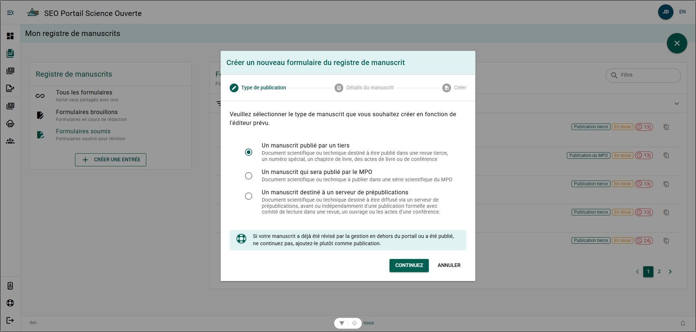
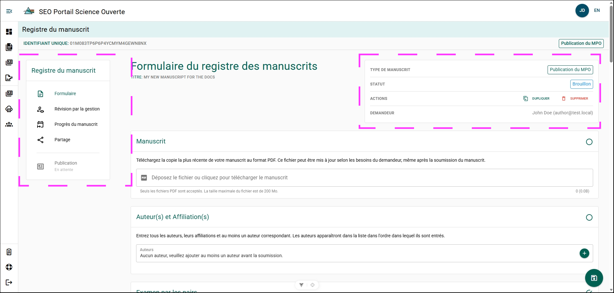

# Créer un formulaire de dossier de manuscrit

Créez un formulaire de dossier de manuscrit (MRF) pour commencer à faire le suivi d’une publication dans le Portail de science ouverte (PSO). Le MRF contient les renseignements sur le manuscrit et appuie le processus d’examen de la publication.

Créez un nouveau MRF à partir de la page **Mes manuscrits**.

**Étapes**

1. Cliquez sur **+ Créer un manuscrit** dans le menu **Manuscrits**.
2. Sélectionnez le **Type de publication souhaité**.
3. Cliquez sur **Continuer**.
4. Saisissez le titre du manuscrit dans le champ **Titre**.
5. Sélectionnez la **Région responsable** dans le champ **Régions du MPO**.
6. Cliquez sur **Continuer**.
7. Cliquez sur **Créer**.

**Résultat**

Un nouveau formulaire de dossier de manuscrit est créé et ouvert aux fins de modification.

**Informations supplémentaires**
- Si vous avez déjà effectué un examen de gestion du manuscrit à l’aide de l’ancien formulaire MRF, consultez la [Foire aux questions](../frequently-asked-questions#how-do-i-add-my-publication-if-i-completed-my-manuscript-management-review-using-the-old-form-mrf).

## Naviguer dans le formulaire de dossier de manuscrit {/* #navigate-the-manuscript-record-form */}

### Menu du dossier de manuscrit {/* #manuscript-record-menu */}

- **Formulaire** – Ouvre la page principale du MRF où vous pouvez remplir et soumettre le formulaire de dossier de manuscrit.
- **Examen de gestion du manuscrit** – Ouvre le [Panneau d’examen de gestion du manuscrit](./submit-manuscript-record-form#manuscript-management-review-panel) et affiche l’état actuel de l’examen.
- **Progression du manuscrit** – Ouvre la page [Progression du manuscrit](./manuscript-record-form-features#view-manuscript-progress) et affiche le flux de travail ainsi que la progression actuelle du MRF.
- **Partage** – Ouvre la page [Partage](./manuscript-record-form-features#share-a-manuscript-record-form), où vous pouvez partager le MRF avec d’autres utilisateurs. Les auteurs et les utilisateurs participant à l’examen de gestion y ont automatiquement accès et n’ont pas besoin d’être ajoutés.
- **Publication** – Ouvre le [Dossier de publication](../publications/my-publications-page) associé, s’il en existe un. Un dossier de publication est automatiquement créé lorsque le manuscrit est marqué comme accepté pour publication.

### Menu d’état du formulaire de dossier de manuscrit {/* #manuscript-record-form-status-menu */}

- **Type de manuscrit** : Affiche le type de publication associé au MRF.
- **État** : Affiche l’étape actuelle du MRF dans le processus de publication.
- **Actions** : Actions disponibles pour le MRF.
  - Consultez [Dupliquer un MRF](./manuscript-record-form-features#duplicate-a-manuscript-record-form).
  - Consultez [Supprimer un MRF](./manuscript-record-form-features#delete-a-manuscript-record-form).
- **Demandeur** : Personne qui a créé le MRF.

