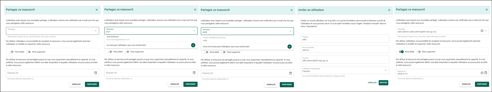

# Fonctionnalités du formulaire de dossier de manuscrit

## Supprimer un formulaire de dossier de manuscrit {/* #delete-a-manuscript-record-form */}

Un formulaire de dossier de manuscrit (MRF) peut être supprimé du PSO s’il est actuellement à l’état **Brouillon**.

**Étapes**

1. Ouvrez le MRF que vous souhaitez supprimer.
2. Cliquez sur **Supprimer**.
3. Confirmez l’action.

**Résultat**

Le MRF est supprimé du PSO et n’apparaît plus dans votre liste de formulaires de dossier de manuscrit.

## Dupliquer un formulaire de dossier de manuscrit {/* #duplicate-a-manuscript-record-form */}

La duplication d’un MRF vous permet de créer un nouveau dossier de manuscrit avec un nouveau type de publication tout en conservant les renseignements du dossier original.

**Étapes**

1. Ouvrez le MRF que vous souhaitez dupliquer.
2. Cliquez sur **Dupliquer**.
3. Sélectionnez le type de publication, puis cliquez sur **Suivant**.
4. Confirmez l’action.

**Résultat**

- Un nouveau MRF est créé et prérempli avec les mêmes renseignements que le dossier original.
- Le nouveau MRF est à l’état **Brouillon**.
- Le texte « (Clone) » est ajouté à la fin du titre du nouveau MRF.

**Informations supplémentaires**

- Les MRF dont le processus est terminé ou qui sont fermés peuvent également être dupliqués.

## Courriels de rappel mensuels {/* #monthly-reminder-emails */}

Le PSO envoie un **courriel de rappel mensuel** si vous avez des formulaires de dossier de manuscrit dont l’étape **Examen de gestion** est marquée comme **Terminée**.

Ces rappels permettent d’assurer un suivi précis du cycle de vie des publications et de maintenir à jour les renseignements sur les manuscrits dans le PSO.

## Partager un formulaire de dossier de manuscrit {/* #share-a-manuscript-record-form */}

Partagez l’accès à un formulaire de dossier de manuscrit (MRF) avec un autre utilisateur, comme un administrateur ou un chef de section.

:::tip
Les auteurs du MPO et les examinateurs associés au MRF y ont déjà accès en fonction de leur rôle et n’ont pas besoin d’être ajoutés manuellement.
:::

**Étapes**

1. Ouvrez le manuscrit à partir de la page **Mes dossiers de manuscrit**.
2. Sélectionnez **Partage** dans le menu de la section.
3. Cliquez sur **Partager**.
4. Entrez le nom ou l’adresse courriel de l’utilisateur dans le champ de recherche **Utilisateur**.
5. Sélectionnez l’utilisateur dans les résultats de recherche.
6. Sélectionnez le niveau d’accès.

Choisissez l’une des options suivantes :

- **Peut modifier** – Permet à l’utilisateur de consulter et de modifier le MRF.
- **Peut supprimer** – Permet à l’utilisateur de supprimer le MRF.

7. (Facultatif) Définissez une date d’expiration dans le champ **Expire le**.
8. Cliquez sur **Partager**.

**Étapes conditionnelles**

Si l’utilisateur n’apparaît pas dans les résultats de recherche :

- Suivez les étapes de la section **[Inviter un utilisateur](../common-features/invite-a-user)**.

**Résultat**

L’utilisateur sélectionné obtient l’accès au formulaire de dossier de manuscrit avec les autorisations attribuées.

### Modifier les autorisations de partage {/* #edit-share-permissions */}

Modifiez les autorisations d’un formulaire de dossier de manuscrit déjà partagé.

**Étapes**

1. Cliquez sur l’icône **Crayon** dans la colonne **Actions**.
2. Modifiez les paramètres de partage.
3. Cliquez sur **Enregistrer**.

**Résultat**

Les autorisations mises à jour sont appliquées au formulaire de dossier de manuscrit partagé.

### Supprimer les autorisations de partage {/* #remove-share-permissions */}

Supprimez l’accès partagé d’un utilisateur au formulaire de dossier de manuscrit.

**Étapes**

1. Cliquez sur l’icône **Corbeille** dans la colonne **Actions**.
2. Cliquez sur **OK** pour confirmer.

**Résultat**

L’accès de l’utilisateur au formulaire de dossier de manuscrit est supprimé.

## Consulter la progression du manuscrit {/* #view-manuscript-progress */}

Utilisez la page **Progression du manuscrit** pour suivre l’état du manuscrit tout au long du processus de publication.

**Étapes**

1. Ouvrez le manuscrit à partir de la page **Mes dossiers de manuscrit**.
2. Cliquez sur **Progression du manuscrit** dans le menu du dossier de manuscrit.

**Résultat**

La page **Progression du manuscrit** affiche l’état actuel du processus ainsi que les étapes importantes de la publication du manuscrit.

