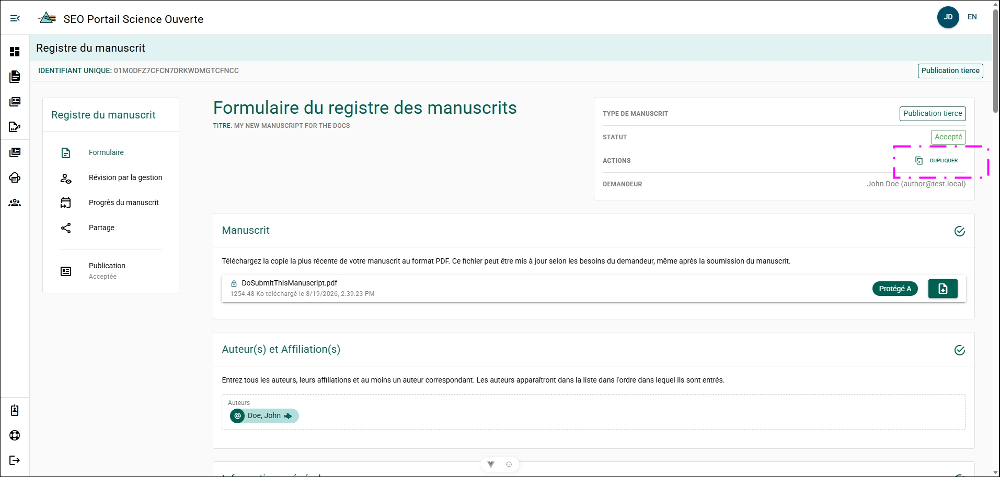
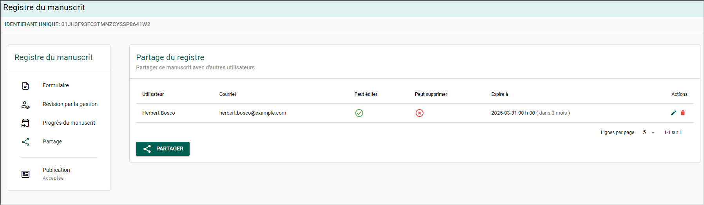
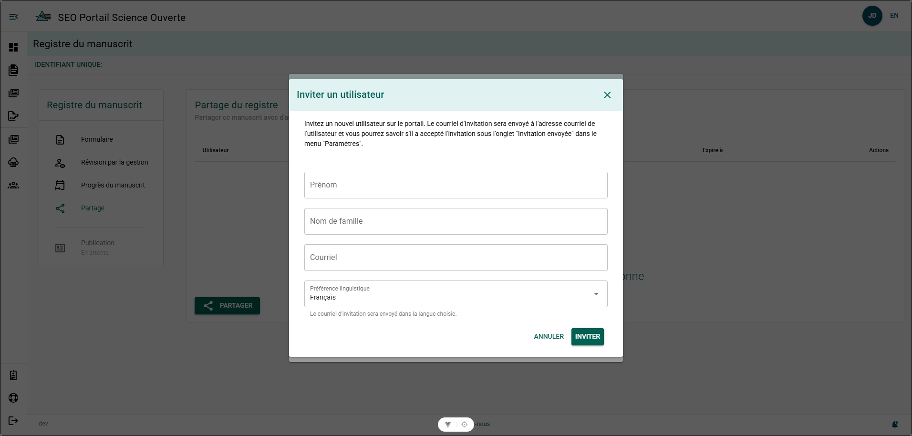
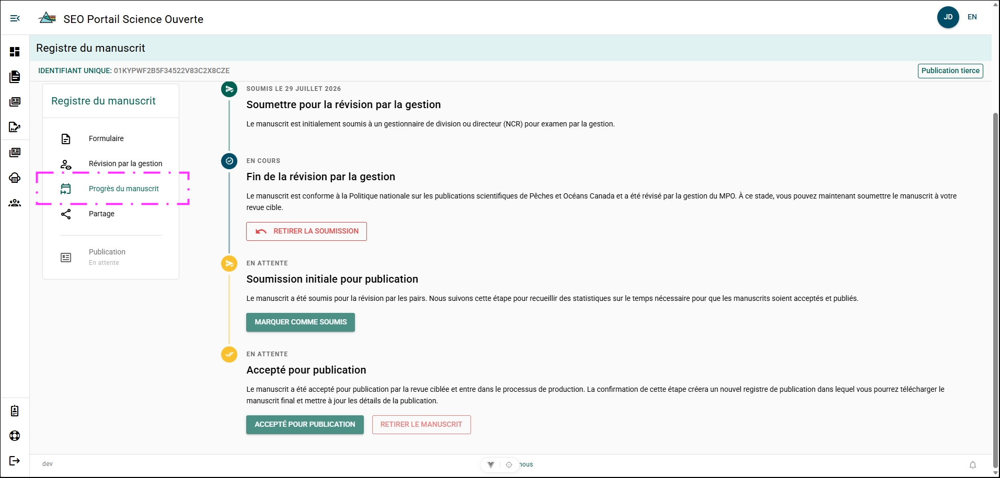

# Fonctionnalités du formulaire de dossier de manuscrit

## Supprimer un formulaire de dossier de manuscrit {/* #delete-a-manuscript-record-form */}

Un formulaire de dossier de manuscrit peut être supprimé du PSO s’il est actuellement à l’état **BROUILLON**.

**Étapes**

1. Ouvrez le MRF que vous souhaitez supprimer.
2. Cliquez sur **Supprimer**.
3. Confirmez l’action.

**Résultat**

Le MRF a été supprimé du PSO et n’apparaîtra plus dans votre liste de formulaires de dossier de manuscrit.

## Dupliquer un formulaire de dossier de manuscrit {/* #duplicate-a-manuscript-record-form */}

La duplication d’un MRF vous permet de créer un nouveau dossier de manuscrit avec un nouveau type de publication tout en conservant les renseignements du dossier original.

**Étapes**

1. Ouvrez le MRF que vous souhaitez dupliquer.
2. Cliquez sur **Dupliquer**.
3. Sélectionnez le type de publication, puis cliquez sur **Suivant**.
4. Confirmez l’action.

**Résultat**

- Un nouveau MRF est créé et prérempli avec les mêmes renseignements que le dossier original.
- Le nouveau MRF est à l’état **Brouillon**.
- La mention « (Clone) » est ajoutée à la fin du titre du nouveau MRF.

**Informations supplémentaires**

- Les MRF qui sont terminés ou fermés peuvent également être dupliqués.

## Courriels de rappel mensuels {/* #monthly-reminder-emails */}

Le PSO envoie un **courriel de rappel mensuel** si vous avez des formulaires de dossier de manuscrit pour lesquels l’étape **Examen de gestion** est indiquée comme **Terminée**.

Ces rappels permettent de s’assurer que le cycle de vie de la publication fait l’objet d’un suivi précis et que les renseignements sur le manuscrit demeurent à jour dans le PSO.

## Partager un formulaire de dossier de manuscrit {/* #share-a-manuscript-record-form */}

Partagez l’accès à un formulaire de dossier de manuscrit (MRF) avec un autre utilisateur, comme un administrateur ou un chef de section.

:::tip
Les auteurs du MPO et les examinateurs associés au MRF ont déjà accès au dossier en fonction de leur rôle et n’ont pas besoin d’y être ajoutés manuellement.
:::

**Étapes**

1. Ouvrez le MRF.
2. Sélectionnez **Partage** dans le menu du dossier de manuscrit.
3. Cliquez sur **Partager**.
4. Recherchez l’utilisateur par son nom ou son adresse courriel.
5. Sélectionnez l’utilisateur.
6. Sélectionnez le niveau d’accès :
    - **Peut modifier** – Permet à l’utilisateur de consulter et de modifier le MRF.
    - **Peut supprimer** – Permet à l’utilisateur de supprimer le MRF.
7. Définissez une date d’expiration (facultatif).
8. Cliquez sur **Partager**.

**Résultat**

- L’utilisateur sélectionné peut maintenant accéder au MRF avec les autorisations qui lui ont été attribuées.

### Inviter un utilisateur

Si l’utilisateur ne figure pas dans la liste des auteurs, vous pouvez l’inviter à accéder au PSO!

Dans la boîte de dialogue **Partager ce manuscrit** :

**Étapes**

1. Recherchez l’utilisateur par son nom ou son adresse courriel.
2. Cliquez sur **Vous ne trouvez pas l’utilisateur que vous recherchez?**.
3. Remplissez le formulaire **Inviter un utilisateur** :
    - Prénom
    - Nom de famille
    - Adresse courriel
    - Langue préférée
4. Cliquez sur **Inviter**.

**Résultat**

- Une invitation à utiliser le PSO est envoyée à l’adresse courriel de l’utilisateur.

**Informations supplémentaires**

- Vous pouvez consulter l’état de votre invitation dans [Invitations envoyées](../settings/sent-invitations).

### Modifier les autorisations de partage {/* #edit-share-permissions */}

Modifiez les autorisations d’un utilisateur ayant déjà accès à un formulaire de dossier de manuscrit partagé.

**Étapes**

1. Cliquez sur l’icône **Crayon** dans la colonne **Actions**.
2. Modifiez les paramètres de partage.
3. Cliquez sur **Enregistrer**.

**Résultat**

- Les autorisations mises à jour sont appliquées au formulaire de dossier de manuscrit partagé.

### Supprimer les autorisations de partage {/* #remove-share-permissions */}

Supprimez l’accès partagé d’un utilisateur au formulaire de dossier de manuscrit.

**Étapes**

1. Cliquez sur le bouton d’action **Supprimer**.
2. Confirmez l’action.

**Résultat**

- L’accès de l’utilisateur au formulaire de dossier de manuscrit est supprimé.

## Consulter la progression du manuscrit {/* #view-manuscript-progress */}

Utilisez la page **Progression du manuscrit** pour suivre l’état du manuscrit tout au long du processus de publication.

**Étapes**

1. Ouvrez le MRF.
2. Cliquez sur **Progression du manuscrit** dans le menu du dossier de manuscrit.

**Résultat**

- La page **Progression du manuscrit** affiche l’état actuel du flux de travail et les étapes importantes du processus de publication du manuscrit.

