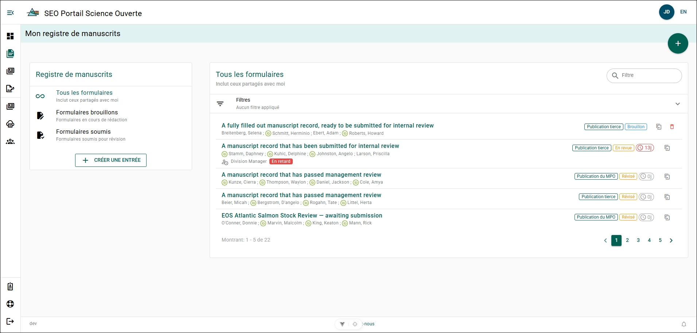

# Mes dossiers de manuscrit

La page **Mes dossiers de manuscrit** présente tous les dossiers de manuscrit que vous avez créés ou qui ont été partagés avec vous. La vue par défaut affiche les MRF qui ont été soumis et qui font actuellement l’objet d’un examen de gestion du manuscrit. Vous pouvez modifier la vue actuelle des MRF ou créer un nouveau MRF à partir du menu **Dossiers de manuscrit** situé à gauche de la page.

## Étiquettes de tous les formulaires de dossier {/* #all-record-forms-labels */}

- **ORCID** : Un cercle vert contenant les lettres « iD » à gauche du nom d’un auteur indique que celui-ci a associé un [ORCID](../references/orcid) à son compte.
- **Examen de gestion du manuscrit** : Une icône grise représentant une personne avec une horloge à gauche du nom d’un gestionnaire indique que ce MRF lui a été soumis aux fins d’examen de gestion du manuscrit.
- **En retard** : Une case rouge affichant « En retard » indique que ce MRF fait l’objet d’un examen de gestion du manuscrit depuis plus de 10 jours ouvrables.
- **Type de publication** : Une case verte affichant « Publication par un tiers », « Publication scientifique et technique secondaire de la DGEO » ou « Prépublication » indique le type de publication associé au MRF.
- **État** : Une case bleue affichant « Ébauche », une case jaune affichant « En cours d’examen », une case jaune affichant « Examiné », une case verte affichant « Accepté » ou une case rouge affichant « Retiré » indique l’état du MRF dans le cycle de publication.
- **Compteur d’examen** : Une case grise ou rouge contenant une horloge, un nombre et la lettre « j » indique le nombre de jours ouvrables écoulés depuis la soumission du MRF à l’examen de gestion du manuscrit. Si la case est rouge, le délai d’examen de 10 jours est dépassé.
- **Dupliquer** : Un carré gris contenant une flèche pointant vers l’intérieur représente l’[action de duplication](./duplicate-manuscript-record-form). Cette action vous permet de créer une copie de ce MRF.

