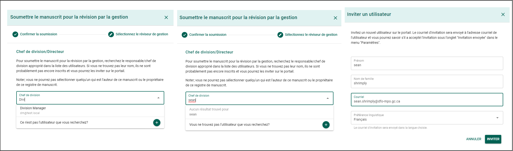
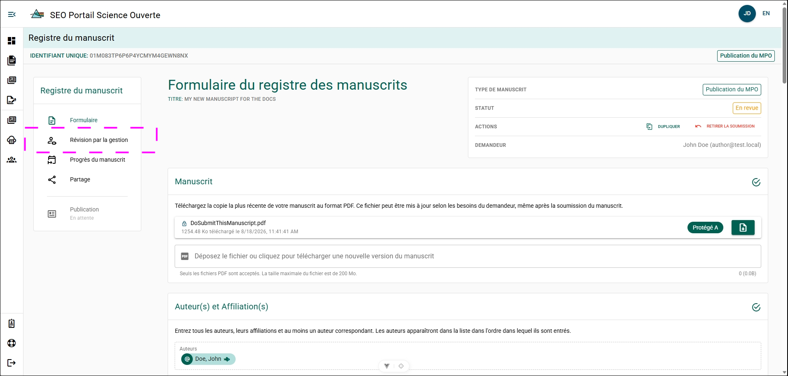
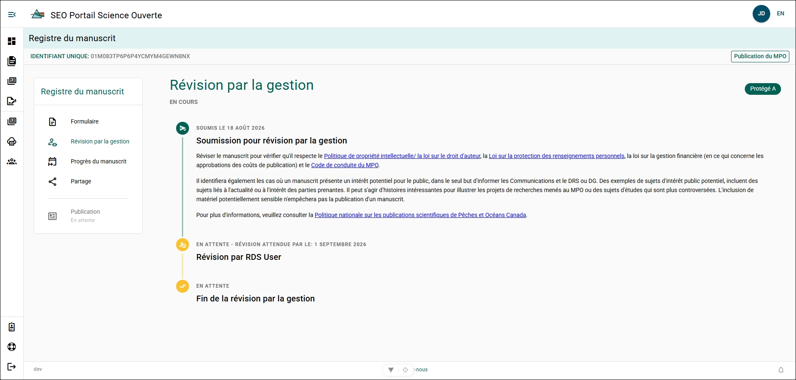
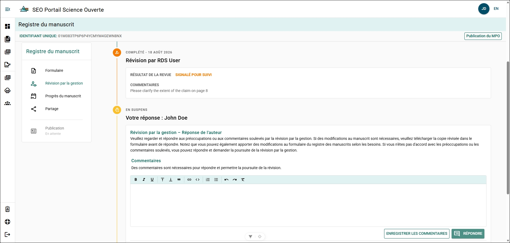
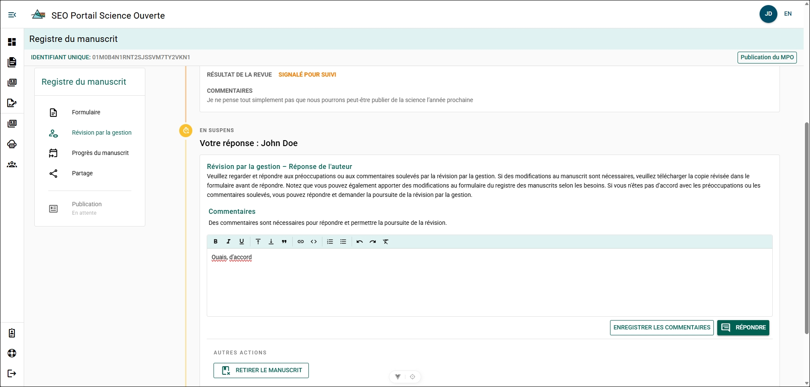

# Soumettre à l’examen de gestion du manuscrit

Soumettez le formulaire de dossier de manuscrit (MRF) une fois que tous les champs obligatoires ont été remplis.

:::important
Le **demandeur du MRF ou tout auteur inscrit** peut soumettre le manuscrit à l’examen de gestion du manuscrit.

L’utilisateur qui soumet le MRF devient automatiquement le **demandeur du MRF**.

Si la personne qui a créé le MRF **n’est pas un auteur** (par exemple, un adjoint administratif), elle peut perdre l’accès au MRF après sa soumission. Un auteur peut lui partager de nouveau le MRF au besoin.
:::

**Étapes**

1. Faites défiler la page **Dossier de manuscrit** jusqu’en bas.
2. Cliquez sur **Soumettre**.
3. Passez en revue la déclaration de consentement relative à la **Soumission à l’examen de gestion**.
4. Cliquez sur **Oui** pour accepter le consentement.
5. Cliquez sur **Suivant**.
6. Entrez le nom du gestionnaire chargé de l’examen dans le champ de recherche.
7. Sélectionnez le gestionnaire dans les résultats de recherche.
8. Cliquez sur **Soumettre**.

**Étapes conditionnelles**

Si le nom du gestionnaire chargé de l’examen n’apparaît pas dans les résultats de recherche :

1. Cliquez sur **Vous ne trouvez pas l’utilisateur que vous recherchez?**.
2. Entrez le **Prénom**, le **Nom de famille**, l’**Adresse courriel** et la **Langue préférée** du gestionnaire.
3. Cliquez sur **Inviter**.

**Résultat**

Le manuscrit est soumis à l’examen de gestion.

**Informations supplémentaires**

- Pour les types de publication **Publication par un tiers** et **Prépublication**, les gestionnaires de division, les directeurs de la Région de la capitale nationale (RCN) de la Direction générale des écosystèmes et des océans (DGEO), les directeurs régionaux des Sciences (DRS) ou les directeurs généraux (DG) de la DGEO dans la RCN peuvent effectuer l’examen de gestion du manuscrit.
- Pour le type de publication **Rapport scientifique et technique secondaire de la DGEO**, un DRS ou un DG de la DGEO dans la RCN peut effectuer l’examen de gestion du manuscrit.

Pour confirmer la soumission, vérifiez la case **État** dans le coin supérieur droit de la page **Dossier de manuscrit**. L’état devrait indiquer **En examen**.

## Panneau d’examen de gestion du manuscrit {/* #manuscript-management-review-panel */}

Vous pouvez consulter et gérer la progression de votre MRF pendant son examen de gestion à partir du panneau **Examen de gestion du manuscrit**.

Cliquez sur **Examen de gestion du manuscrit** dans le menu du dossier de manuscrit.

Le panneau **Examen de gestion du manuscrit** affiche :

- la date à laquelle le MRF a été soumis à l’examen de gestion du manuscrit;
- les éléments que le gestionnaire doit examiner;
- la date à laquelle l’examen en cours devrait être terminé;
- le résultat de l’examen de gestion du manuscrit.

### Commentaires de l’examen de gestion du manuscrit {/* #manuscript-management-review-comments */}

Le panneau **Examen de gestion du manuscrit** permet au gestionnaire chargé de l’examen de laisser des commentaires. Ces commentaires peuvent être consultés et faire l’objet d’une réponse directement dans le panneau. Les auteurs associés au MRF, les rédacteurs et les directeurs peuvent consulter les commentaires. Les commentaires sont enregistrés avec le dossier du MRF.

Si un commentaire est ajouté pendant l’examen de gestion du manuscrit, l’auteur correspondant reçoit une notification par courriel et une notification d’alerte apparaît sur la page **Tableau de bord** de tous les auteurs associés au MRF. Le compteur de 10 jours de l’examen de gestion du manuscrit est mis en pause afin de laisser du temps pour effectuer les révisions.

Pour poursuivre l’examen de gestion du manuscrit :

**Étapes**

1. Écrivez un commentaire dans la zone de commentaires.
2. Cliquez sur **Répondre**.

**Résultat**

- La réponse est envoyée au gestionnaire chargé de l’examen.
- Un courriel est envoyé au gestionnaire chargé de l’examen pour l’aviser de la réponse.
- Le compteur de 10 jours reprend.

### Se retirer de l’examen de gestion du manuscrit {/* #withdraw-from-manuscript-management-review */}

Si le gestionnaire chargé de l’examen a indiqué que votre MRF nécessite des révisions, vous avez la possibilité de le retirer de l’examen de gestion du manuscrit.

**Étapes**

1. Écrivez un commentaire dans la zone de commentaires.
2. Cliquez sur **Retirer le manuscrit**.
3. Confirmez l’action.

**Résultat**

- L’examen de gestion du manuscrit est terminé et prend fin.
- L’état du dossier de manuscrit passe à **Retiré**.
- Le dossier de manuscrit est verrouillé et ne peut plus être modifié.

## Annuler la soumission à l’examen de gestion du manuscrit {/* #unsubmit-from-manuscript-management-reviews */}

Un formulaire de dossier de manuscrit peut être retiré de l’examen de gestion du manuscrit et retourné à l’état **BROUILLON** en tout temps.

**Étapes**

1. Cliquez sur **Annuler la soumission**.
2. Indiquez la raison de l’annulation de la soumission.
3. Confirmez l’action.

**Résultat**

- Le MRF a été retiré de l’examen de gestion du manuscrit et est passé de l’état **En cours d’examen** à **Brouillon**.
- Une notification par courriel indiquant la raison de l’annulation de la soumission a été envoyée au gestionnaire chargé de l’examen et à l’auteur.

