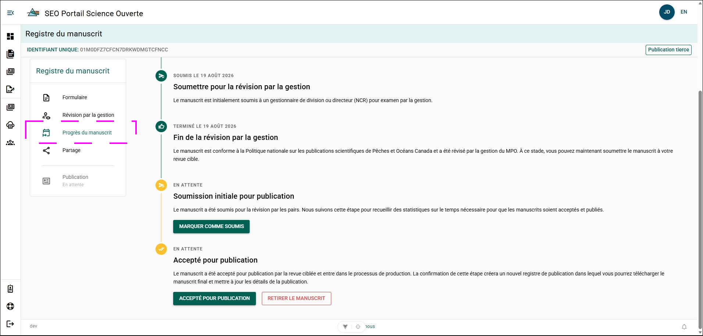
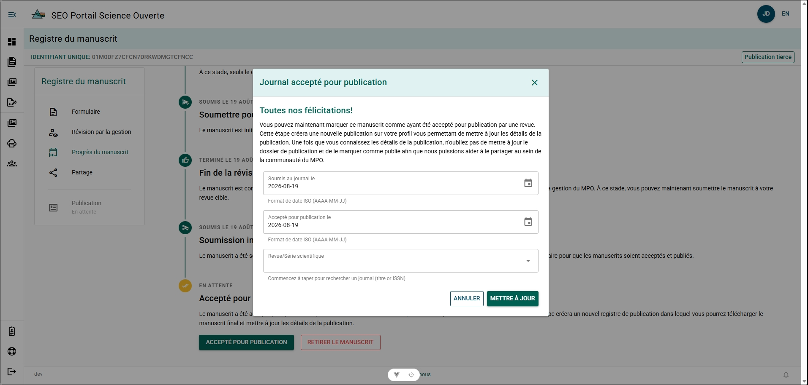
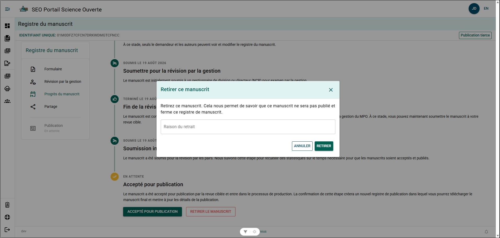
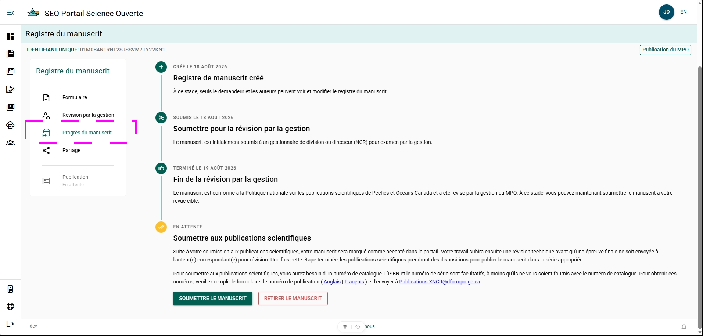
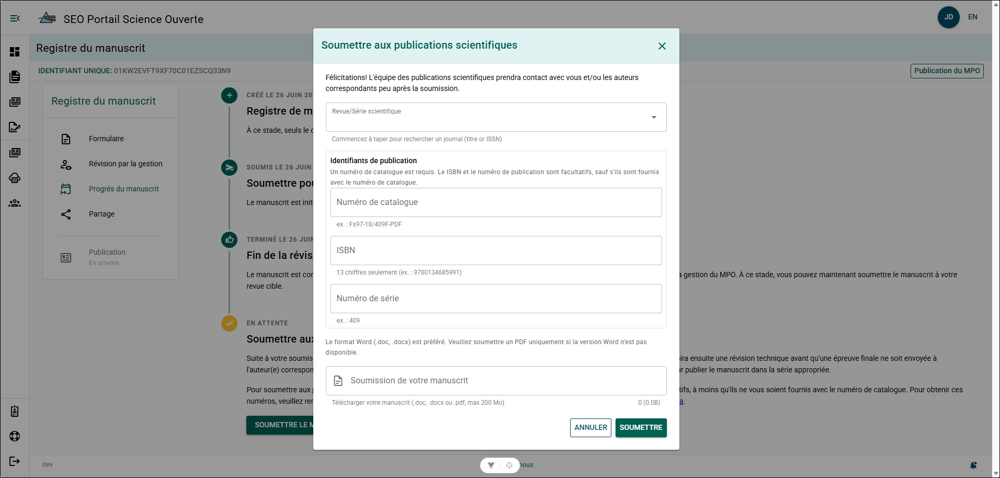

import ExternalLocalizedLink from '@site/src/components/ExternalLocalizedLink';

# Soumettre à l’éditeur

## Publications par un tiers et prépublications {/* #third-party-publications-and-preprints */}

Les publications par un tiers et les prépublications sont également appelées :
- Publications primaires

### Marquer comme soumis {/* #mark-as-submitted */}

Soumettez le manuscrit à une revue après avoir terminé le processus d’examen de gestion du manuscrit.

**Étapes**

1. Ouvrez le formulaire de dossier de manuscrit.
2. Sélectionnez **Progression du manuscrit** dans le menu du dossier de manuscrit.
3. Cliquez sur **Marquer comme soumis**.
4. Saisissez la date à laquelle le manuscrit a été soumis à l’éditeur.
5. Cliquez sur **Mettre à jour**.

**Résultat**

- Le MRF de ce manuscrit passe à l’état **Soumis** et ne peut plus être modifié.

### Accepté pour publication {/* #accepted-for-publication */}

Indiquez la décision de l’éditeur :

**Étapes**

1. Ouvrez le formulaire de dossier de manuscrit.
2. Sélectionnez **Progression du manuscrit** dans le menu du dossier de manuscrit.
3. Cliquez sur **Accepté pour publication**.
4. Remplissez le formulaire :
   - Saisissez la date **Soumis à la revue le**, si elle diffère de celle indiquée.
   - Saisissez la date **Accepté pour publication le**, si elle diffère de celle indiquée.
   - Saisissez et sélectionnez la **Revue/Série**.
5. Cliquez sur **Mettre à jour**.

**Résultat**

- Le MRF de ce manuscrit passe à l’état **Accepté**.
- Un [Dossier de publication](../publications/manage-publication-details-form) est automatiquement créé pour votre manuscrit.

:::tip
Continuez à mettre à jour le formulaire de dossier de manuscrit tout au long du processus de publication afin d’améliorer les mesures relatives aux délais de publication et d’accroître la visibilité du travail.
:::

### Retirer le manuscrit {/* #withdraw-manuscript */}

Indiquez que vous ne cherchez plus à publier ce manuscrit.

**Étapes**

1. Ouvrez le formulaire de dossier de manuscrit.
2. Sélectionnez **Progression du manuscrit** dans le menu du dossier de manuscrit.
3. Cliquez sur **Retirer le manuscrit**.
4. Saisissez un commentaire expliquant pourquoi vous retirez le manuscrit.
5. Cliquez sur **Retirer**.

**Résultat**

- Le MRF de ce manuscrit passe à l’état **Retiré**.

## Publications scientifiques et techniques secondaires de la DGEO {/* #eos-secondary-scientific-and-technical-publications */}

Les publications scientifiques et techniques secondaires de la DGEO sont également appelées :
- Publications secondaires
- Publications du MPO
- Rapports techniques

## Demander des numéros de publication {/* #request-publication-numbers */}

Après avoir terminé le **processus d’examen de gestion du manuscrit**, vous pouvez demander des numéros de publication à Publications du MPO.

**Étapes**

1. Remplissez le **Formulaire de demande de numéros de publication**.  
   <ExternalLocalizedLink linkKey="requestPubNums">**FORMULAIRE DE DEMANDE DE NUMÉROS DE PUBLICATION**</ExternalLocalizedLink>.
2. Envoyez le formulaire rempli par courriel à [**Publications.XNCR@dfo-mpo.gc.ca**](mailto:Publications.XNCR@dfo-mpo.gc.ca).
3. Insérez les numéros de publication dans le <ExternalLocalizedLink linkKey="colophonPage">**colophon ou la page de citation appropriée**</ExternalLocalizedLink> de votre rapport.

**Résultat**

Votre rapport possède les numéros de catalogue requis et est prêt à être publié.

:::info
Les DOI seront générés en votre nom par Publications scientifiques.
:::

## Soumettre à Publications scientifiques {/* #submit-to-science-publications */}

Soumettez le manuscrit à **Publications scientifiques** après avoir reçu les numéros de publication :

**Étapes**

1. Ouvrez le formulaire de dossier de manuscrit.
2. Sélectionnez **Progression du manuscrit** dans le menu de la section.
3. Cliquez sur **Soumettre le manuscrit**.
4. Remplissez le formulaire.

Remplissez les champs suivants :

- **Revue/Série** – Sélectionnez la série de publication.
- **Numéro de catalogue** – Saisissez le numéro de catalogue attribué.
- **Copie du manuscrit** – Téléversez le fichier du manuscrit (formats `.docx` ou `.doc` acceptés).
- **ISBN** – Saisissez l’ISBN, s’il est disponible.
- **Numéro de numéro** – Saisissez le numéro du numéro, s’il y a lieu.

5. Cliquez sur **Soumettre**.

**Résultat**

- Le manuscrit est soumis à **Publications scientifiques** aux fins d’examen et de publication.
- Un [Dossier de publication](../publications/manage-publication-details-form) est automatiquement créé pour votre manuscrit.
- Le MRF de ce rapport passe à l’état **Accepté** et ne peut plus être modifié.

:::tip
Soumettez votre manuscrit au format `docx`!

Vous pouvez soumettre votre manuscrit au format PDF. Toutefois, Publications scientifiques ne pourra pas y apporter de modifications si des changements sont requis. Cela entraînera des retards dans la publication. Si des modifications sont nécessaires, Publications scientifiques communiquera avec l’auteur correspondant par courriel.
:::
