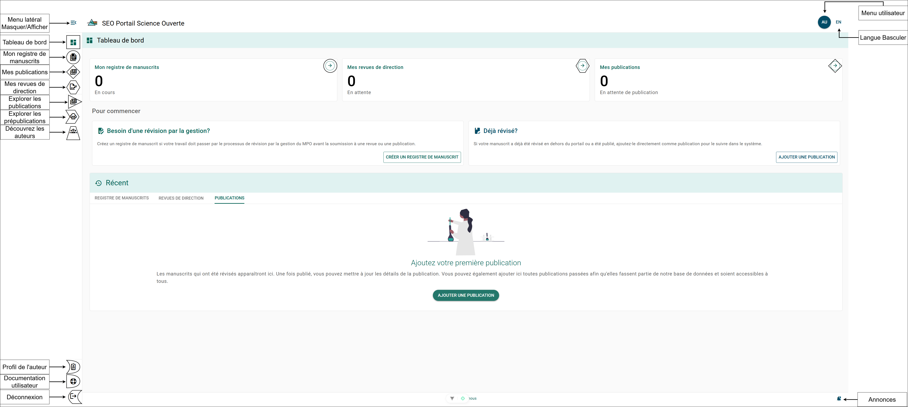
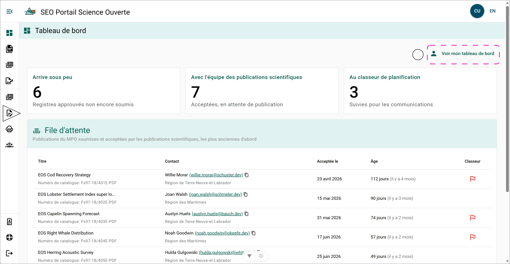

# Tableau de bord

## Tableau de bord de l’auteur {/* #author-dashboard */}

La page **Tableau de bord** est le principal point d’accès du PSO et la page vers laquelle vous serez redirigé après une authentification réussie. Pour accéder à la page **Tableau de bord** en tout temps, sélectionnez le bouton **Tableau de bord** dans le menu de gauche. Consultez le **symbole carré** dans la figure **Tableau de bord**.

### Boutons de navigation {/* #navigation-buttons */}

- □ [Tableau de bord](./dashboard)
- ○ [Mes manuscrits](../manuscript-record-forms/my-manuscripts)
- ◇ [Mes publications](../publications/my-publications)
- ⬡ [Mes examens de gestion](../manuscript-management-review/my-management-review)
- △ [Explorateur de publications](./publication-explorer)
- ⮞ [Explorateur de prépublications](./pre-print-explorer)
- ▱ [Explorateur des auteurs](./author-explorer)
- ☽ [Profil de l’auteur](../settings/author-profile)
- ◗ [Documentation utilisateur](https://osp-pso-docs.ent.dfo-mpo.ca/)
- ☾ Déconnexion
- ⍟ [Menu des paramètres](../settings/)
- EN/FR Bascule d’affichage entre l’anglais et le français

## Tableau de bord du rédacteur {/* #editor-dashboard */}

Si vous détenez un [rôle de rédacteur régional ou de rédacteur en chef](../references/roles), vous pourrez accéder au **Tableau de bord du rédacteur**. À partir de ce tableau de bord, vous pouvez consulter les publications scientifiques et techniques secondaires de la DGSE qui ont été soumises à **Publications scientifiques** aux fins d’examen et de publication.

### Boutons de navigation {/* #navigation-buttons-1 */}

- ○ Voir mon tableau de bord
  - Ce bouton remplace le tableau de bord du rédacteur par celui de l’auteur. Un bouton au même endroit vous permet de revenir au tableau de bord du rédacteur.
- △ [Explorateur régional des manuscrits](./regional-manuscript-explorer)

### File d’attente {/* #due-queue */}

- **Titre** : Titre du rapport avec le numéro de catalogue qui lui a été attribué.
- **Personne-ressource** : Principale personne-ressource du rapport et sa région responsable.
- **Accepté le** : Date à laquelle le rapport a été soumis à Publications scientifiques.
- **Âge** : Nombre de jours écoulés depuis la soumission du rapport à Publications scientifiques.
- **Cahier** : Si, pendant l’[examen de gestion du manuscrit](../manuscript-management-review), le rapport a été signalé comme devant être considéré pour le [Cahier de planification](../manuscript-management-review#planning-binder), un drapeau rouge apparaît.

