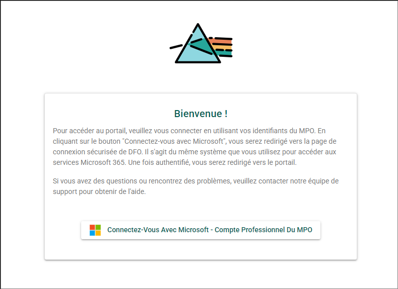

# Démarrage rapide

## Configuration requise {/* #system-requirements */}

### Adresse du site (URL) {/* #site-address-url */}

:::important
Assurez-vous d’être connecté au RPV du MPO si vous travaillez à distance. Le PSO est accessible uniquement à partir du réseau du MPO ou lorsque vous êtes connecté au RPV.
:::

[https://osp-pso.ent.dfo-mpo.ca](https://osp-pso.ent.dfo-mpo.ca)

### Exigences relatives au navigateur Web {/* #web-browser-requirements */}

Le PSO est optimisé pour tous les principaux navigateurs (Chrome, Firefox, Edge et Safari), à l’exception d’Internet Explorer 11 et des versions antérieures.

## Ouvrir une session {/* #logging-in */}

L’authentification au PSO s’effectue à l’aide de votre compte professionnel Microsoft du MPO. S’il s’agit de votre première connexion, un compte sera automatiquement créé pour vous à partir de votre profil du MPO.

Pour ouvrir une session dans le PSO :

1. Accédez au PSO : [https://osp-pso.ent.dfo-mpo.ca](https://osp-pso.ent.dfo-mpo.ca).
2. Cliquez sur **CONNEXION**.
3. Sélectionnez **Se connecter avec Microsoft – Compte professionnel du MPO**.
4. Suivez les instructions pour vous connecter à l’aide de votre compte professionnel Microsoft du MPO.

Si vous éprouvez des difficultés à ouvrir une session, veuillez communiquer avec **[l’équipe de soutien du PSO](mailto:DFO.OpenScience-ScienceOuverte.MPO@dfo-mpo.gc.ca)**.

## Mettre à jour les renseignements de l’utilisateur {/* #update-user-information */}

Pour accéder au menu des renseignements de l’utilisateur :

1. Cliquez sur le bouton circulaire **Menu utilisateur**, qui contient vos initiales et se trouve dans le coin supérieur droit de l’écran.
2. Cliquez sur le bouton **Paramètres**.

### Profil utilisateur {/* #user-profile */}

Assurez-vous que les renseignements suivants sont exacts :

- Prénom
- Nom
- Adresse courriel professionnelle
- Langue préférée

Si vous apportez des modifications, assurez-vous de les enregistrer en cliquant sur le bouton **Enregistrer** dans le coin inférieur droit de la section **Profil utilisateur**. Si vous devez modifier l’adresse courriel associée à ce compte, veuillez communiquer avec **[l’équipe de soutien du PSO](mailto:DFO.OpenScience-ScienceOuverte.MPO@dfo-mpo.gc.ca)**.

## Fermer une session {/* #logging-out */}

Pour fermer votre session dans l’application du Portail de la science ouverte :

1. Cliquez sur le bouton **Menu utilisateur** dans le coin supérieur droit de l’écran.
2. Cliquez sur le bouton **Déconnexion**.

Votre session dans l’application du Portail de la science ouverte est maintenant fermée. Veuillez noter qu’une période prolongée d’inactivité entraînera automatiquement la fermeture de votre session.
