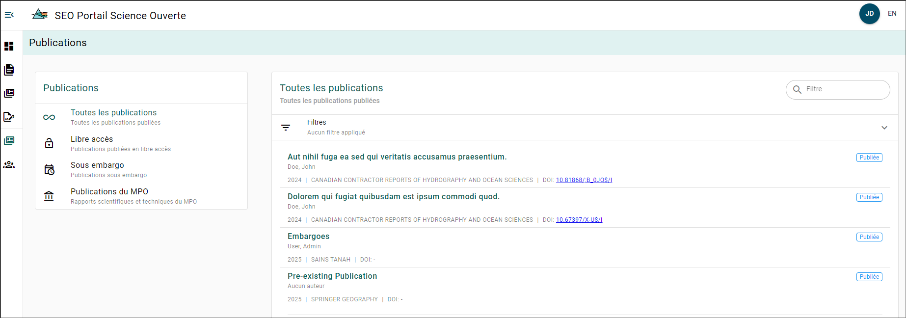
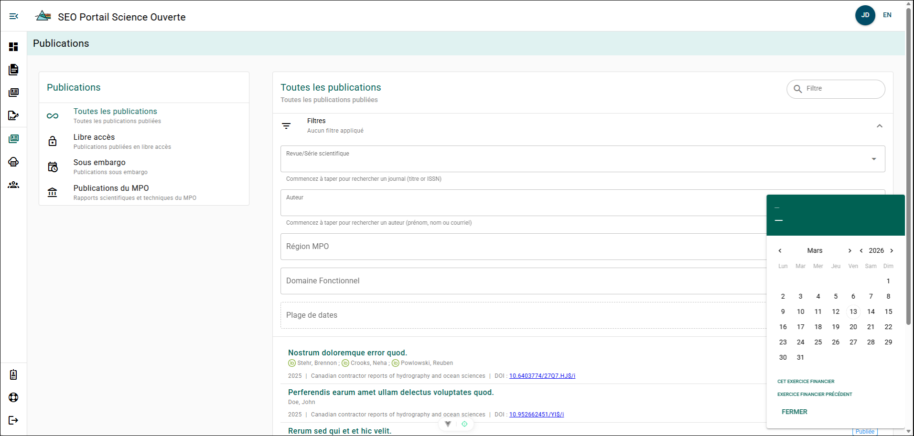

import Tabs from '@theme/Tabs';
import TabItem from '@theme/TabItem';

# Explorateur de publications

Vous pouvez explorer les publications soumises au PSO ainsi que leurs détails. Veuillez noter que si une publication est sous embargo, seuls ses détails peuvent être consultés.



### Filtrage {/* #filtering */}

Vous pouvez filtrer les publications par type à l’aide du **menu de filtres des publications** situé à gauche de la page.

:::tip

Le tableau de filtrage est également accessible aux rôles ayant accès à l’Explorateur régional des manuscrits!

:::



### Télécharger les renseignements sur les publications {/* #download-publications-information */}

Les renseignements sur les publications affichées dans l’Explorateur de publications peuvent être téléchargés sous forme de fichier Microsoft Excel (`.xlsx`) ou de fichier [Research Information Systems (RIS)](https://en.wikipedia.org/wiki/RIS_(file_format)) (`.ris`).

:::info
Si vous n’appliquez aucun filtre, les renseignements sur toutes les publications du PSO seront téléchargés!
:::

Les onglets ci-dessous présentent un exemple des renseignements téléchargés pour une publication ayant trois auteurs, pour chacun des types de fichiers :

<Tabs>
<TabItem value="excel" label="Excel" default>

Feuille 1 : **Publications**

| Title / Titre | Journal / Series / Série | Publisher / Éditeur | ISSN | Year / Année | Published On / Date de publication | Accepted On / Date d'acceptation | Embargoed Until / Sous embargo jusqu'au | Open Access / Libre accès | Status / Statut | DOI | ISBN | Catalogue Number / Numéro de catalogue | Region / Région | Functional Area / Secteur fonctionnel | Author Count / Nombre d'auteurs |
|---------------|:------------------------:|:-------------------:|:----:|:------------:|:----------------------------------:|:--------------------------------:|:---------------------------------------:|:-------------------------:|:---------------:|:---:|:----:|:--------------------------------------:|:---------------:|:-------------------------------------:|:-------------------------------:|
| Dolor dolorum suscipit repellendus facilis quo perspiciatis. | Canadian contractor reports of hydrography and ocean sciences | Fisheries and Oceans Canada - Pêches et Océans Canada | 1488-5425 | 2025 | 2025-07-21 | 2025-06-21 |  | No | published | 10.3408/6$/i |  |  | Newfoundland and Labrador Region / Région de Terre-Neuve-et-Labrador |  | 3 |

Feuille 2 : **Authors Auteurs**

| Publication Title / Titre de la publication | Published On / Date de publication | Author / Auteur | ORCID | Organization / Organisation | ROR | Corresponding Author / Auteur correspondant |
|--------------------------------------------|:----------------------------------:|-----------------|:-----:|-----------------------------|-----|:------------------------------------------:|
| Dolor dolorum suscipit repellendus facilis quo perspiciatis. | 2025-07-21 | Crist, Gregorio |  | Velit quos deleniti quia cupiditate. / Atque doloribus inventore nesciunt ut. | https://ror.org/0n9f7hu1 | No |
| Dolor dolorum suscipit repellendus facilis quo perspiciatis. | 2025-07-21 | Wyman, Daphne |  | Deserunt eaque id voluptas eum. / Suscipit repudiandae suscipit. | https://ror.org/072ar585 | No |
| Dolor dolorum suscipit repellendus facilis quo perspiciatis. | 2025-07-21 | Homenick, Diamond |  | Occaecati aliquid delectus. / Quia aut atque tempore exercitationem. | https://ror.org/0ee7bxs9 | No |

</TabItem>

<TabItem value="ris" label="RIS">

```mdx
TY  - RPRT
TI  - Dolor dolorum suscipit repellendus facilis quo perspiciatis.
AU  - Crist, Gregorio
AD  - Velit quos deleniti quia cupiditate. (https://ror.org/0n9f7hu1)
AU  - Wyman, Daphne
AD  - Deserunt eaque id voluptas eum. (https://ror.org/072ar585)
AU  - Homenick, Diamond
AD  - Occaecati aliquid delectus. (https://ror.org/0ee7bxs9)
PY  - 2025
DA  - 2025/07/21
JO  - Canadian contractor reports of hydrography and ocean sciences
PB  - Fisheries and Oceans Canada - Pêches et Océans Canada
SN  - 1488-5425
DO  - 10.3408/6$/i
ER  - 
```

</TabItem>
</Tabs>
