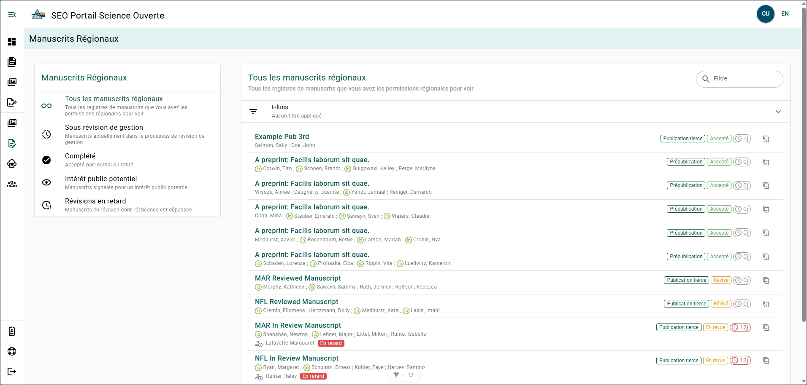

# Explorateur régional des manuscrits

:::info
Vous devez détenir le rôle `Region Editor`, `Editor`, `Chief Editor` ou `Director` pour consulter les manuscrits régionaux!
:::

L’Explorateur régional des manuscrits permet aux rédacteurs et aux directeurs de consulter les formulaires de dossier de manuscrit (MRF) qui sont en cours d’examen de gestion du manuscrit.

## Régional ou national {/* #regional-vs-national */}

Les utilisateurs ayant le rôle **Rédacteur régional** verront uniquement les MRF de leur région. Les rôles **Rédacteur**, **Rédacteur en chef** et **Directeur** permettent de consulter les MRF de toutes les régions.

## Menu de filtres rapides {/* #quick-filter-menu */}

Le menu **Manuscrits régionaux** situé à gauche de la page vous permet de filtrer rapidement la liste des MRF :

- **Tous les manuscrits régionaux** : Affiche tous les MRF.
- **En cours d’examen de gestion du manuscrit** : MRF qui ont été soumis à l’examen de gestion du manuscrit.
- **Terminés** : MRF dont l’examen de gestion du manuscrit est terminé et qui ont été acceptés pour publication ou retirés.
- **Intérêt potentiel pour le public** : MRF qui ont été signalés pour le Cahier de planification pendant l’examen de gestion du manuscrit.
- **Examens en retard** : MRF qui sont en cours d’examen de gestion du manuscrit depuis plus de 10 jours.

