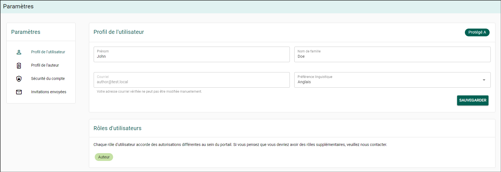
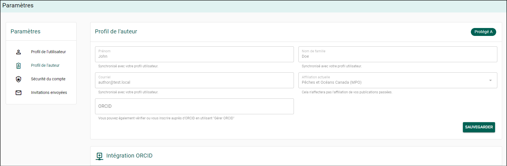
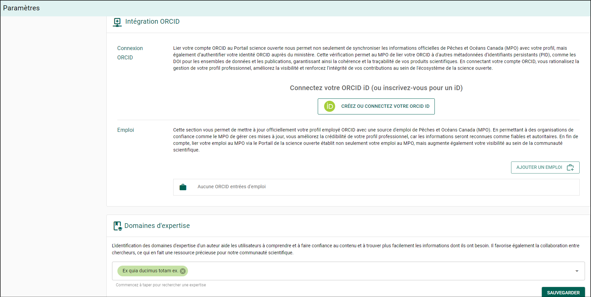
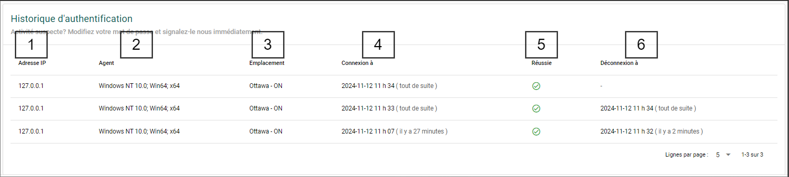
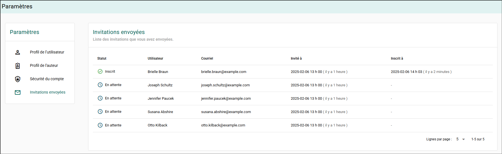
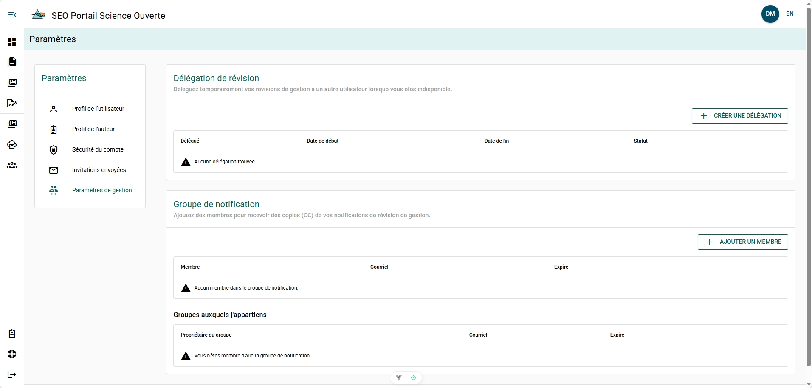
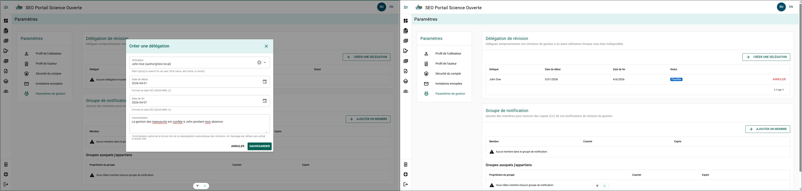
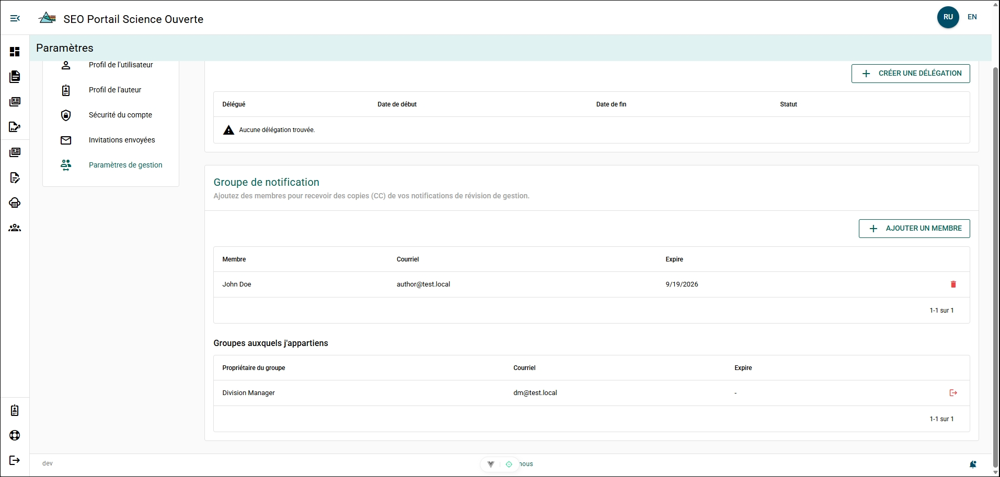

# Paramètres du compte

## Page du profil utilisateur {/* #user-profile-page */}

### Profil utilisateur {/* #user-profile */}

#### Prénom et nom de famille {/* #first-and-last-name */}

Le **prénom et le nom de famille** associés à votre compte apparaîtront en gris. Si vous souhaitez modifier le nom associé à votre compte :

1. Cliquez sur le **champ Nom** pour le sélectionner.
2. Appuyez sur **Retour arrière** pour supprimer l’ancien nom.
3. Entrez le nouveau nom.
4. Cliquez sur le **bouton Enregistrer** pour sauvegarder les changements.

#### Courriel {/* #email */}

L’adresse courriel associée à votre compte apparaîtra en gris et ne peut pas être modifiée. Cette adresse est également utilisée pour vous connecter à votre compte du Portail de la science ouverte. Si vous souhaitez modifier cette adresse courriel, veuillez envoyer un courriel à l’[équipe de soutien du Portail de la science ouverte](mailto:DFO.OpenScience-ScienceOuverte.MPO@dfo-mpo.gc.ca).

#### Langue par défaut {/* #default-language */}

La langue par défaut de votre compte apparaîtra dans cette boîte. Si vous souhaitez modifier votre langue par défaut :

1. Cliquez sur la **boîte Langue par défaut** pour afficher le menu déroulant.
2. Sélectionnez la langue souhaitée.
3. Cliquez sur le **bouton Enregistrer** pour sauvegarder les changements.

### Rôles utilisateur {/* #user-roles */}

Les rôles utilisateur déterminent le type de compte que vous possédez. Tous les utilisateurs reçoivent le rôle Auteur lors de la création de leur compte.

Envoyez un courriel à l’[équipe de soutien du PSO](mailto:DFO.OpenScience-ScienceOuverte.MPO@dfo-mpo.gc.ca) pour ajouter ou retirer des rôles à votre compte.

#### Tableau sommaire des permissions {/* #permission-summary-table */}

| Permission | Auteur (par défaut) | Directeur | Éditeur | Éditeur en chef | Éditeur régional | Observateur régional |
|------------|:-------------------:|:---------:|:--------:|:---------------:|:----------------:|:--------------------:|
| Créer des dossiers de manuscrits | ✓ | ✓ | ✓ | ✓ | ✓ | ✓ |
| Créer des publications | ✓ | ✓ | ✓ | ✓ | ✓ | ✓ |
| Mettre à jour les auteurs | ✗ | ✗ | ✓ | ✓ | Régional | ✗ |
| Compléter un examen de gestion | ✗ | ✓ | ✗ | ✗ | ✗ | ✗ |
| Voir tous les dossiers de manuscrits | ✗ | ✓ | ✓ | ✓ | Régional | Régional |
| Mettre à jour les publications | ✗ | ✗ | ✓ | ✓ | Régional | ✗ |
| Supprimer des publications | ✗ | ✗ | ✗ | ✓ | ✗ | ✗ |
| Publier des publications secondaires du SEO | ✗ | ✗ | ✗ | ✓ | ✗ | ✗ |
| Mettre à jour les affiliations des auteurs | ✗ | ✗ | ✓ | ✓ | ✗ | ✗ |

## Page du profil d’auteur {/* #author-profile-page */}

### Profil d’auteur {/* #author-profile */}

#### Affiliation actuelle {/* #current-affiliation */}

Comme le PSO est actuellement une plateforme interne, l’**affiliation actuelle** de tous les utilisateurs est définie à Pêches et Océans Canada. Si vous souhaitez modifier votre **affiliation actuelle**, veuillez envoyer un courriel à l’[équipe de soutien du Portail de la science ouverte](mailto:DFO.OpenScience-ScienceOuverte.MPO@dfo-mpo.gc.ca).

#### ORCID {/* #orcid */}

Si vous possédez un ORCID mais que vous **ne souhaitez pas** authentifier votre compte PSO avec ORCID, vous pouvez l’ajouter manuellement à votre profil d’auteur. Toutefois, il est fortement recommandé de connecter et d’authentifier votre compte PSO avec votre ORCID. Veuillez consulter la section [ORCID](./orcid.mdx) pour plus d’information.

### Intégration ORCID {/* #orcid-integration */}

Le PSO permet la connexion et l’authentification de votre **Open Researcher and Contributor ID (ORCID)** avec votre compte PSO. Cette intégration permet de gérer vos dossiers ORCID par l’intermédiaire du PSO avec une identification officielle du MPO.

Pour des instructions détaillées sur l’intégration ORCID et la connexion de votre compte ORCID au PSO, veuillez consulter la section [ORCID](orcid).

### Domaines d’expertise {/* #areas-of-expertise */}

La boîte **Domaines d’expertise** affiche les expertises que vous avez sélectionnées et qui représentent le mieux vos connaissances et votre expérience.

Pour ajouter ou retirer une expertise :

1. Cliquez sur le **bouton MODIFIER**.
2. Sélectionnez le champ **Domaines d’expertise**.
3. Commencez à saisir l’expertise souhaitée.
4. Cliquez sur l’expertise que vous souhaitez ajouter dans la liste filtrée.
5. Pour retirer une expertise, cliquez sur l’icône **X** à côté de l’expertise.
6. Cliquez sur le **bouton ENREGISTRER** pour confirmer vos changements.

## Sécurité du compte {/* #account-security */}

### Historique d’authentification {/* #authentication-history */}

Le Portail de la science ouverte conserve un historique des tentatives de connexion pour chaque compte utilisateur. Cet historique fournit une visualisation de l’activité de connexion afin de vous aider à surveiller les tentatives d’accès non autorisées.

:::danger
Si vous remarquez plusieurs tentatives de connexion dans un court laps de temps ou toute autre activité suspecte :

- Informez l’[équipe de soutien du Portail de la science ouverte](mailto:DFO.OpenScience-ScienceOuverte.MPO@dfo-mpo.gc.ca).
:::

#### Description de l’historique d’authentification {/* #authentication-history-breakdown */}

##### 1 - Adresse IP {/* #1---ip-address */}

La colonne Adresse IP correspond à l’adresse Internet associée à l’ordinateur tentant de se connecter à votre compte.

##### 2 - Agent {/* #2---agent */}

La colonne Agent correspond au système d’exploitation de l’ordinateur tentant de se connecter à votre compte.

##### 3 - Emplacement {/* #3---location */}

:::tip
Si vous vous connectez au Portail de la science ouverte à l’aide d’un VPN, cet emplacement peut être différent de votre emplacement actuel.
:::

La colonne Emplacement indique l’emplacement géographique approximatif associé à l’adresse IP.

##### 4 - Connexion à {/* #4---login-at */}

La colonne Connexion à affiche la date et l’heure auxquelles une tentative de connexion a été effectuée sur votre compte. L’heure affichée correspond à l’heure de votre ordinateur.

##### 5 - Réussite {/* #5---successful */}

La colonne Réussite indique si la connexion à votre compte a réussi ou non. Si elle a réussi, une coche verte sera affichée. Sinon, une croix rouge apparaîtra.

##### 6 - Déconnexion à {/* #6---logout-at */}

La colonne Déconnexion à affiche la date et l’heure auxquelles votre compte a été déconnecté. L’heure affichée correspond à l’heure de votre ordinateur.

## Invitations envoyées {/* #sent-invitations */}

Les invitations que vous avez envoyées aux utilisateurs pour les inviter au PSO seront affichées sur la page Invitations envoyées. La date et l’heure auxquelles un utilisateur invité se connecte au PSO pour la première fois seront affichées dans la colonne **Inscrit le**.

## Paramètres de gestion {/* #management-settings */}

### Délégation d’examen {/* #review-delegation */}

La délégation d’examen vous permet de déléguer temporairement vos responsabilités liées aux examens de gestion des manuscrits à un autre utilisateur. Cette délégation est utilisée lorsqu’un autre utilisateur agit en votre nom pendant une période donnée.

Les règles de délégation comprennent :

- Limité dans le temps : la délégation doit avoir une date de début et une date de fin. La délégation peut être interrompue plus tôt.
- Aucune chaîne : un utilisateur ne peut avoir plus d’une délégation active à la fois.
- Niveau équivalent : un utilisateur ne peut pas avoir des permissions de rôle supérieures à celles du gestionnaire délégant.
- Aucune autodélégation : un utilisateur ne peut pas se déléguer à lui-même ni prolonger sa propre période de délégation.

#### Déléguer un utilisateur {/* #delegate-a-user */}

1. Cliquez sur **+ CRÉER UNE DÉLÉGATION**.
2. Remplissez le formulaire :
   - **Utilisateur** – Sélectionnez l’utilisateur qui recevra la délégation.
   - **Date de début** – Entrez la date de début de la délégation.
   - **Date de fin** – Entrez la date de fin de la délégation.
   - **Commentaires** (facultatif) – Entrez des notes au besoin.
3. Cliquez sur **ENREGISTRER**.

**Résultat** : L’utilisateur sélectionné peut maintenant agir en votre nom pendant la période de délégation. Les détails de la délégation ont été envoyés par le PSO à vous, à l’utilisateur délégué et à votre groupe de notification.

### Groupe de notification {/* #notification-group */}

Le groupe de notification vous permet de sélectionner les utilisateurs que vous souhaitez mettre en copie conforme (CC) des courriels d’examen de gestion des manuscrits que vous recevez du PSO.

#### Ajouter un membre à votre groupe de notification {/* #add-member-to-your-notification-group */}

1. Cliquez sur **+ AJOUTER UN MEMBRE**.
2. Remplissez le formulaire :
   - **Utilisateur** – Sélectionnez l’utilisateur qui recevra les courriels.
   - **Expiration** (facultatif) – Sélectionnez la date à laquelle l’utilisateur cessera de recevoir les courriels.
3. Cliquez sur **ENREGISTRER**.

**Résultat** – L’utilisateur est ajouté à votre groupe de notification.

#### Retirer un membre de votre groupe de notification {/* #remove-member-from-your-notification-group */}

1. Cliquez sur l’icône **Supprimer** à la fin de la ligne de l’utilisateur.

**Résultat** : L’utilisateur est retiré de votre groupe de notification. Vous recevrez un courriel vous informant de ce changement.

#### Vous retirer d’un groupe de notification {/* #remove-yourself-from-a-notification-group */}

1. Cliquez sur l’icône **Quitter** à la fin de la ligne du groupe.

**Résultat** : Vous êtes retiré de ce groupe de notification. Le propriétaire du groupe sera informé du changement par courriel.

#### Plus de détails {/* #more-details */}

Les courriels d’examen de gestion des manuscrits que votre groupe de notification recevra comprennent :

- Notifications des étapes d’examen (nouveau réviseur assigné)
- Rappels des examens de gestion à échéance ou en retard
- Résumés hebdomadaires des examens de gestion en attente
- Notifications de fin d’examen de gestion
- Notifications de création de délégation
- Rappels liés au cahier de planification