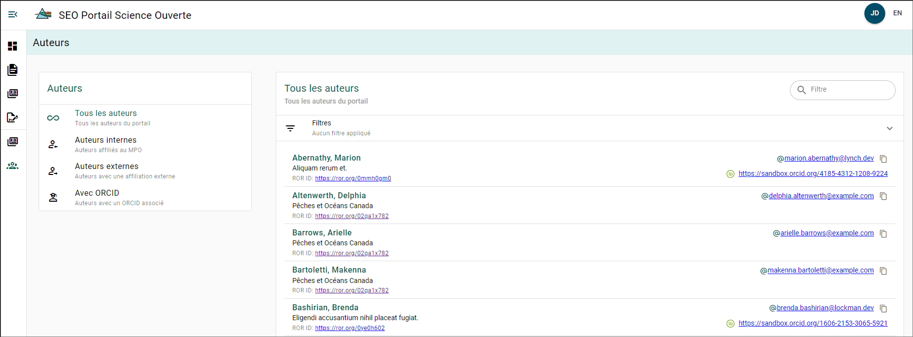

# Explorateur des auteurs

Vous pouvez explorer tous les auteurs qui ont créé un compte dans le PSO ou qui ont été ajoutés comme auteurs à un manuscrit. En explorant un auteur, vous pouvez accéder à un lien vers la page ROR de son organisation, à son adresse courriel et à son ORCID (s’il est disponible).

Les auteurs peuvent être filtrés à l’aide du **menu de filtrage des auteurs** situé sur le côté gauche de la page. Les filtres disponibles sont :

- Tous les auteurs
- Auteurs internes
- Auteurs externes
- Auteurs avec ORCID