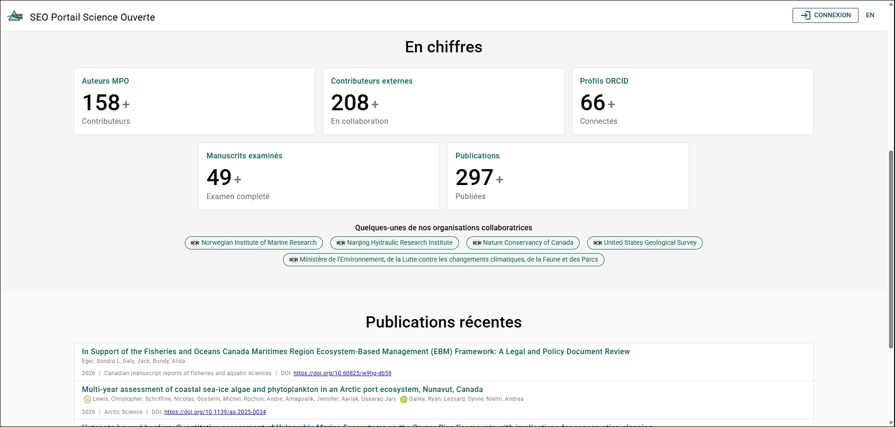

# Indicateurs du portail

La page de connexion présente un résumé des publications à mesure qu’elles progressent dans le Portail de la science ouverte. Vous n’avez pas besoin d’être connecté pour consulter cette page.

Pour accéder à cette page, vous pouvez effectuer l’une des actions suivantes :

- Aller à l’adresse suivante : [https://osp-pso.ent.dfo-mpo.ca](https://osp-pso.ent.dfo-mpo.ca/#/).
- Cliquer sur l’icône **Accueil du PSO** située à gauche de la bannière supérieure.

