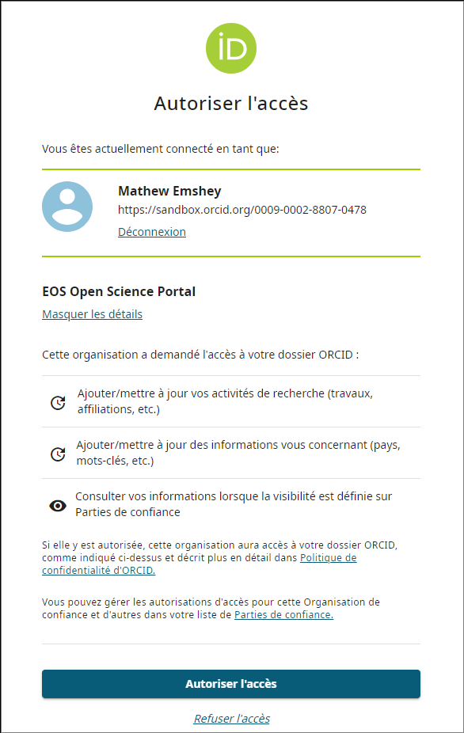
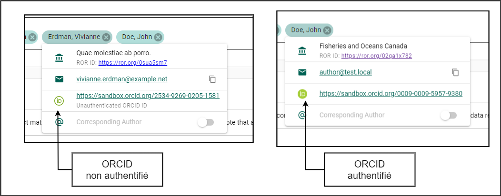
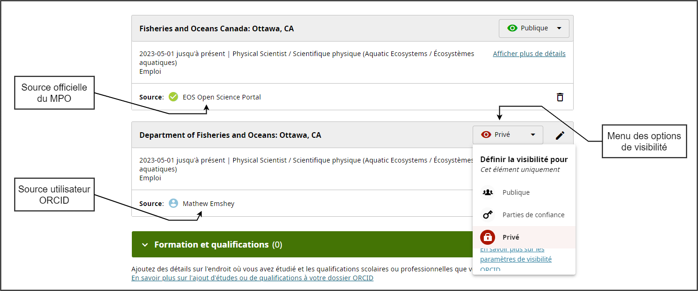
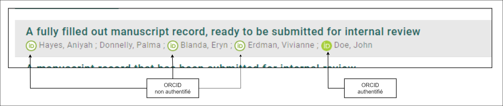
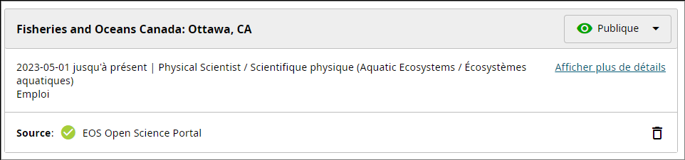
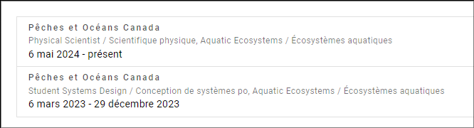

# ORCID

[ORCID (Open Researcher and Contributor ID)](https://orcid.org/) est un identifiant numérique unique et persistant (PID) qui permet de distinguer les chercheurs et leurs travaux. Il relie les contributions — telles que les articles, les ensembles de données et les évaluations — entre les organisations, les revues et les organismes de financement. ORCID permet aux chercheurs d’obtenir une attribution et une reconnaissance appropriées pour leurs travaux, même lorsqu’ils changent d’institution ou de rôle.

ORCID simplifie la collecte de données et la production de rapports, améliore la collaboration et la visibilité entre les projets, et facilite la gestion des profils de chercheurs. Cela favorise la transparence et la continuité des activités scientifiques.

## Créer un ORCID {/* #create-an-orcid */}

Suivez ces étapes si vous **n’avez pas déjà** de compte ORCID :

1. Accédez à [osp-pso.ent.dfo-mpo.ca](https://osp-pso.ent.dfo-mpo.ca/) et connectez-vous.
2. Cliquez sur le bouton **Menu utilisateur** situé dans le coin supérieur droit de la page.
3. Sélectionnez le bouton **Paramètres**.
4. Dans le menu **Paramètres** à gauche, cliquez sur le bouton **Profil d’auteur**.
5. Dans la section **Intégration ORCID**, cliquez sur **CRÉER OU CONNECTER VOTRE IDENTIFIANT ORCID**.
6. Sur la page ORCID, cliquez sur le lien **Register now** sous l’en-tête **Sign in to ORCID**.
7. Remplissez le formulaire d’inscription et cliquez sur **Next Step**.

:::tip
Il est recommandé d’utiliser votre adresse courriel personnelle comme **courriel principal**, puisque votre profil ORCID est personnel et non lié au MPO.  
Vous pouvez utiliser votre adresse @dfo-mpo.gc.ca comme **courriel secondaire**.
:::

8. Configurez votre mot de passe et cliquez sur **Next Step**.
9. Ignorez le formulaire *Current employment* en cliquant sur **Skip this step without adding an affiliation** sous le bouton **Next Step**.  
   (Votre **dossier d’emploi** sera ajouté dans la section [Ajouter un emploi par l’entremise du PSO](#add-employment-through-the-osp).)
10. Choisissez le niveau de visibilité souhaité pour votre profil et cliquez sur **Next Step**.
11. Acceptez les conditions d’utilisation d’ORCID et cliquez sur **Complete registration**.
12. Cliquez sur **Authorize access**.  
    Pour plus de détails sur l’accès autorisé au PSO, consultez [Autoriser l’accès](#authorize-access).
13. Cliquez sur **CONTINUE** pour finaliser le processus.
14. Vérifiez la boîte de réception de votre courriel principal et cliquez sur **Verify your email address**.
15. Félicitations ! Votre compte ORCID est maintenant créé, vérifié et lié à votre profil PSO !

## Ajouter un ORCID existant à votre profil PSO {/* #add-an-existing-orcid-to-your-osp-profile */}

Suivez ces étapes si vous **avez déjà** un compte ORCID et souhaitez le lier à votre profil PSO :

1. Accédez à [osp-pso.ent.dfo-mpo.ca](https://osp-pso.ent.dfo-mpo.ca/) et connectez-vous.
2. Cliquez sur le bouton **Menu utilisateur** situé dans le coin supérieur droit de la page.
3. Sélectionnez le bouton **Paramètres**.
4. Dans le menu **Paramètres** à gauche, cliquez sur **Profil d’auteur**.
5. Dans la section **Intégration ORCID**, cliquez sur **CRÉER OU CONNECTER VOTRE IDENTIFIANT ORCID**.
6. Connectez-vous à votre compte ORCID existant et cliquez sur **Sign in to ORCID**.
7. Cliquez sur **Authorize access**.  
   Pour plus de détails sur l’accès que vous accordez, consultez [Autoriser l’accès](#authorize-access).
8. Cliquez sur **CONTINUE**.
9. Félicitations ! Votre compte ORCID est maintenant lié à votre profil PSO !

## Autoriser l’accès {/* #authorize-access */}

Afin d’optimiser votre expérience avec ORCID par l’intermédiaire du PSO, nous recommandons d’autoriser le PSO à mettre à jour votre profil ORCID en votre nom. Cette autorisation confirme votre affiliation au MPO et permet au PSO d’ajouter automatiquement des attributs comme les affiliations, les domaines d’expertise et les contributions de recherche à votre profil ORCID.

En gérant vos dossiers d’emploi par l’intermédiaire du PSO, vous permettez l’affichage d’un badge officiel de source du MPO sur votre profil ORCID, fournissant des références visibles et vérifiées qui renforcent votre crédibilité professionnelle.

## Gérer les dossiers d’emploi {/* #manage-employment-records */}

Lier votre emploi au MPO à votre profil ORCID par l’intermédiaire du PSO augmente la crédibilité de votre profil et améliore sa visibilité et sa fiabilité au sein de la communauté scientifique.

### Ajouter un emploi par l’entremise du PSO {/* #add-employment-through-the-osp */}

Pour ajouter un dossier d’emploi par l’intermédiaire du PSO :

1. Accédez à la section **Intégration ORCID** dans le **Profil d’auteur** du PSO.
2. Cliquez sur le bouton **AJOUTER UN EMPLOI**.
3. Remplissez le formulaire *Ajouter un emploi du MPO à ORCID*, y compris :
   - **Organisation** : Pêches et Océans Canada (prérempli par défaut)
   - **Direction** : Sciences des écosystèmes et des océans / Ecosystems and Oceans Science
   - **Rôle / Titre du poste** : Par exemple, *Biologiste / Biologist*
   - Laissez la **date de fin** vide si vous ajoutez votre poste actuel.
4. Cliquez sur **CRÉER** pour enregistrer le poste.

:::tip
**Bonne pratique :** Incluez votre direction et votre titre de poste en anglais et en français !  
Consultez [Bonnes pratiques](#best-practices) pour plus d’information.
:::

### Masquer les emplois non attribués au MPO {/* #hide-non-dfo-sourced-employment */}

Lors de la création de votre compte ORCID, vous pouvez ajouter votre emploi actuel, qui sera affiché comme étant *attribué par votre compte utilisateur ORCID*. Toutefois, il est recommandé que tous les dossiers liés à vos activités au MPO affichent le badge officiel de source du MPO, conformément aux [bonnes pratiques ORCID](#best-practices).

Pour masquer votre dossier d’emploi autoattribué :

1. Ajoutez vos emplois actuels et/ou précédents en suivant les étapes de [Ajouter un emploi par l’entremise du PSO](#add-employment-through-the-osp).
2. Connectez-vous à votre compte ORCID à l’adresse [orcid.org](https://orcid.org/signin).
3. Dans la section *Employment*, trouvez le dossier d’emploi identifié par **Source : *Votre nom***.
4. Cliquez sur le bouton **Visibility** situé dans le coin supérieur droit du dossier pour afficher les *paramètres de visibilité*.
   - Les options incluent **Everyone**, **Trusted parties** ou **Only me**, selon les paramètres choisis lors de la création du compte.
5. Sélectionnez **Only me** pour masquer le dossier d’emploi.

### Modifier des dossiers d’emploi {/* #edit-employment-records */}

Pour modifier un dossier d’emploi :

1. Accédez à la section **Intégration ORCID** dans le **Profil d’auteur** du PSO.
2. Cliquez sur le dossier d’emploi que vous souhaitez modifier.
3. Modifiez les détails dans le formulaire **Modifier votre dossier d’emploi ORCID du MPO**.
4. Cliquez sur **ENREGISTRER** pour appliquer les modifications ou sur **ANNULER** pour les ignorer.

### Supprimer des dossiers d’emploi {/* #delete-employment-records */}

Pour supprimer un dossier d’emploi :

1. Accédez à la section **Intégration ORCID** dans le **Profil d’auteur** du PSO.
2. Cliquez sur le dossier d’emploi que vous souhaitez supprimer.
3. Cliquez sur le bouton **SUPPRIMER** **>** confirmez en cliquant de nouveau sur **SUPPRIMER**.

:::warning
La suppression du dossier d’emploi le retirera à la fois du PSO et de votre profil ORCID !
:::

## Déconnecter votre ORCID {/* #disconnect-your-orcid */}

Pour déconnecter votre profil ORCID de votre compte PSO :

1. Accédez à la section **Intégration ORCID** dans le **Profil d’auteur** du PSO.
2. Cliquez sur le bouton **DÉCONNECTER VOTRE IDENTIFIANT ORCID**.
3. Confirmez en cliquant sur **OUI**.

Une fois déconnecté, le PSO supprimera toutes les clés et tous les jetons utilisés pour modifier votre profil ORCID, empêchant ainsi toute mise à jour future par le PSO. Toutefois, les modifications déjà effectuées par le PSO demeureront visibles sur votre profil ORCID.

Pour supprimer ou modifier ces changements, connectez-vous à votre compte sur le [site Web ORCID](https://orcid.org/).

Si vous souhaitez reconnecter votre profil ORCID à votre compte PSO, suivez les étapes de [Ajouter un ORCID existant à votre profil PSO](#add-an-existing-orcid-to-your-osp-profile).

## Bonnes pratiques {/* #best-practices */}

Voici les bonnes pratiques recommandées pour l’utilisation d’ORCID dans le contexte du PSO.

### Authentifier votre ORCID {/* #authenticate-your-orcid */}

L’authentification de votre compte ORCID permet au PSO de mettre à jour votre profil ORCID avec des informations provenant d’une source officielle du MPO. Suivez les étapes de [Ajouter un ORCID existant à votre profil PSO](#add-an-existing-orcid-to-your-osp-profile) pour authentifier votre compte. Si vous n’avez pas de compte ORCID, vous pouvez en créer un par l’intermédiaire du PSO en suivant les étapes de [Créer un ORCID](#create-an-orcid).

### Utiliser le badge officiel de source du MPO {/* #use-the-official-dfo-source-badge */}

Les dossiers d’emploi ajoutés directement sur le site ORCID seront attribués à vous-même, tandis que ceux ajoutés par l’intermédiaire du PSO afficheront un badge officiel de source du MPO. Réajoutez tous les dossiers liés au MPO par l’intermédiaire du PSO afin d’appliquer ce badge.

Consultez l’exemple dans [Masquer les emplois non attribués au MPO](#hide-non-dfo-sourced-employment) pour voir une comparaison visuelle des badges de source.

### Nom bilingue de l’organisation et du titre du poste {/* #bilingual-organization-and-role-title */}

- Incluez les versions anglaise et française du nom de votre organisation et de votre titre de poste.
- Choisissez l’ordre des langues (anglais/français ou français/anglais) selon votre préférence.
- Séparez les langues avec un `/`.
  - Exemple : **English / French** ou **French / English**

### Mettre à jour les dossiers d’emploi lors de changements d’emploi {/* #update-employment-records-when-your-employment-changes */}

Gardez vos dossiers d’emploi ORCID à jour, particulièrement lorsque votre rôle au MPO prend fin (y compris les affectations intérimaires). Assurez-vous d’ajouter une **date de fin** à ces dossiers par l’intermédiaire du PSO. Cela permet de conserver un historique d’emploi clair, professionnel et exact.

