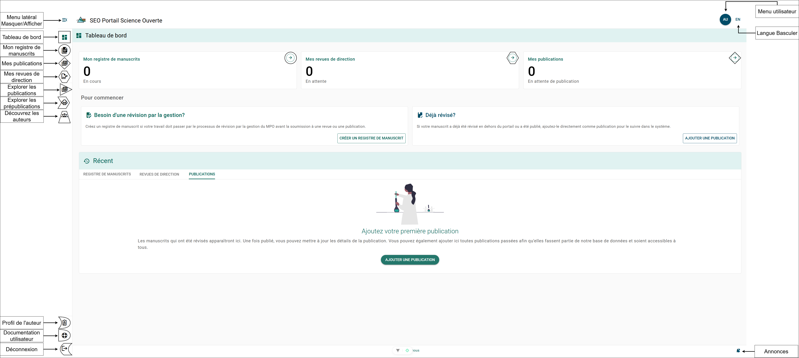

# Navigation du portail

## Objectif {/* #purpose */}

Le Portail de la science ouverte (PSO) vise à améliorer la mobilisation des connaissances scientifiques de Pêches et Océans Canada (MPO) en respectant la Feuille de route du Canada pour la science ouverte. L’objectif principal est de créer un portail adaptable qui simplifie le processus de publication, assure la traçabilité de la recherche, favorise la communication ouverte et encourage la collaboration. Ce portail permet au personnel du Secteur des sciences des écosystèmes et des océans (SEO) de suivre, découvrir et promouvoir la recherche scientifique et l’expertise au sein du ministère.

Les fonctionnalités supplémentaires du PSO comprennent l’entreposage et le partage des formulaires de dossier de manuscrit (MRF), le suivi du statut des publications, les profils d’expertise des auteurs ainsi que l’intégration ORCID.

## Naviguer dans le tableau de bord {/* #navigating-the-dashboard */}

### Tableau de bord {/* #dashboard */}

La **page Tableau de bord** est le principal point central du PSO et la page vers laquelle vous serez redirigé après une authentification réussie. Pour accéder à la **page Tableau de bord** à tout moment, sélectionnez le **bouton Tableau de bord** dans le menu latéral gauche. Référez-vous au **symbole carré** dans la **figure du Tableau de bord**.

### Menu de navigation – Pages « Mes » versus pages « Explorer » {/* #navigation-menu---my-pages-versus-explore-pages */}

Le menu latéral est séparé en deux sections principales. Les pages « Mes » regroupent les éléments liés directement à votre compte, tandis que les pages « Explorer » vous permettent de consulter tous les éléments publics du portail, comme les publications, les auteurs et les prépublications.

#### Page Mes manuscrits {/* #my-manuscripts-page */}

La **page Mes manuscrits** est l’endroit où vous pouvez gérer les formulaires de dossier de manuscrit (MRF) nouveaux et en cours.

#### Mes publications {/* #my-publications */}

La **page Mes publications** est l’endroit où vous pouvez gérer les publications en attente ou publiées.

#### Mes examens de gestion des manuscrits {/* #my-manuscript-management-reviews */}

La **page Mes examens de gestion des manuscrits** est l’endroit où vous pouvez consulter les manuscrits qu’on vous a demandé d’examiner.

#### Bouton Menu utilisateur {/* #user-menu-button */}

Le **bouton Menu utilisateur** ouvre le menu qui vous permet d’accéder à vos **[Paramètres du compte](./account-settings.mdx)**, de retourner au tableau de bord et de vous **déconnecter**. Pour ouvrir le **Menu utilisateur**, sélectionnez le **bouton Menu utilisateur** dans la barre de navigation supérieure droite.

### Bouton de changement de langue {/* #language-toggle-button */}

Le **bouton de changement de langue** vous permet de changer la langue du PSO entre l’anglais et le français. Pour changer la langue, sélectionnez le **bouton de changement de langue** dans la barre de navigation supérieure droite.

### Actions rapides {/* #quick-action */}

#### Créer un dossier de manuscrit {/* #create-manuscript-record */}

Le **bouton CRÉER UN DOSSIER DE MANUSCRIT** dans la section *Besoin d’un examen de gestion ?* vous permet de lancer directement l’[outil de création de dossier de manuscrit](../publication-process/manuscript-record-form.mdx#create-a-new-manuscript-record-form) à partir du tableau de bord.

#### Ajouter une publication {/* #add-publication */}

Le **bouton AJOUTER UNE PUBLICATION** dans la section *Déjà révisé ?* vous permet de lancer directement l’[outil d’ajout de publication](../publication-process/publications.mdx#creating-a-record-for-an-existing-publication) à partir du tableau de bord.