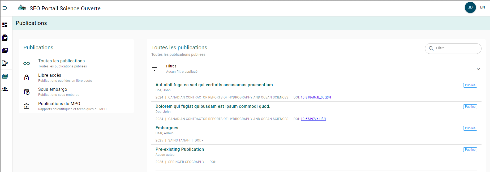
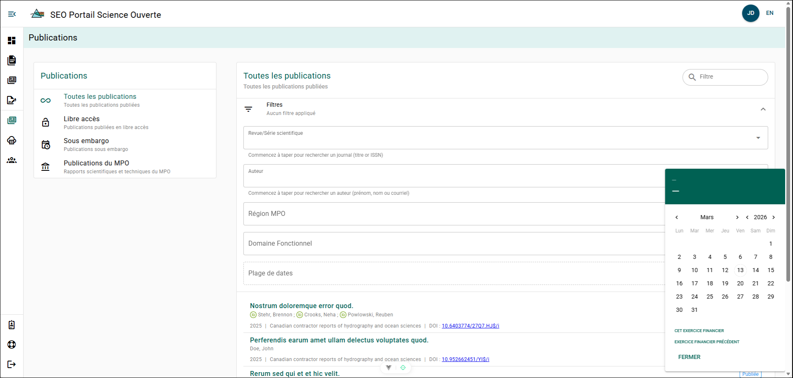

# Explorateur des publications

Vous pouvez explorer les publications et leurs détails qui ont été soumis au PSO. Veuillez noter que si une publication est sous embargo, seuls ses détails peuvent être consultés.

Vous pouvez filtrer les publications par type à l’aide du **menu de filtrage des publications** situé sur le côté gauche de la page.

:::tip

Le tableau de filtrage est également disponible pour les rôles ayant accès à l’Explorateur régional des manuscrits !

:::

